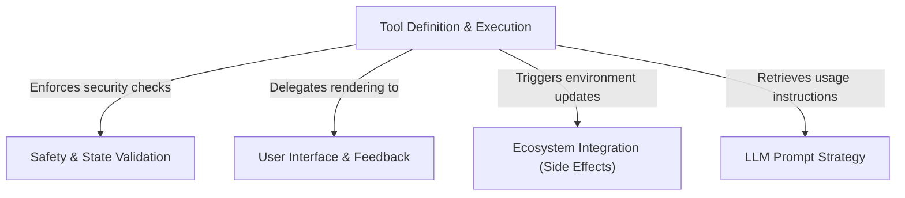

# Tutorial: FileWriteTool

This project implements a robust **file writing tool** that allows an AI agent to safely create or overwrite files on the local filesystem. It orchestrates the process by validating permissions and file states to ensure **safety**, executing the write operation, and synchronizing changes with external systems like **VS Code** and Language Servers. The tool also provides a clear **User Interface** to visualize changes and supplies specific instructions to the AI model on how to use the capability correctly.

## Chapters

1. [Tool Definition & Execution](01_tool_definition___execution.md)
2. [LLM Prompt Strategy](02_llm_prompt_strategy.md)
3. [Safety & State Validation](03_safety___state_validation.md)
4. [Ecosystem Integration (Side Effects)](04_ecosystem_integration__side_effects_.md)
5. [User Interface & Feedback](05_user_interface___feedback.md)

---

Generated by [Code IQ](https://github.com/adityasoni99/Code-IQ)