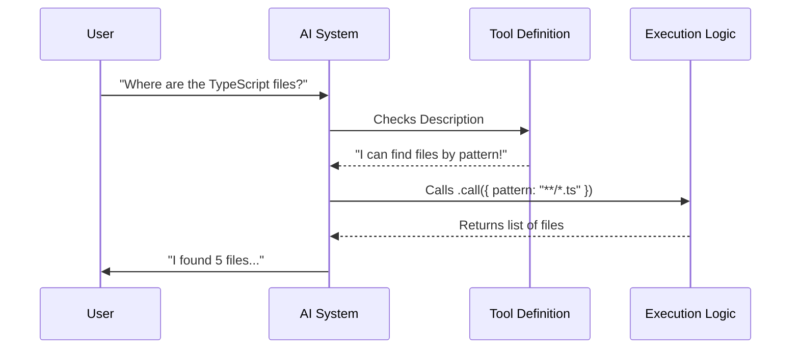

# Chapter 1: Tool Definition

Welcome to the **GlobTool** project! 

In this tutorial series, we will build a powerful utility that allows an AI system to search for files on your computer. If you've ever used a terminal command like `ls *.txt` or searched for a file in your code editor, you know how useful this is. We are giving that superpower to an AI.

## The Motivation: Teaching AI a New Skill

Imagine an AI as a very smart assistant sitting in a windowless room. It knows a lot about coding, but it cannot see your computer's hard drive. It's blind to your files.

To fix this, we need to give the AI a **Tool**.

A Tool is like a "skill card" or a plugin. It tells the AI:
1.  **"I exist!"** (Name and Description)
2.  **"Here is how you talk to me."** (Input Schema)
3.  **"Here is what I can do."** (Execution Logic)

In this chapter, we will look at the **Tool Definition**, which is the blueprint that holds all these pieces together.

## The Blueprint: `GlobTool`

In our project, the main object is called `GlobTool`. It acts as a container. Think of it as a form you fill out to register a new employee. You need to fill in their name, their job title, and the specific tasks they are allowed to perform.

We create this definition using a helper function called `buildTool`.

### 1. Naming the Tool
First, we need to give our tool an identity so the system knows when to use it.

```typescript
// From GlobTool.ts
import { buildTool } from '../../Tool.js'
import { GLOB_TOOL_NAME, DESCRIPTION } from './prompt.js'

export const GlobTool = buildTool({
  name: GLOB_TOOL_NAME, // 'Glob'
  searchHint: 'find files by name pattern or wildcard',
  
  async description() {
    return DESCRIPTION
  },
// ... continued below
```

**Explanation:**
*   `name`: This is the unique ID of the tool.
*   `searchHint`: A short tagline humans see in the UI.
*   `description`: A longer explanation for the AI. It tells the AI *why* it should use this tool (e.g., "Use this to find files using patterns like `*.ts`").

### 2. Defining Inputs and Outputs
The AI needs to know strictly what data to send to the tool (Inputs) and what data to expect back (Outputs).

```typescript
  // ... inside buildTool({
  get inputSchema() {
    return inputSchema() // Detailed in Chapter 2
  },
  get outputSchema() {
    return outputSchema() // Detailed in Chapter 2
  },
```

**Explanation:**
We don't write the logic here directly; we point to schemas. This ensures the AI doesn't try to send us random text when we need a specific file pattern.
*   *Learn more in [Data Schemas](02_data_schemas.md).*

### 3. Capabilities and Safety
We need to tell the system how "dangerous" or "heavy" this tool is.

```typescript
  // ... inside buildTool({
  isConcurrencySafe() {
    return true // Can run multiple times at once
  },
  isReadOnly() {
    return true // Does NOT modify files
  },
```

**Explanation:**
*   `isReadOnly`: This is crucial for safety. Since `GlobTool` only *finds* files and doesn't delete or write them, we mark it as read-only. This helps the system trust the tool.
*   *Learn more in [Filesystem Security & Validation](04_filesystem_security___validation.md).*

### 4. The Action (Execution)
Finally, the definition includes the actual code that runs when the tool is called.

```typescript
  // ... inside buildTool({
  async call(input, context) {
    // 1. Get the pattern from input
    // 2. Search the filesystem
    // 3. Return the list of files
    return { data: output }
  }
}) // End of buildTool
```

**Explanation:**
The `call` function is the engine. When the AI decides "I want to search for files," this function executes.
*   *We will write the logic for this in [Execution Handler](03_execution_handler.md).*

---

## Under the Hood: How It Works

When the system starts up, it reads this `GlobTool` definition. Here is the flow of events when a user interacts with it:



1.  **Registration:** The system loads `GlobTool`.
2.  **Matching:** The user asks a question. The system looks at the `description` in our definition to see if this tool can help.
3.  **Execution:** If it's a match, the system triggers the code inside our definition.

## A Look at the Code

Let's look at a slightly larger snippet from `GlobTool.ts` to see how the definition aggregates UI logic alongside business logic.

```typescript
// GlobTool.ts
export const GlobTool = buildTool({
  name: GLOB_TOOL_NAME,
  
  // UI Helpers
  userFacingName, 
  renderToolUseMessage,
  
  // Logic Helpers
  getPath({ path }): string {
    return path ? expandPath(path) : getCwd()
  },

  // ... rest of configuration
})
```

**Explanation:**
The definition is a "one-stop-shop."
*   It handles **UI**: `renderToolUseMessage` controls how the tool looks in the chat window (see [UI Rendering](05_ui_rendering.md)).
*   It handles **Utilities**: `getPath` is a helper function specific to this tool to figure out which folder to search in.

## Conclusion

The **Tool Definition** is the wrapper that turns raw code into a capability the AI can understand. It bundles:
1.  **Metadata** (Name/Description)
2.  **Contracts** (Input/Output Schemas)
3.  **Behavior** (The `call` function)

Now that we have our container, we need to be very specific about what data we allow inside it.

[Next Chapter: Data Schemas](02_data_schemas.md)

---

Generated by [Code IQ](https://github.com/adityasoni99/Code-IQ)