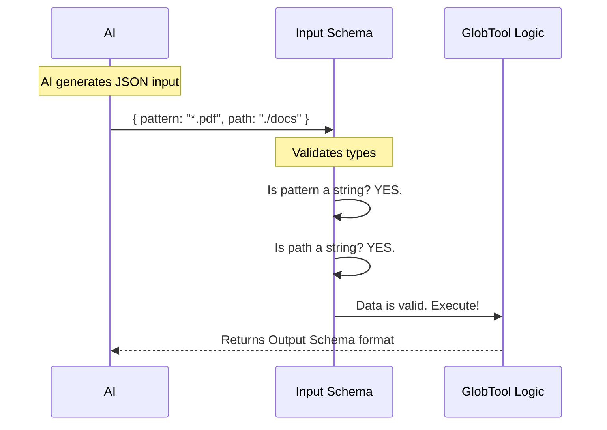

# Chapter 2: Data Schemas

In [Chapter 1: Tool Definition](01_tool_definition.md), we created the "ID Badge" for our `GlobTool`. We gave it a name and a description so the AI knows it exists.

However, knowing a tool exists isn't enough. The AI needs to know exactly **how** to talk to it.

## The Motivation: The Guard at the Gate

Imagine a vending machine. To get a snack, you must insert a specific type of coin. If you try to push a banana into the coin slot, the machine will jam.

Our tool works the same way. We need a strict "Guard" that stands between the AI and our code.
1.  **Input Schema:** Checks if the AI is sending the right "coins" (data).
2.  **Output Schema:** Ensures we package the "snack" (results) in a format the AI can easily digest.

We use a library called **Zod** to build these schemas. It acts as our gatekeeper.

## Concept 1: The Input Schema

The Input Schema defines strict rules for what the AI is allowed to ask for. For our file search tool, we need two things from the AI:
1.  **What to search for?** (The Pattern)
2.  **Where to look?** (The Path)

Let's build this schema step-by-step.

### Step 1: The Pattern (Required)
The most important input is the glob pattern (like `*.txt` or `src/**/*.ts`).

```typescript
// Part of GlobTool.ts
import { z } from 'zod/v4'

// We define a strict object
z.strictObject({
  pattern: z.string().describe('The glob pattern to match files against'),
  // ... next field goes here
})
```

**Explanation:**
*   `z.string()`: We tell the Guard, "This **must** be text." If the AI sends a number, the Guard rejects it.
*   `.describe(...)`: This is a hidden note passed to the AI. It guides the AI on what to put in this field.

### Step 2: The Path (Optional)
Sometimes the AI wants to search a specific folder. Other times, it just wants to search the current folder.

```typescript
// ... inside the object
  path: z
    .string()
    .optional() // It is okay to skip this!
    .describe('The directory to search in...'),
// ...
```

**Explanation:**
*   `.optional()`: This tells the Guard, "It's okay if this data is missing."
*   If the AI doesn't send a path, our code will default to the current working directory later.

## Concept 2: The Output Schema

Once our tool finishes searching, it needs to hand the data back to the AI. We don't just dump raw data; we structure it carefully.

This ensures the AI always knows where to look for the filenames.

### The Structure
We return an object containing the list of files and some useful statistics.

```typescript
// Part of GlobTool.ts
const outputSchema = z.object({
  filenames: z
    .array(z.string())
    .describe('Array of file paths that match the pattern'),
    
  numFiles: z.number().describe('Total number of files found'),
  // ... metrics below
})
```

**Explanation:**
*   `filenames`: This is the core data. It is an array (list) of strings.
*   `numFiles`: A helper number so the AI doesn't have to count the array manually.

### Adding Metrics and Safety
We also add fields to help us understand performance and safety limits.

```typescript
// ... inside outputSchema
  durationMs: z
    .number()
    .describe('Time taken to execute the search in milliseconds'),

  truncated: z
    .boolean() // True or False
    .describe('Whether results were truncated (limited to 100 files)'),
```

**Explanation:**
*   `truncated`: If we find 10,000 files, we don't want to crash the AI. We might stop after 100. This flag warns the AI: "Hey, there is more data than what I'm showing you."

---

## Under the Hood: The Validation Flow

Before any real code runs, the "Guard" (Zod) checks everything. Here is what happens when the user asks: *"Find all PDF files in the documents folder."*



If the AI makes a mistake (e.g., sends a number for the pattern), the Gatekeeper stops it immediately and sends back an error message. The `GlobTool` logic never even runs!

## Implementation Details

In `GlobTool.ts`, we wrap these schemas in a helper called `lazySchema`. This is a technical trick to ensure our schemas don't cause startup issues if they are loaded out of order.

Here is how we plug them into the Tool Definition we created in Chapter 1:

```typescript
// GlobTool.ts
const inputSchema = lazySchema(() =>
  z.strictObject({
    pattern: z.string().describe('The glob pattern...'),
    path: z.string().optional().describe('The directory...'),
  }),
)

export const GlobTool = buildTool({
  // ... name and description ...
  
  get inputSchema() {
    return inputSchema()
  },
  get outputSchema() {
    return outputSchema() // Defined similarly
  },
  // ...
})
```

**Explanation:**
1.  We define the schemas as variables (`inputSchema`, `outputSchema`).
2.  We attach them to the `GlobTool` object using getters (`get inputSchema()`).

Now, the system has the **ID Badge** (Definition) and the **Rulebook** (Schemas).

## Conclusion

Data Schemas are the contract between the AI and our Code.
1.  **Input Schema:** Ensures we get valid data (Pattern and Path).
2.  **Output Schema:** Ensures we return consistent results (Filenames and Metrics).

With the contract signed and the definitions ready, we can finally write the code that actually does the work!

[Next Chapter: Execution Handler](03_execution_handler.md)

---

Generated by [Code IQ](https://github.com/adityasoni99/Code-IQ)