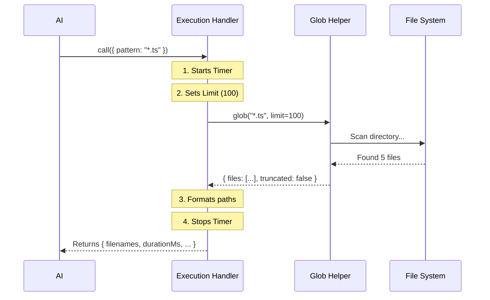

# Chapter 3: Execution Handler

In the previous chapter, [Data Schemas](02_data_schemas.md), we established the strict rules for talking to our tool. We created a "Gatekeeper" that ensures the AI sends valid requests (Input) and receives structured responses (Output).

But right now, our tool is just a form with no function. It’s like a restaurant menu with no chef in the kitchen.

In this chapter, we will build the **Execution Handler**. This is the `call` method—the engine that actually performs the work.

## The Motivation: The Engine Room

The **Execution Handler** is the bridge between the abstract request ("Find text files") and the concrete reality of your computer's hard drive.

Its job is to:
1.  **Receive** the validated input (from Chapter 2).
2.  **Do the work** (search the filesystem).
3.  **Manage constraints** (don't crash the system if there are too many files).
4.  **Package the results** to match our Output Schema.

## Concept: The `call` Method

Every tool in our system must have a `call` function. This function is triggered automatically when the AI decides to use the tool.

It looks like this:

```typescript
async call(input, context) {
  // 1. Setup & Safety
  // 2. Perform the Action
  // 3. Return the Data
}
```

Let's build the `call` method for `GlobTool` step-by-step.

### Step 1: Starting the Timer
AI models are sensitive to time. If a tool takes too long, the AI might time out or get confused. We need to track how long our search takes.

```typescript
// Inside the call() method...
async call(input, { abortController, getAppState, globLimits }) {
  // Start the stopwatch
  const start = Date.now()
  
  // Get system state (needed for permissions later)
  const appState = getAppState()
  
  // ... continue logic
```

**Explanation:**
*   `Date.now()`: We grab the current timestamp so we can calculate the duration later.
*   `context`: The second argument gives us access to system helpers, like `getAppState`.

### Step 2: Setting Limits
Imagine searching for `*` (everything) in a folder with 1,000,000 files. If we return all of them, we will overwhelm the AI's context window (its "short-term memory").

We need to enforce a strict limit.

```typescript
  // ... inside call()
  
  // Default to 100 files if no specific limit is set globally
  const limit = globLimits?.maxResults ?? 100
  
  // ... continue logic
```

**Explanation:**
*   We check `globLimits` from the context.
*   If we hit this limit, we will stop searching and tell the AI, "Here is what I found so far."

### Step 3: The Actual Search
Now we perform the "Business Logic." We call a helper function named `glob` that does the heavy lifting of scanning the disk.

```typescript
  // ... inside call()

  // Run the search!
  const { files, truncated } = await glob(
    input.pattern,           // What to look for ("*.ts")
    GlobTool.getPath(input), // Where to look ("./src")
    { limit, offset: 0 },    // Constraints
    abortController.signal,  // ability to cancel
    appState.toolPermissionContext // security context
  )
```

**Explanation:**
*   `GlobTool.getPath(input)`: We reuse the helper we defined in [Tool Definition](01_tool_definition.md) to determine the folder.
*   `truncated`: This boolean tells us if there were more files than the `limit` allowed.

### Step 4: Formatting the Output
The AI works best with clean, relative paths.
*   **Absolute Path:** `/Users/username/project/src/index.ts` (Too long, leaks personal info)
*   **Relative Path:** `src/index.ts` (Perfect)

```typescript
  // ... inside call()

  // Convert absolute paths to short relative paths
  const filenames = files.map(toRelativePath)
  
  // Calculate how long it took
  const durationMs = Date.now() - start
```

**Explanation:**
*   We use `.map()` to transform the raw file list into a cleaner list.
*   We stop the "stopwatch" by subtracting the start time from the current time.

### Step 5: Returning the Package
Finally, we bundle everything into an object that matches the **Output Schema** we designed in [Data Schemas](02_data_schemas.md).

```typescript
  // ... inside call()

  return {
    data: {
      filenames,      // The list of files
      durationMs,     // How long it took
      numFiles: filenames.length, // Count
      truncated,      // Did we cut it short?
    }
  }
} // End of call function
```

## Under the Hood: The Execution Flow

What actually happens when you ask the AI to "Find files"? Here is the flow of data:



1.  **Request:** The AI invokes the tool.
2.  **Delegation:** The Handler doesn't write low-level filesystem code itself; it delegates that to the `glob` helper. This keeps our tool code clean.
3.  **Formatting:** The Handler prepares the raw data for human/AI consumption.

## Implementation Details

Let's look at how this fits into the actual `GlobTool.ts` file.

The `GlobTool` object packs everything together. Notice how the `call` function sits alongside the schemas we defined previously.

```typescript
// GlobTool.ts
export const GlobTool = buildTool({
  name: GLOB_TOOL_NAME,
  // ... description and schemas ...

  // The code we wrote above goes here:
  async call(input, { abortController, getAppState, globLimits }) {
    const start = Date.now()
    const appState = getAppState()
    const limit = globLimits?.maxResults ?? 100
    
    // ... logic ...

    return {
      data: output,
    }
  },
  
  // ... UI rendering logic ...
})
```

### Handling "No Results"
You might notice another function in the file called `mapToolResultToToolResultBlockParam`. This is a specialized formatter for the chat interface.

It handles the case where the logic runs successfully, but finds nothing.

```typescript
  mapToolResultToToolResultBlockParam(output, toolUseID) {
    if (output.filenames.length === 0) {
      return {
        // ... standard headers ...
        content: 'No files found',
      }
    }
    // ... otherwise return the list ...
  }
```

**Explanation:**
Instead of returning an empty array `[]` which might look like an error to a user, we explicitly return the text "No files found". This improves the User Experience.

## Conclusion

The **Execution Handler** is the muscle of the tool. It takes the validated instructions from the "Gatekeeper" (Schema), performs the heavy lifting (Filesystem Search), and packages the result neatly for the AI.

However, searching the filesystem is risky. What if the AI tries to read a sensitive system file? Or what if the user doesn't have permission to access a folder?

We need to add a layer of security.

[Next Chapter: Filesystem Security & Validation](04_filesystem_security___validation.md)

---

Generated by [Code IQ](https://github.com/adityasoni99/Code-IQ)