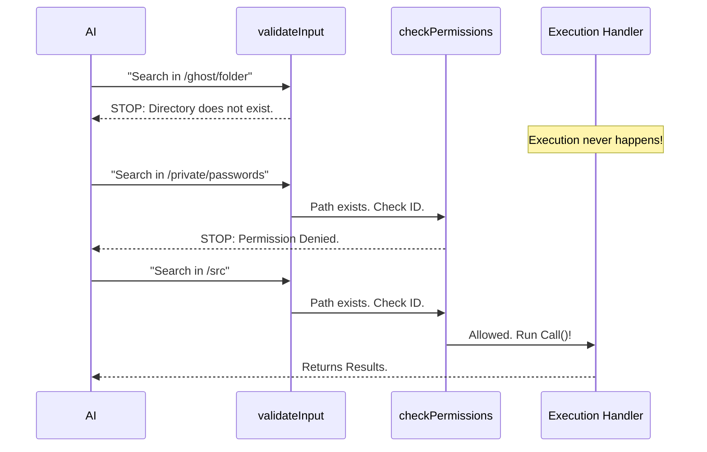

# Chapter 4: Filesystem Security & Validation

In the previous chapter, [Execution Handler](03_execution_handler.md), we built the engine of our tool. We gave it the ability to search through files and return results.

However, an engine without brakes or sensors is dangerous.

What if the AI asks to search a folder that doesn't exist? The program might crash.
What if the AI tries to search a private system folder containing passwords? We definitely don't want to allow that.

In this chapter, we will build the **Security Guard**. This logic sits *before* the execution handler. It stops bad requests before they can cause trouble.

## The Motivation: The Bouncer at the Door

Think of your filesystem as a VIP club. The **Execution Handler** is the DJ inside playing the music. But before anyone gets to the DJ, they have to pass the Bouncer (Validation & Security).

The Bouncer checks two things:
1.  **Does this place exist?** (Validation): If the AI asks for the "Unicorn Room," and that room doesn't exist, the Bouncer stops them immediately.
2.  **Are you on the list?** (Permissions): If the AI tries to enter the "Manager's Office," the Bouncer checks if they have the key.

This ensures our tool is **Robust** (doesn't crash) and **Secure** (protects your privacy).

## Concept 1: Validation (`validateInput`)

The `validateInput` function is responsible for sanity checks. For `GlobTool`, its main job is to ensure the `path` the AI wants to search is actually a valid directory.

If we skip this, our search code will throw an ugly error when it tries to open a missing folder.

### The Strategy
Here is the logic we need to implement:

```typescript
async validateInput({ path }) {
  // 1. If no path is provided, we use the default (safe)
  if (!path) return { result: true }

  // 2. Check if the folder exists on the computer
  const exists = await fs.stat(path)

  // 3. Make sure it is a Folder, not a File
  if (!exists.isDirectory()) {
     return { result: false, message: 'Not a directory!' }
  }

  return { result: true }
}
```

**Explanation:**
*   We use `fs.stat` (a filesystem command) to peek at the path.
*   We return an object: `{ result: true }` means "Go ahead." `{ result: false }` stops the tool and sends the `message` back to the AI.

## Concept 2: Security (`checkPermissions`)

Even if a folder exists, the AI might not have the right to see it. We use a centralized permission system to handle this.

Instead of writing complex security logic inside every single tool, we delegate this check to a helper function.

```typescript
async checkPermissions(input, context) {
  // Get the current security settings
  const appState = context.getAppState()
  
  // Ask the central authority: "Can I read this?"
  return checkReadPermissionForTool(
    GlobTool,
    input,
    appState.toolPermissionContext,
  )
}
```

**Explanation:**
*   `checkReadPermissionForTool`: This is a shared utility. It looks at the global "Allow List." If the user only allowed access to the `/project` folder, and the tool tries to read `/system`, this function returns `false`.

---

## Under the Hood: The Safety Flow

When the AI calls a tool, the system automatically runs these checks in a specific order. The `call` function (from Chapter 3) is **only** reached if both checks pass.



## Implementation Details

Let's see how this looks inside `GlobTool.ts`. We add these two functions to our tool definition.

### 1. Implementing `validateInput`
We add extra logic here to handle "UNC paths" (network paths like `\\Server\Share`) which can be a security risk on Windows, and to provide helpful error messages.

```typescript
// Inside GlobTool.ts
async validateInput({ path }): Promise<ValidationResult> {
  if (path) {
    const absolutePath = expandPath(path)

    // SECURITY: Block UNC paths to prevent credential leaks
    if (absolutePath.startsWith('\\\\') || absolutePath.startsWith('//')) {
      return { result: true } // We let it pass here but handle it safely elsewhere
    }
    
    // ... verification continues below
```

**Explanation:**
*   **UNC Check:** Network paths can sometimes trick a computer into sending your username/password hash to a malicious server. We flag them here.

### 2. Handling Missing Folders
If the folder is missing, we don't just say "Error." We try to be helpful.

```typescript
    // ... inside validateInput
    try {
      stats = await fs.stat(absolutePath)
    } catch (e) {
      if (isENOENT(e)) { // Error: No Entry (File not found)
        // Helper tries to guess if you made a typo
        const suggestion = await suggestPathUnderCwd(absolutePath)
        return { 
           result: false, 
           message: `Directory missing. Did you mean ${suggestion}?` 
        }
      }
      throw e
    }
```

**Explanation:**
*   `suggestPathUnderCwd`: This is a clever helper. If you type `src/componentss` (extra 's'), it might check the disk and suggest `src/components`. This helps the AI correct its own mistakes without human intervention.

### 3. Implementing `checkPermissions`
This part is very concise because we rely on the framework's utilities.

```typescript
// Inside GlobTool.ts
async checkPermissions(input, context): Promise<PermissionDecision> {
  const appState = context.getAppState()
  
  return checkReadPermissionForTool(
    GlobTool,
    input,
    appState.toolPermissionContext,
  )
},
```

**Explanation:**
This method ensures that `GlobTool` respects the global "Read Only" mode or specific directory restrictions set by the user in the application settings.

## Conclusion

By adding **Filesystem Security & Validation**, we have transformed our tool from a "naive script" into a "production-grade utility."

1.  **Validation** prevents crashes and guides the AI when it makes typos.
2.  **Permissions** ensure the AI acts within the boundaries set by the user.

Now our tool is defined (Chapter 1), understands data (Chapter 2), can execute tasks (Chapter 3), and is safe to use (Chapter 4).

The final piece of the puzzle is making the output look beautiful for the human user.

[Next Chapter: UI Rendering](05_ui_rendering.md)

---

Generated by [Code IQ](https://github.com/adityasoni99/Code-IQ)