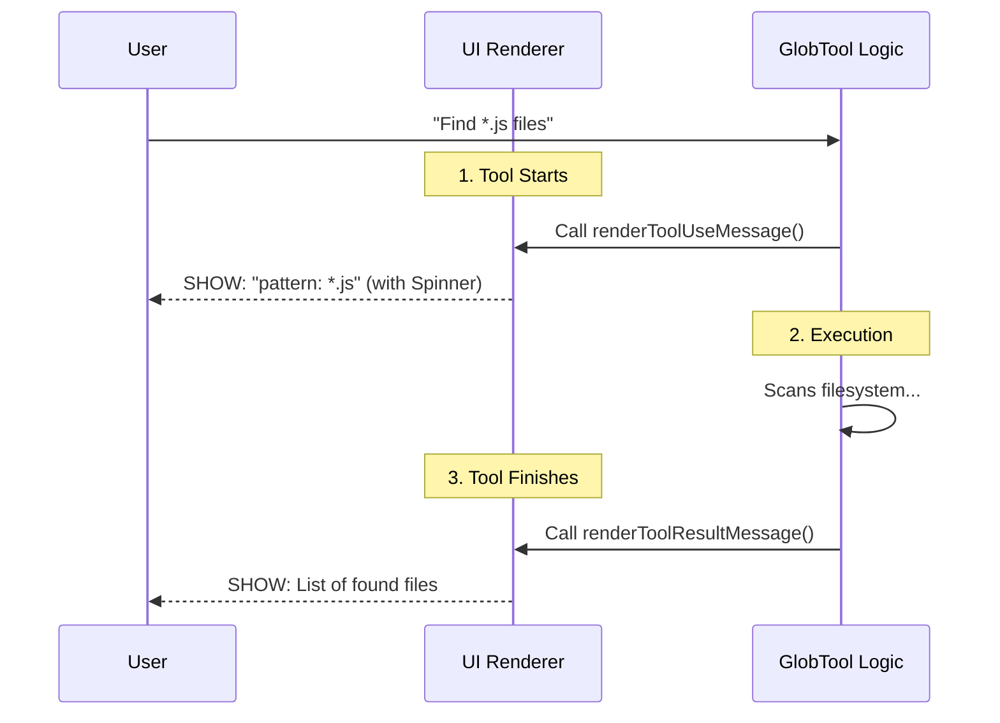

# Chapter 5: UI Rendering

Welcome to the final chapter of the **GlobTool** tutorial!

In the previous chapter, [Filesystem Security & Validation](04_filesystem_security___validation.md), we secured our tool. We added a "Bouncer" to ensure the AI doesn't access restricted files or crash on missing folders.

Now we have a tool that is **Defined** (Ch. 1), understands **Data** (Ch. 2), can **Execute** (Ch. 3), and is **Safe** (Ch. 4).

But there is one problem left: **Presentation**.

Right now, if the AI runs our tool, the interaction looks robotic and raw. In this chapter, we will build the **UI Rendering** layer. This is the "Frontend" of our tool—it determines what the human user actually sees in the chat window.

## The Motivation: talking to Humans, not Computers

Imagine ordering food at a restaurant.
1.  **Without UI:** The waiter hands you a slip of paper that says `{ status: "cooking", ingredients: ["beef", "bun"] }`.
2.  **With UI:** The waiter smiles and says, "We are grilling your burger now."

The **UI Rendering** layer is that translation. It converts abstract data (like `{ pattern: "*.ts" }`) into friendly status messages (like "Searching for TypeScript files...").

### The Use Case
We want to achieve two things:
1.  **While running:** Show a concise status message (e.g., `pattern: "*.ts"`).
2.  **If it fails:** Show a friendly error (e.g., "File not found") instead of a scary system crash code.

## Concept 1: The Status Message

When the AI decides to use the tool, the tool might take a few seconds to run. We need to show the user a "loading state."

We use a function called `renderToolUseMessage`. It takes the Input Schema data and returns a string or a React component.

```typescript
// From UI.tsx
export function renderToolUseMessage(input) {
  const { pattern, path } = input
  
  // If no path is specified, just show the pattern
  if (!path) {
    return `pattern: "${pattern}"`
  }
  
  // Otherwise show both
  return `pattern: "${pattern}", path: "${path}"`
}
```

**Explanation:**
*   **Input:** The function receives the arguments the AI prepared (e.g., `pattern: "*.ts"`).
*   **Logic:** We check if `path` exists. If the user didn't specify a folder, we don't want to show `path: "undefined"`. We keep it clean.
*   **Output:** A simple string that appears next to the loading spinner in the chat.

## Concept 2: Friendly Errors

Computers love error codes like `ENOENT` (Error NO ENTry). Humans hate them.

If our Validation logic (from Chapter 4) fails, or the system throws an error, we catch it in `renderToolUseErrorMessage`.

```typescript
// From UI.tsx
import { Text } from '../../ink.js' // UI Component helper

export function renderToolUseErrorMessage(result) {
  // Check if the error contains our specific flag
  if (isFileNotFoundError(result)) {
    // Return a styled Red text component
    return (
      <Text color="error">File not found</Text>
    )
  }
  
  // Fallback for other errors
  return <Text color="error">Error searching files</Text>
}
```

**Explanation:**
*   Instead of dumping a stack trace, we look for known error types.
*   We use `<Text color="error">` (similar to HTML/CSS styling) to make the message distinct and readable.

## Concept 3: The Tool Name

Finally, we need a short, human-readable label for the tool. While the internal ID might be `glob_tool_v1`, the user just wants to see "Search".

```typescript
// From UI.tsx
export function userFacingName(): string {
  return 'Search'
}
```

**Explanation:**
This string appears on the tool badge in the UI history. It helps the user quickly scan their chat history to see what tools were used.

---

## Under the Hood: The Visual Lifecycle

How does the system decide what to paint on the screen? Let's look at the lifecycle of a user request.



1.  **Start:** As soon as the AI calls the tool, the system asks `UI.tsx` for a status string.
2.  **Wait:** The user sees this string while the `call()` function (Chapter 3) does the heavy lifting.
3.  **Finish:** When data returns, the system displays the results (often using a shared list viewer).

## Implementation Details

In `GlobTool.ts`, we bundle these UI functions into our definition, just like we did with Schemas and Execution logic.

```typescript
// GlobTool.ts
import { 
  renderToolUseMessage, 
  renderToolUseErrorMessage, 
  userFacingName 
} from './UI.js'

export const GlobTool = buildTool({
  name: GLOB_TOOL_NAME,
  
  // We attach the UI functions here:
  userFacingName,
  renderToolUseMessage,
  renderToolUseErrorMessage,
  
  // ... rest of the tool definition
})
```

### Note on Result Rendering
You might wonder: "Where is the function that renders the *list* of files?"

For `GlobTool`, we actually borrow this logic from another tool (`GrepTool`) to keep our code DRY (Don't Repeat Yourself).

```typescript
// From UI.tsx
import { GrepTool } from '../GrepTool/GrepTool.js'

// Reuse the existing list-view component
export const renderToolResultMessage = GrepTool.renderToolResultMessage
```

This ensures that whether you are searching for *filenames* (Glob) or *text content* (Grep), the results look consistent to the user.

## Conclusion

Congratulations! You have built the **GlobTool** from scratch.

Let's review what we accomplished:
1.  **[Tool Definition](01_tool_definition.md):** We created the blueprint and identity of the tool.
2.  **[Data Schemas](02_data_schemas.md):** We defined strict contracts for Input and Output.
3.  **[Execution Handler](03_execution_handler.md):** We wrote the engine to search the filesystem.
4.  **[Filesystem Security & Validation](04_filesystem_security___validation.md):** We added safety checks to protect the user.
5.  **[UI Rendering](05_ui_rendering.md):** We polished the presentation to make it human-friendly.

You now have a fully functional, safe, and beautiful AI tool capable of searching your computer's filesystem. You can use this pattern to build any tool you can imagine—from database queries to API integrations.

**Happy Coding!**

---

Generated by [Code IQ](https://github.com/adityasoni99/Code-IQ)