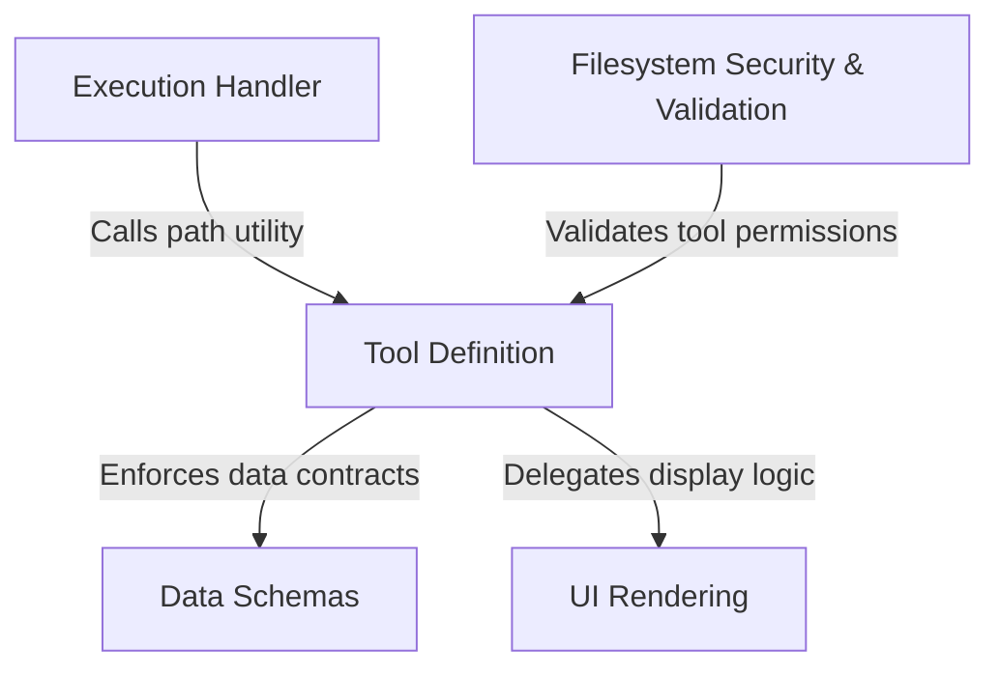

# Tutorial: GlobTool

The project defines a **GlobTool** capability that allows the system to search for files using *wildcard patterns* (like `**/*.ts`). It orchestrates **data schemas** for validation, **security checks** to ensure safe filesystem access, and specific **execution logic** to perform the search, while utilizing a dedicated **UI** layer to format and display the results to the user.

## Chapters

1. [Tool Definition](01_tool_definition.md)
2. [Data Schemas](02_data_schemas.md)
3. [Execution Handler](03_execution_handler.md)
4. [Filesystem Security & Validation](04_filesystem_security___validation.md)
5. [UI Rendering](05_ui_rendering.md)

---

Generated by [Code IQ](https://github.com/adityasoni99/Code-IQ)