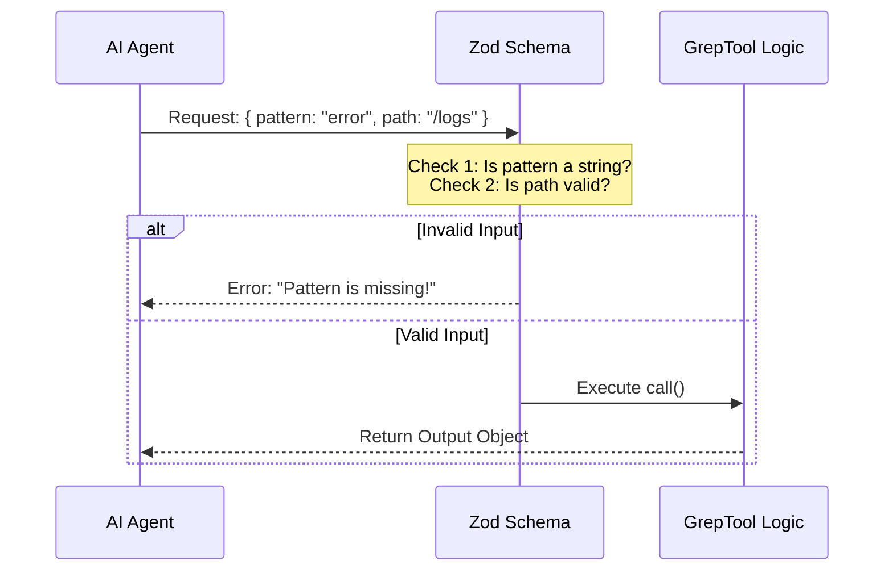

# Chapter 1: Tool Definition & Schema

Welcome to the **GrepTool** project! In this first chapter, we are going to lay the foundation for our tool.

## Motivation: The "Application Form"

Imagine you are a manager and you have a very enthusiastic but occasionally confused employee (the AI Agent). You want this employee to search through a filing cabinet (your file system) for specific documents.

If you just tell them "Go look for stuff," they might get lost, look in the wrong drawer, or bring you back a sandwich instead of a file.

To prevent this, you create a strict **Application Form**. To send a request, the employee *must* fill out:
1.  **What** text to look for (The Pattern).
2.  **Where** to look (The Path).
3.  **How** to report back (Just filenames? Or the actual content?).

In code, we call this "Form" the **Schema**. It creates a strict contract between the AI and your code.

## Key Concept: The `buildTool` Factory

We create our tool using a helper function called `buildTool`. This creates the container for our logic. It defines the tool's identity.

```typescript
import { buildTool } from '../../Tool.js'

export const GrepTool = buildTool({
  name: 'grep',
  userFacingName: () => 'Search',
  description: async () => 'Search file contents with regex...',
  // ... schemas and logic go here
})
```

*   **name**: The internal ID used by the system.
*   **userFacingName**: What the user sees in the UI (e.g., "Search").
*   **description**: Instructions for the AI on *when* to use this tool.

## Defining the Input (The "Form")

We use a library called **Zod** to define our input form. Zod allows us to specify exactly what types of data we accept (strings, numbers, choices).

### 1. The Basics: Pattern and Path
The most essential parts of a grep search are the text pattern and the file path.

```typescript
import { z } from 'zod/v4'

const inputSchema = z.strictObject({
  pattern: z.string()
    .describe('The regular expression pattern to search for'),
  
  path: z.string().optional()
    .describe('File or directory to search in. Defaults to current folder.'),
})
```

*   **`z.string()`**: The AI must provide text here.
*   **`.describe(...)`**: This is a hint to the AI explaining what this field does.
*   **`.optional()`**: The AI doesn't *have* to provide a path; if they don't, we'll assume the current directory.

### 2. Advanced Options: Flags and Modes
Grep is powerful because of its flags. We can add these to our schema so the AI can use features like "case insensitive" search or specific output modes.

```typescript
// Continuing the object above...
  output_mode: z.enum(['content', 'files_with_matches', 'count'])
    .optional()
    .describe('How to display results: show lines, just filenames, or a count.'),

  '-i': z.boolean().optional()
    .describe('Case insensitive search (ignore capitalization).'),
```

*   **`z.enum([...])`**: A multiple-choice question. The AI *must* pick one of these three options.
*   **`z.boolean()`**: A Checkbox. True (yes) or False (no).

## Defining the Output (The "Receipt")

Just as we demand strict input, we promise a strict output format. This helps other parts of the program (like the UI) know exactly how to display the results.

```typescript
const outputSchema = z.object({
  mode: z.enum(['content', 'files_with_matches', 'count']),
  numFiles: z.number(),
  filenames: z.array(z.string()),
  content: z.string().optional(),
})
```

When the tool finishes, it will return an object matching this shape. For example, if we searched for "hello" and found it in two files, the output might look like:

```json
{
  "mode": "files_with_matches",
  "numFiles": 2,
  "filenames": ["src/hello.ts", "README.md"]
}
```

## Internal Implementation: How it flows

When the AI decides to use the `GrepTool`, the system performs a validation check before your code ever runs.



### Validating the Path
One specific check we perform manually is ensuring the path actually exists. We don't want to run a search command on a folder that isn't there.

We use a `validateInput` hook inside `buildTool`:

```typescript
// Inside buildTool({ ... })
async validateInput({ path }) {
  if (path) {
    // Check if the file exists on the disk
    try {
      await fs.stat(path)
    } catch (error) {
      return { 
        result: false, 
        message: `Path does not exist: ${path}` 
      }
    }
  }
  return { result: true }
}
```

**Explanation:**
1.  We check if `path` was provided.
2.  We try to "stat" (get info about) the file.
3.  If it fails (catch block), we tell the AI the path is invalid. This saves time by stopping the error before it happens.

## Putting it Together

The `buildTool` combines the schemas, the validation, and the actual execution logic (which we will build in later chapters) into one cohesive unit.

```typescript
export const GrepTool = buildTool({
  name: 'grep',
  // ... metadata ...
  
  // 1. Attach the forms
  inputSchema,
  outputSchema,

  // 2. Attach validation logic
  validateInput,

  // 3. The main logic function (covered in Chapter 3 & 4)
  async call(input, context) {
    // This is where we will eventually run 'ripgrep'
    return { data: { /* ... output ... */ } }
  }
})
```

## Summary

In this chapter, we defined the **Contract** for our tool.
1.  We created a **Tool Definition** using `buildTool`.
2.  We built an **Input Schema** so the AI knows strictly what data to provide (Pattern, Path, Flags).
3.  We built an **Output Schema** to define what the result looks like.
4.  We added **Validation** to reject bad paths immediately.

Now that we have the data structures defined, how do we show the results to the human user?

[Next Chapter: UI Presentation Layer](02_ui_presentation_layer.md)

---

Generated by [Code IQ](https://github.com/adityasoni99/Code-IQ)