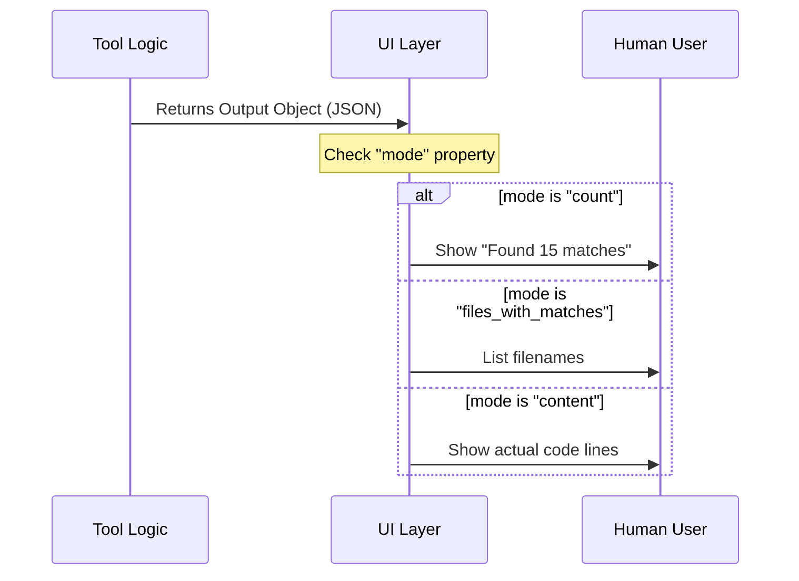

# Chapter 2: UI Presentation Layer

In the previous chapter, [Tool Definition & Schema](01_tool_definition___schema.md), we created the strict forms (Schemas) that the AI uses to communicate with our code.

Now, we need to bridge the gap between the computer and the human.

## Motivation: The Car Dashboard

Imagine driving a car that has no dashboard. You press the gas (Input), and the engine revs (Logic), but you have no idea how fast you are going or if the engine is overheating.

The **UI Presentation Layer** is your dashboard.
1.  **Tool Use Display**: When the AI "steps on the gas" (searches for text), the UI tells you: *"Searching for 'error' in /logs..."*
2.  **Tool Result Display**: When the engine responds, the UI converts the raw data into a readable gauge: *"Found 5 matches."*

In our `GrepTool`, we use a library called **Ink** (which is React for the command line) to build these displays.

## Part 1: Displaying the Request ("Tool Use")

When the AI decides to run a command, we want to confirm to the user exactly what is happening. We use a function called `renderToolUseMessage`.

### The Goal
If the AI sends this JSON input:
```json
{ "pattern": "console.log", "path": "src/app.ts" }
```
We want to display this friendly text:
`pattern: "console.log", path: "src/app.ts"`

### The Code
Here is how we transform the raw input object into a human-readable string.

```typescript
// From file: UI.tsx
export function renderToolUseMessage(input) {
  // 1. Always show the pattern
  const parts = [`pattern: "${input.pattern}"`];

  // 2. Only show the path if the AI provided one
  if (input.path) {
    parts.push(`path: "${input.path}"`);
  }

  // 3. Join them with a comma
  return parts.join(', ');
}
```

**Explanation:**
1.  We start an array `parts` with the most important info: the pattern.
2.  We check if `path` exists. Remember from Chapter 1, `path` is optional. If it's there, we add it.
3.  We join the array into a single string.

## Part 2: Displaying the Result ("Tool Result")

Displaying the result is slightly more complex because our tool has three different "Output Modes" (defined in our Schema). The UI must adapt to show the right "gauge" for the right mode.

### The Flow



### The Component: `renderToolResultMessage`

This function acts as a switch. It looks at the `mode` property of the output and decides which React component to render.

```typescript
// From file: UI.tsx
export function renderToolResultMessage(output, context) {
  const { verbose } = context;

  // Case A: User wanted to see the actual content lines
  if (output.mode === 'content') {
    return <SearchResultSummary 
             count={output.numLines} 
             content={output.content} 
             verbose={verbose} 
           />;
  }
  
  // ... continued below
```

**Explanation:**
*   **`output`**: This is the data matching the **Output Schema** we defined in Chapter 1.
*   **`verbose`**: A setting that determines if we show a compact summary or a detailed view.
*   **`SearchResultSummary`**: This is a helper component (we'll look at it next) that makes the text look pretty.

### Handling Other Modes

If the user didn't ask for content, they might just want a count or a list of files.

```typescript
  // Case B: User just wanted a count of matches
  if (output.mode === 'count') {
    return <SearchResultSummary 
             count={output.numMatches} 
             countLabel="matches"
             secondaryCount={output.numFiles}
             secondaryLabel="files"
           />;
  }

  // Case C: Default (List of filenames)
  return <SearchResultSummary 
           count={output.numFiles} 
           countLabel="files" 
           content={output.filenames.join('\n')} 
         />;
}
```

**Explanation:**
*   **Case B**: We pass `countLabel="matches"` so the UI says "15 matches". We also show how many files those matches were found in.
*   **Case C**: If we just list filenames, the "content" we display is simply the list of file paths joined by a newline (`\n`).

## Part 3: The "Label Maker" Component

You noticed we used `<SearchResultSummary />` in all three cases. This is a "dumb" component that simply formats text nicely. It handles details like pluralization (Match vs Matches) and bolding numbers.

Here is a simplified look at how it renders the text:

```typescript
// Simplified from UI.tsx
function SearchResultSummary({ count, countLabel, content }) {
  // Logic to handle pluralization (e.g., "1 file" vs "5 files")
  const label = (count === 1) ? countLabel.slice(0, -1) : countLabel;

  return (
    <Box flexDirection="column">
      <Text>Found <Text bold>{count}</Text> {label}</Text>
      
      {/* Only show content box if there is content */}
      {content && (
        <Box marginLeft={2}>
           <Text>{content}</Text>
        </Box>
      )}
    </Box>
  );
}
```

**Explanation:**
1.  **Pluralization**: It checks if `count` is 1. If so, it removes the 's' from the label (e.g., "files" becomes "file").
2.  **Visual Hierarchy**: It uses `<Box>` and `<Text>` (Ink components) to create a layout. It bolds the number so it pops out to the user.
3.  **Conditional Rendering**: If `content` is empty (like in a search with 0 results), that part of the UI simply doesn't draw.

## Handling Errors

Sometimes, the AI messes up (e.g., asks for a file that doesn't exist). We need a UI for that too.

```typescript
export function renderToolUseErrorMessage(result) {
  // Did we get a "File not found" error?
  if (result.includes("File not found")) {
    return (
      <MessageResponse>
        <Text color="error">File not found</Text>
      </MessageResponse>
    );
  }
  
  // Generic fallback
  return <Text color="error">Error searching files</Text>;
}
```

This ensures that instead of crashing or showing a raw error object, the user sees a clean, red error message indicating what went wrong.

## Summary

In this chapter, we built the **User Interface** for our GrepTool.

1.  We used **`renderToolUseMessage`** to show the user exactly what the AI is searching for (Pattern & Path).
2.  We used **`renderToolResultMessage`** to switch between different output visuals based on the **Output Mode**.
3.  We created a shared **`SearchResultSummary`** component to keep our formatting consistent (bolding numbers, handling plurals).

Now that we have the **Form** (Schema) and the **Dashboard** (UI), we need to build the **Engine**. How do we actually construct the search command to send to the operating system?

[Next Chapter: Search Command Builder](03_search_command_builder.md)

---

Generated by [Code IQ](https://github.com/adityasoni99/Code-IQ)