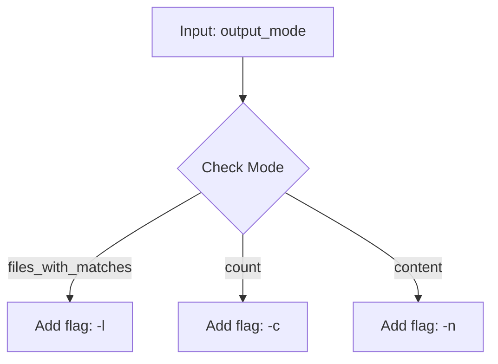
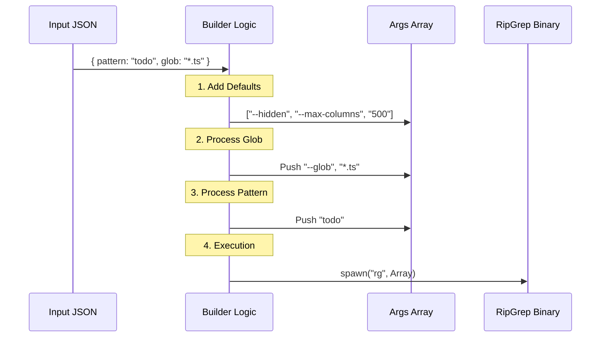

# Chapter 3: Search Command Builder

Welcome back! In the previous chapter, [UI Presentation Layer](02_ui_presentation_layer.md), we built the "Dashboard" that shows the user what is happening.

Now we are going down into the engine room.

## Motivation: The Translator

Imagine you are a Chef. A waiter runs into the kitchen and shouts, "Table 4 wants a burger, medium rare, no pickles!"

You don't just start cooking randomly. You translate that verbal request into a specific set of actions on your grill:
1.  Grab meat patty.
2.  Heat grill to medium.
3.  **Do not** add pickles.

In our tool, the **AI Agent** is the waiter. It gives us a polite, high-level request object:
```json
{
  "pattern": "login",
  "path": "src/",
  "-i": true
}
```

However, our actual search engine is a binary program called `ripgrep` (or `rg`). It doesn't understand JSON. It only understands cryptic flags like:
`rg "login" src/ -i`

The **Search Command Builder** is the logic that translates the **Input Object** into that **List of Arguments**.

## The Concept: Building an Array

Beginners often try to build commands as a single long string:
`const cmd = "rg " + pattern + " " + path;`

**Do not do this.** If a file has a space in its name (e.g., `My Document.txt`), the computer will think it is two different files.

Instead, we build an **Array of Strings**. Each flag, value, or option is a separate item in the list. This is safer and cleaner.

```javascript
// Good!
const args = ["-i", "login", "My Document.txt"];
```

## Step 1: The Foundation & Defaults

Every time our tool runs, we want certain safety rules to apply, regardless of what the user asked for. This happens at the very start of our `call` method.

```typescript
// Inside the call() method
async call(input, context) {
  // 1. Start with the basics
  const args = ['--hidden'];

  // 2. Add safety limits
  // Prevent extremely long lines from flooding the output
  args.push('--max-columns', '500');
  
  // ... continue building ...
}
```

**Explanation:**
*   **`--hidden`**: We tell `rg` to look in hidden files (like `.env`).
*   **`--max-columns`**: If a file has a line with 10,000 characters (like minified code), we chop it off so it doesn't crash our display.

## Step 2: Excluding the Noise

We want to search "hidden" files, but we definitely *don't* want to search inside massive implementation folders like `.git`.

```typescript
const VCS_DIRECTORIES = ['.git', '.svn', '.hg'];

// Loop through the bad list
for (const dir of VCS_DIRECTORIES) {
  // Add a "NOT" glob pattern (!)
  args.push('--glob', `!${dir}`);
}
```

**Explanation:**
*   We create a loop.
*   For every unwanted directory, we push two strings: `--glob` and `!dirname`.
*   The `!` tells the search engine: "Exclude this."

## Step 3: Handling Flags (The Checkboxes)

Now we look at the specific options the AI chose. Most of these are simple "If True, Add Flag" scenarios.

### Case Insensitivity
If the user wants to find "Error", "error", and "ERROR", they use the `-i` flag.

```typescript
// input['-i'] comes from our Zod schema
if (input['-i']) {
  args.push('-i');
}
```

### Multiline Mode
If the user wants to match patterns that span across multiple lines (like a function opening and closing brace).

```typescript
if (input.multiline) {
  // Allow '.' to match newlines
  args.push('-U', '--multiline-dotall');
}
```

## Step 4: Output Modes (The Switch)

In [Chapter 1: Tool Definition & Schema](01_tool_definition___schema.md), we defined `output_mode`. This drastically changes what flags we send to `ripgrep`.



Here is the code translation:

```typescript
// 1. Just want filenames?
if (input.output_mode === 'files_with_matches') {
  args.push('-l'); // List files only
} 

// 2. Just want a number?
else if (input.output_mode === 'count') {
  args.push('-c'); // Count matches
}
```

If the mode is `content` (the default), we usually want line numbers so the user knows where the code is:

```typescript
// 3. Want actual content?
if (input.output_mode === 'content') {
  // -n adds line numbers (e.g., "15: console.log")
  args.push('-n');
}
```

## Step 5: Context (Seeing the bigger picture)

If you find an error on line 50, it helps to see lines 49 and 51 too. This is called "Context".

```typescript
// Helper: context_c is input['-C']
if (input.output_mode === 'content') {
  
  if (input.context) {
    // Add specific number of context lines
    args.push('-C', input.context.toString());
  }
  
  // Logic for -A (After) and -B (Before) exists here too...
}
```

**Note:** We convert the number to a string (`.toString()`) because CLI arguments are always strings.

## Step 6: The Pattern (The Edge Case)

Finally, we need to add the actual text we are looking for. There is a tricky edge case here!

**The Problem:**
Imagine searching for a negative number: `"-5"`.
If we run `rg -5`, the tool crashes because it thinks `-5` is a setting, not a search pattern.

**The Solution:**
We check the pattern first. If it looks like a flag, we use `-e` (expression) to force it to be treated as text.

```typescript
const { pattern } = input;

if (pattern.startsWith('-')) {
  // Safe way: explicitly say "this is an expression"
  args.push('-e', pattern);
} else {
  // Standard way
  args.push(pattern);
}
```

## Step 7: Filtering with Globs

Advanced users might want to search only specific file types (like `*.ts`).

```typescript
if (input.glob) {
  // Example input.glob: "*.ts, *.js"
  // We split by comma or space
  const patterns = input.glob.split(',');

  for (const p of patterns) {
    args.push('--glob', p.trim());
  }
}
```

## Visualizing the Flow

Here is how the data flows from the function start to the final command execution.



## Summary

In this chapter, we built the **Translation Layer**.

1.  We learned **not** to build strings, but to push items into an **Array**.
2.  We applied **Safety Defaults** (`--max-columns`, excluding `.git`).
3.  We translated **Input Flags** (Output Mode, Context) into specific CLI flags (`-l`, `-n`, `-C`).
4.  We handled **Edge Cases** like patterns starting with a hyphen.

Now we have a perfectly constructed command. We hand this off to the operating system, and `ripgrep` returns a stream of text data.

But `ripgrep` returns raw text. How do we turn that raw text back into the structured JSON object we promised in our Output Schema?

[Next Chapter: Output Mode Processing](04_output_mode_processing.md)

---

Generated by [Code IQ](https://github.com/adityasoni99/Code-IQ)