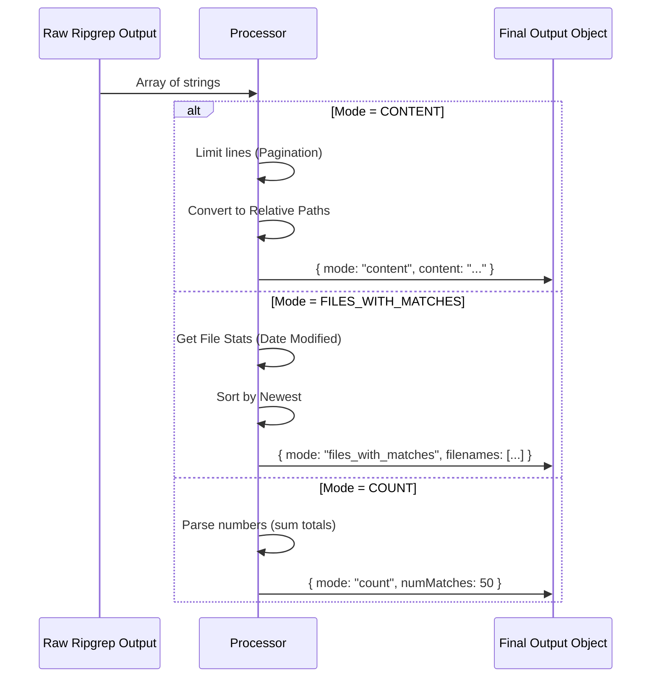

# Chapter 4: Output Mode Processing

Welcome to Chapter 4! In the previous chapter, [Search Command Builder](03_search_command_builder.md), we built the engine that sends a search command to the operating system.

Now, the engine has finished running. It has handed us a pile of raw text data. Our job is to clean this data up and package it nicely for the AI.

## Motivation: The "Raw Footage" vs. The "Final Cut"

Imagine you are filming a movie. You shoot hours of raw footage (the Search Result). You cannot just show that raw footage to the audience; it's messy, unorganized, and way too long.

You need an **Editor** to:
1.  **Trim** the excess scenes (Limit results).
2.  **Color Correct** the image (Fix file paths).
3.  **Package** it into the final format (JSON).

In **GrepTool**, the `ripgrep` command returns "Raw Footage" that looks like this:
```text
/Users/alice/projects/app/src/utils.ts:15:export const add = (a, b) => a + b;
/Users/alice/projects/app/src/main.ts:10:console.log(add(1, 2));
```

This is messy. It has absolute paths (which are long and waste AI "tokens") and lacks structure. Our **Output Mode Processing** logic turns that into the clean JSON object we promised in our Schema.

## Concept 1: The Token Saver (Relative Paths)

The most important "cleanup" task is fixing the file paths.

**The Problem:**
The tool might output `/home/user/development/projects/my-app/src/index.ts`.
To an AI with a limited memory (context window), that long path is expensive "noise."

**The Solution:**
We convert it to a **Relative Path**: `src/index.ts`.

```typescript
// Helper function used in our processing
const finalLines = rawResults.map(line => {
  // If line starts with /absolute/path...
  // Cut off the beginning to make it 'src/file.ts'
  return toRelativePath(line); 
})
```

## Concept 2: The Three Modes

In [Chapter 1: Tool Definition & Schema](01_tool_definition___schema.md), we defined three output modes. We handle the raw data differently depending on which mode the user selected.

### The Flow



## Implementation: Handling "Content" Mode

This is the default mode. The user wants to see the actual lines of code that matched.

### Step 1: Applying Limits (Pagination)
Before we process text, we check if there is too much of it. We use a helper `applyHeadLimit`.

```typescript
// Inside call() output_mode === 'content'

// 1. Slice the array if it's too big
const { items: limitedResults, appliedLimit } = applyHeadLimit(
  results,    // The raw array from ripgrep
  head_limit, // User preference (default 250)
  offset      // Pagination offset
)
```

**Explanation:**
If `results` has 10,000 lines, but `head_limit` is 250, we only keep the first 250. This prevents the tool from crashing the UI or overflowing the AI's memory.

### Step 2: Formatting the Lines
We iterate through the kept lines and shorten the paths.

```typescript
// 2. Map through results to fix paths
const finalLines = limitedResults.map(line => {
  const colonIndex = line.indexOf(':');
  
  // Separate filename from the rest of the line
  const filePath = line.substring(0, colonIndex);
  const rest = line.substring(colonIndex);
  
  // Reassemble with short path
  return toRelativePath(filePath) + rest;
})
```

### Step 3: Returning the Object
Finally, we package it into the structure defined in our Schema.

```typescript
return { 
  data: {
    mode: 'content',
    content: finalLines.join('\n'), // Join array into one string
    numLines: finalLines.length,
    appliedLimit, // Tell the UI we cut it short
  } 
}
```

## Implementation: Handling "Files With Matches" Mode

In this mode, the user asks: *"I don't care what the code says, just tell me WHICH files contain the word 'password'."*

We want to be smart here. If we find 100 files, the AI probably wants to see the **most recently modified** files first.

### Step 1: Getting File Stats
We have a list of filenames. We need to ask the file system for their details (metadata).

```typescript
// Inside call() output_mode === 'files_with_matches'

// Ask OS for stats (size, modified time) for every file
const stats = await Promise.allSettled(
  results.map(file => getFsImplementation().stat(file))
)
```

**Explanation:**
*   `Promise.allSettled`: We check all files in parallel. If one fails (maybe it was deleted mid-search), it doesn't crash the whole process.

### Step 2: Sorting by Date
We combine the filename with its "Modified Time" (`mtime`) and sort.

```typescript
const sortedMatches = results
  .map((filename, index) => {
    // Pair filename with its timestamp
    const r = stats[index];
    const time = r.status === 'fulfilled' ? r.value.mtimeMs : 0;
    return [filename, time]; 
  })
  .sort((a, b) => b[1] - a[1]) // Sort newest first
  .map(pair => pair[0]);       // Keep only the filename
```

### Step 3: Limiting and Output
Just like before, we chop off the list if it's too long, shorten the paths, and return.

```typescript
const { items: finalMatches } = applyHeadLimit(sortedMatches, head_limit);
const relativeMatches = finalMatches.map(toRelativePath);

return {
  data: {
    mode: 'files_with_matches',
    filenames: relativeMatches,
    numFiles: relativeMatches.length,
  }
}
```

## Implementation: Handling "Count" Mode

In this mode, the user asks: *"How many times does 'TODO' appear?"*
`ripgrep` returns lines like: `src/file.ts:5` (meaning 5 matches in this file).

We need to do some math.

```typescript
// Inside call() output_mode === 'count'

let totalMatches = 0;
let fileCount = 0;

for (const line of finalCountLines) {
  // Parse "src/file.ts:5" -> Get "5"
  const countStr = line.substring(line.lastIndexOf(':') + 1);
  const count = parseInt(countStr, 10);
  
  if (!isNaN(count)) {
    totalMatches += count; // Add 5 to total
    fileCount += 1;        // Increment file counter
  }
}
```

We then return the totals:

```typescript
return {
  data: {
    mode: 'count',
    numMatches: totalMatches,
    numFiles: fileCount,
    // We also return the raw content so the UI can verify
    content: finalCountLines.join('\n'), 
  }
}
```

## Summary

In this chapter, we learned how to be a **Data Editor**.

1.  We learned that raw output contains **Absolute Paths** which are wasteful, so we convert them to **Relative Paths**.
2.  We learned how to process **Content Mode** by limiting line counts.
3.  We learned how to process **Files Mode** by sorting results by modification date (most relevant first).
4.  We learned how to process **Count Mode** by parsing numbers from the text stream.

However, we kept mentioning `applyHeadLimit` and `offset`. What happens if the user searches for something that has 1,000,000 matches? Even with our cleanup, that's too much data. We need a way to browse through pages of results.

[Next Chapter: Result Pagination](05_result_pagination.md)

---

Generated by [Code IQ](https://github.com/adityasoni99/Code-IQ)