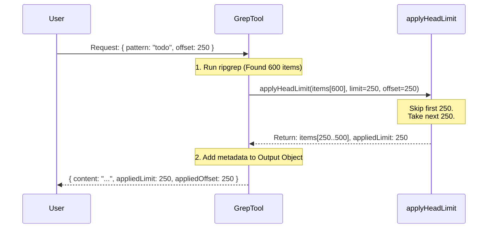

# Chapter 5: Result Pagination

Welcome to the final chapter of the GrepTool tutorial!

In the previous chapter, [Output Mode Processing](04_output_mode_processing.md), we learned how to clean up raw text into structured data. We fixed paths and sorted files.

However, we have one final, critical problem to solve.

## Motivation: The "Firehose" Problem

Imagine asking the AI to search for the word `if` in a massive codebase.
There could be **10,000 matches**.

If we send 10,000 lines of code to the AI at once:
1.  **Context Overflow**: The AI's memory (context window) fills up instantly.
2.  **Confusion**: The AI forgets what it was originally trying to do because it's drowning in data.
3.  **Crash**: The system might time out trying to process that much text.

We need a way to control the flow. We need **Pagination**.

## The Analogy: The News Editor

Think of your tool as a **News Editor**.
A journalist brings in a 50-page story. The Editor doesn't print the whole thing.
1.  **The Cut**: The Editor takes the first 3 paragraphs (The **Limit**).
2.  **The Note**: They add a note at the bottom: *"Continued on page 5..."* (The **Metadata**).
3.  **The Next Page**: If the reader wants more, they turn to page 5 to read the next chunk (The **Offset**).

## Concept 1: The `applyHeadLimit` Helper

We implement this logic in a helper function called `applyHeadLimit`. It takes a massive array of results and slices it into a manageable chunk.

### Step 1: The Slice
We use two variables defined in our Input Schema:
*   **`head_limit`**: How many items to show (Default: 250).
*   **`offset`**: How many items to skip (Default: 0).

```typescript
// Inside applyHeadLimit helper function
const effectiveLimit = limit ?? 250;

// Slice the array: Skip 'offset', then take 'limit' amount
const sliced = items.slice(offset, offset + effectiveLimit);
```

### Step 2: The "Continued on Page 5" Check
We need to know if we actually cut anything off. If the result was short (e.g., 5 matches), we don't need to say "Page 1 of 100".

```typescript
// Did we have more items than we are showing?
const wasTruncated = items.length - offset > effectiveLimit;

// If yes, we report the limit. If no, undefined.
const appliedLimit = wasTruncated ? effectiveLimit : undefined;
```

### Step 3: Returning the Packet
We return the small slice *and* the metadata indicating if truncation happened.

```typescript
return {
  items: sliced,
  appliedLimit: appliedLimit,
};
```

## Internal Implementation: The Flow

How does this look when the tool actually runs? Let's visualize a scenario where the user searches for something common.

**Scenario**: 
*   Total Matches found: **600**
*   Default Limit: **250**
*   User asks for the **second page** (Offset: 250).



## Integrating into `call()`

Now we use this helper inside our main logic. We do this *after* `ripgrep` returns the raw results, but *before* we do heavy processing (like formatting strings).

### 1. Slicing the Raw Data
In `call()`, specifically for **Content Mode**:

```typescript
// results = The massive array from ripgrep
const { items: limitedResults, appliedLimit } = applyHeadLimit(
  results,
  head_limit, // from input
  offset,     // from input
);
```

**Why do this early?**
If we have 10,000 results and only need 250, we don't want to waste CPU time converting paths or formatting strings for the 9,750 items we are going to throw away.

### 2. Returning the Metadata
When we construct the final JSON output, we include the pagination info. This tells the AI: *"Hey, I only gave you 250 lines, but there is more."*

```typescript
return { 
  data: {
    mode: 'content',
    content: finalLines.join('\n'),
    
    // Only include these if limits were actually applied
    ...(appliedLimit !== undefined && { appliedLimit }),
    ...(offset > 0 && { appliedOffset: offset }),
  } 
}
```

## Communicating with the User

Finally, we need to show this on the UI so the human knows what's happening.

We use a helper `formatLimitInfo` to create a friendly string.

```typescript
function formatLimitInfo(appliedLimit, appliedOffset) {
  const parts = [];
  
  if (appliedLimit) parts.push(`limit: ${appliedLimit}`);
  if (appliedOffset) parts.push(`offset: ${appliedOffset}`);
  
  return parts.join(', ');
}
```

Then, in our `mapToolResultToToolResultBlockParam` (which formats the final text for the AI/User), we append this info.

```typescript
// Inside mapToolResultToToolResultBlockParam
if (limitInfo) {
  return `${resultContent}\n\n[Showing results with pagination = ${limitInfo}]`;
}
```

**The Result:**
The user sees:
> ... (lines of code) ...
> 
> **[Showing results with pagination = limit: 250, offset: 0]**

If the AI sees this, it knows: "Aha! I didn't see everything. If I need more, I should call the tool again with `offset: 250`."

## Project Conclusion

Congratulations! You have built the entire architecture for **GrepTool**.

Let's review what we built:

1.  **[Tool Definition & Schema](01_tool_definition___schema.md)**: We created a strict "Application Form" so the AI knows exactly how to ask for a search.
2.  **[UI Presentation Layer](02_ui_presentation_layer.md)**: We built a "Dashboard" to show the human user what the AI is doing.
3.  **[Search Command Builder](03_search_command_builder.md)**: We built a "Translator" to turn JSON requests into safe CLI arguments.
4.  **[Output Mode Processing](04_output_mode_processing.md)**: We built an "Editor" to clean up raw text and handle different file modes.
5.  **Result Pagination**: We built a "Flow Control" system to ensure we never overwhelm the AI with too much data.

You now have a production-ready tool that is safe, user-friendly, and optimized for AI interaction. Happy coding!

---

Generated by [Code IQ](https://github.com/adityasoni99/Code-IQ)