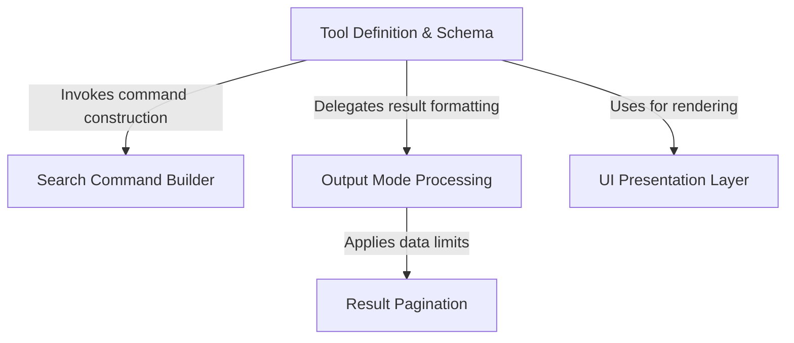

# Tutorial: GrepTool

The project implements a **text search tool** that integrates the `ripgrep` engine with an AI agent interface. It features a robust **schema definition** to validate search parameters, a *command builder* to translate high-level requests into CLI arguments, and an **output processor** that formats results into content, file lists, or counts. The system also manages data volume via **pagination** and includes a **UI layer** to present clear summaries and results to human users.

## Chapters

1. [Tool Definition & Schema](01_tool_definition___schema.md)
2. [UI Presentation Layer](02_ui_presentation_layer.md)
3. [Search Command Builder](03_search_command_builder.md)
4. [Output Mode Processing](04_output_mode_processing.md)
5. [Result Pagination](05_result_pagination.md)

---

Generated by [Code IQ](https://github.com/adityasoni99/Code-IQ)