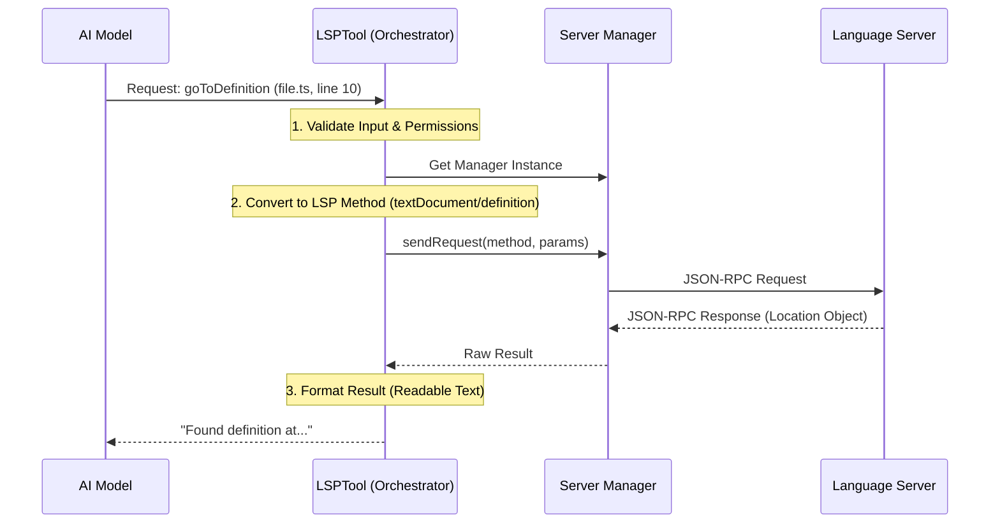

# Chapter 1: LSP Tool Orchestration

Welcome to the **LSPTool** project tutorial! In this series, we will build a powerful bridge between Artificial Intelligence and the tools developers use every day to write code.

## The Motivation: Why do we need this?

Imagine you are an AI trying to understand a massive codebase. You see a function call: `processData()`. You want to know what that function does.

Without help, you might try to search the text files for the string "processData". But what if there are 50 functions named "processData" in different files? How do you know which one is the *real* one being called here?

Modern code editors (like VS Code) solve this using something called the **Language Server Protocol (LSP)**. They "understand" the code structure.

**The Problem:** LSPs speak a complex technical language (JSON-RPC) that is hard to manage directly.
**The Solution:** We need an **Orchestrator**.

## What is LSP Tool Orchestration?

Think of **LSP Tool Orchestration** as a **Conductor** for an orchestra.

*   **The Composer (User/AI):** Wants to hear a specific musical phrase (find a definition).
*   **The Orchestra (LSP Server):** Has all the instruments and talent to play the notes, but needs direction.
*   **The Conductor (LSPTool):** Takes the request from the Composer, ensures the Orchestra is ready, tells the specific section (e.g., the violins) to play, and presents the result back to the Composer.

The Orchestrator handles the messy details so the AI doesn't have to.

## How to Use It

At a high level, the AI sends a simplified command to our tool.

**Example Input (The Request):**
```json
{
  "operation": "goToDefinition",
  "filePath": "/projects/my-app/src/utils.ts",
  "line": 15,
  "character": 8
}
```

**Example Output (The Result):**
```text
Found definition in file: /projects/my-app/src/defs.ts
Line: 42, Character: 1
Content: export function calculateTotal(a, b) { ... }
```

The Orchestrator takes that simple input, does all the heavy lifting, and returns the clear answer.

## Code Walkthrough: The Conductor's Baton

Let's look at how we build this Orchestrator in `LSPTool.ts`. We use a helper called `buildTool` to define how our conductor behaves.

### 1. Defining the Tool
First, we give the tool a name and description so the AI knows when to use it.

```typescript
// LSPTool.ts
export const LSPTool = buildTool({
  name: 'LSP', // The name the AI sees
  searchHint: 'code intelligence (definitions, references...)',
  
  // This tells the AI what this tool does
  async description() {
    return DESCRIPTION
  },
  
  // ... configuration continues
})
```
*Explanation:* This is the ID card of our tool. It tells the system, "I am the LSP tool, and I help with code intelligence."

### 2. The Input Schema
We need to define strictly what "notes" the conductor accepts. We can't just ask for "some code stuff"; we need specific operations.

```typescript
// LSPTool.ts
// We use 'zod' to define the shape of valid inputs
const inputSchema = lazySchema(() =>
  z.strictObject({
    operation: z.enum([
      'goToDefinition', 
      'findReferences', 
      // ... other operations
    ]),
    filePath: z.string(),
    line: z.number().int().positive(),
    character: z.number().int().positive(),
  }),
)
```
*Explanation:* This validates that the AI only asks for operations we support (like `goToDefinition`) and always provides a location (file, line, character).

### 3. The "Call" Method
This is the main event loop. When the AI uses the tool, this function runs.

```typescript
// LSPTool.ts
async call(input: Input, _context) {
  const absolutePath = expandPath(input.filePath)

  // 1. Check if the "Orchestra" (Server) is ready
  const manager = getLspServerManager()
  
  // 2. Translate the request into specific instructions
  const { method, params } = getMethodAndParams(input, absolutePath)

  // 3. Ask the manager to execute the request
  let result = await manager.sendRequest(absolutePath, method, params)

  // 4. Format and return the answer
  return { data: formatResult(input.operation, result) }
}
```
*Explanation:* This is the core logic. It prepares the path, converts the operation to something the server understands, sends it, and packages the result.

## Under the Hood: The Orchestration Flow

What actually happens when that `call` function runs? Let's visualize the sequence.



### Routing the Request
One of the most important jobs of the Orchestrator is translation. The AI says `goToDefinition`, but the LSP Server expects `textDocument/definition`.

We handle this translation in a specific helper function:

```typescript
// LSPTool.ts
function getMethodAndParams(input: Input, path: string) {
  // Convert line numbers: User uses 1-based, LSP uses 0-based
  const position = {
    line: input.line - 1,
    character: input.character - 1,
  }

  switch (input.operation) {
    case 'goToDefinition':
      return {
        method: 'textDocument/definition', // The LSP technical name
        params: { textDocument: { uri: path }, position },
      }
    // ... other cases for hover, references, etc.
  }
}
```
*Explanation:* This switch statement acts as a router. It ensures that `findReferences` gets routed to `textDocument/references` and creates the exact parameter object the LSP standard requires.

### Handling Permissions
Before we even route the request, we must ensure safety. We don't want the AI looking at files it shouldn't access.

```typescript
// LSPTool.ts
async validateInput(input: Input): Promise<ValidationResult> {
  // Check if file exists on disk
  const fs = getFsImplementation()
  const absolutePath = expandPath(input.filePath)
  
  try {
    const stats = await fs.stat(absolutePath)
    if (!stats.isFile()) return { result: false, message: "Not a file" }
  } catch (error) {
    return { result: false, message: "File does not exist" }
  }

  return { result: true }
}
```
*Explanation:* This step happens *before* the `call` function. If the file doesn't exist or isn't a regular file, we stop immediately and tell the AI what went wrong.

## Summary

In this chapter, we've established the foundation of **LSP Tool Orchestration**. We learned:
1.  **The Concept:** The tool acts as a conductor between the AI and the Language Server.
2.  **The Structure:** We define a `buildTool` with input schemas and a `call` method.
3.  **The Flow:** We validate inputs, translate operations to LSP methods, execute them, and format the results.

This orchestration is the "brain" of the operation. However, for the brain to work, it needs to understand exactly what defines a valid request in more detail.

[Next Chapter: Operation Schemas & Validation](02_operation_schemas___validation.md)

---

Generated by [Code IQ](https://github.com/adityasoni99/Code-IQ)