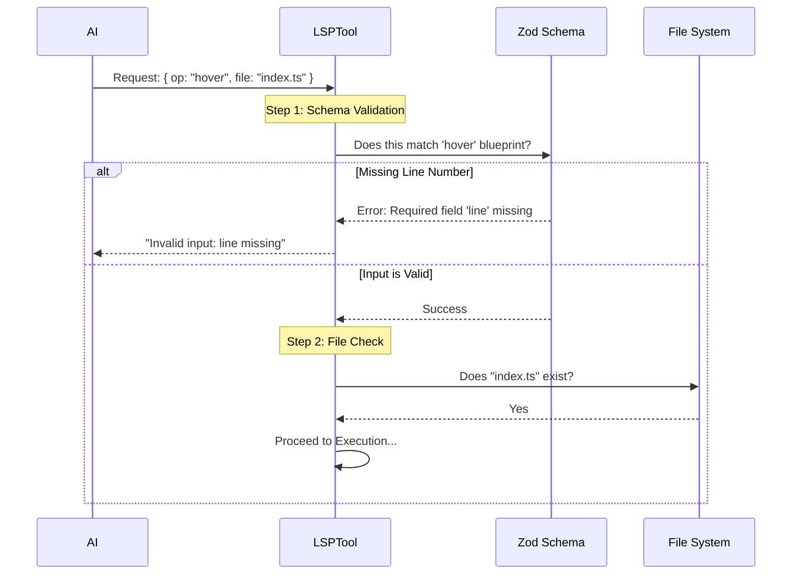

# Chapter 2: Operation Schemas & Validation

Welcome back! In the previous chapter, [LSP Tool Orchestration](01_lsp_tool_orchestration.md), we built the "Conductor" that manages the relationship between the AI and the Language Server.

However, a conductor needs a score to follow. If the AI sends a request like "Please find code," the conductor won't know what to do. It needs specific instructions like "Go to definition in `file.ts` at line 10."

In this chapter, we will build the strict rules—the **Schemas**—that define exactly what a valid request looks like.

## The Motivation: The "Customs Officer"

Imagine you are at an airport. To get through customs, you need to present documents.

*   **Scenario A:** You are a tourist. The officer asks for your **Visa**.
*   **Scenario B:** You are a returning citizen. The officer asks for your **Passport**.

The *type* of traveler you are determines the *structure* of data you must provide.

In our **LSPTool**, it works the same way:
*   If the operation is `workspaceSymbol`, we might need a search query.
*   If the operation is `goToDefinition`, we strictly need a `filePath`, `line`, and `character`.

We need a system to enforce these rules *before* the code tries to run. If we don't, the tool will crash when data is missing.

## Concept: Zod and Schemas

To solve this, we use a library called **Zod**. Zod allows us to create a "blueprint" (Schema) of what our data should look like.

If the input doesn't match the blueprint, Zod stops it immediately and explains exactly what is wrong.

### 1. Defining a Single Operation
Let's look at `schemas.ts`. Here is how we define the requirements for the "Go to Definition" operation.

```typescript
// schemas.ts
const goToDefinitionSchema = z.strictObject({
  // This is the "tag" that identifies this specific operation
  operation: z.literal('goToDefinition'),
  
  // These are the required "documents" for this operation
  filePath: z.string().describe('The path to the file'),
  line: z.number().int().positive(),
  character: z.number().int().positive(),
})
```
*Explanation:* We demand four things. If `line` is missing or if `character` is a negative number, this schema will reject the request.

### 2. The Discriminated Union
Now, here is the magic part. We have many operations (`hover`, `findReferences`, etc.). We group them together into a **Discriminated Union**.

"Discriminated" means we use one specific field (in this case, `operation`) to decide which blueprint to check against.

```typescript
// schemas.ts
export const lspToolInputSchema = lazySchema(() => {
  return z.discriminatedUnion('operation', [
    goToDefinitionSchema,
    findReferencesSchema,
    hoverSchema,
    // ... other schemas added here
  ])
})
```
*Explanation:* This tells Zod: "Look at the `operation` field. If it says 'goToDefinition', use the definition schema. If it says 'hover', use the hover schema."

## How to Use It: Validation Logic

Now that we have our blueprints, how do we use them? We apply them inside the `LSPTool.ts` file, specifically in the `validateInput` method.

This acts as our security checkpoint.

```typescript
// LSPTool.ts
async validateInput(input: Input): Promise<ValidationResult> {
  // 1. Check the input against our strict blueprints
  const parseResult = lspToolInputSchema().safeParse(input)
  
  // 2. If the blueprints don't match, stop immediately
  if (!parseResult.success) {
    return {
      result: false,
      message: `Invalid input: ${parseResult.error.message}`,
    }
  }
  
  // ... continue to check if file exists on disk
  return { result: true }
}
```
*Explanation:*
1.  `safeParse(input)`: This runs the Customs Officer check.
2.  `!parseResult.success`: If the check fails (e.g., missing line number), we return `false` and an error message. The tool never even tries to run the logic.

## Under the Hood: The Validation Flow

Let's visualize exactly what happens when an AI sends a request.



### Why two schemas?
If you look closely at `LSPTool.ts`, you might notice something interesting. We actually define schemas in two places.

1.  **The Tool Definition Schema (`inputSchema`):**
    ```typescript
    // LSPTool.ts
    const inputSchema = lazySchema(() =>
      z.strictObject({
        operation: z.enum(['goToDefinition', 'hover', ...]),
        filePath: z.string(),
        line: z.number(),
        character: z.number(),
      })
    )
    ```
    *Why do we have this?* This is a simplified version we show to the AI model. It's easier for the AI to understand "Fill out these 4 fields" than to understand a complex set of varying rules.

2.  **The Strict Validation Schema (`lspToolInputSchema` in `schemas.ts`):**
    This is the one using `discriminatedUnion` we discussed above. We use this internally to be 100% sure the data is correct before using it.

## Code Walkthrough: Type Safety

Because we use Zod, TypeScript knows exactly what our data looks like. This helps us write bug-free code.

```typescript
// schemas.ts
// This creates a TypeScript type automatically from our Zod blueprint
export type LSPToolInput = z.infer<ReturnType<typeof lspToolInputSchema>>

// LSPTool.ts
export function isValidLSPOperation(op: string): boolean {
  // A helper to check if a string is a valid operation name
  return ['goToDefinition', 'hover', /*...*/].includes(op)
}
```
*Explanation:* `z.infer` translates our validation rules into TypeScript types. If we change the Zod schema, our TypeScript types update automatically!

## Summary

In this chapter, we learned how to be strict "Customs Officers" for our tool:

1.  **Zod Schemas:** We defined blueprints for every operation (definition, hover, references).
2.  **Discriminated Unions:** We grouped these blueprints so the `operation` name decides which rules apply.
3.  **Validation:** We implemented `validateInput` to reject bad requests before they cause crashes.

Now that we know our input is valid and safe, we can move on to the part the user actually sees.

[Next Chapter: User Interface (UI) Components](03_user_interface__ui__components.md)

---

Generated by [Code IQ](https://github.com/adityasoni99/Code-IQ)