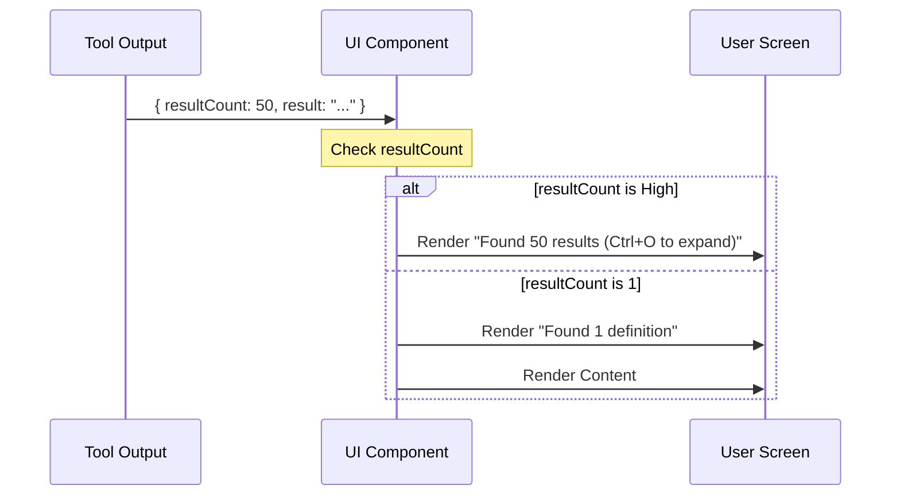

# Chapter 3: User Interface (UI) Components

Welcome back! In the previous chapter, [Operation Schemas & Validation](02_operation_schemas___validation.md), we acted as "Customs Officers," ensuring that every request the AI makes is valid and safe.

Now that we have valid data and the tool is running, we face a new problem: **How do we show the results?**

## The Motivation: The Dashboard

Imagine you are driving a car.
*   **Raw Data:** The engine is spinning at 3,000 RPM, the fuel injector is pulsing every 10ms, and the wheels are rotating 15 times a second.
*   **The Dashboard:** Shows you "60 MPH" and "Half Tank."

If the AI (or the human developer watching the AI) had to read raw JSON database dumps for every action, it would be overwhelming.

**The Goal:** We need a **UI (User Interface)** that acts as a dashboard. It should take complex data and render simple, human-readable summaries in the terminal.

## Key Concepts

We use a library called **Ink** (React for the Command Line) to build our UI.

### 1. Two Types of Messages
In our chat interface, every tool interaction has two parts:
1.  **Tool Use:** "I am starting to look for X..." (The Request)
2.  **Tool Result:** "Here is what I found..." (The Result)

### 2. Information Management
Sometimes a search finds 1 result. Sometimes it finds 500.
*   If we find 1 result, show it.
*   If we find 500, **do not** flood the screen. Show a summary like *"Found 500 results"* and let the user expand it if they want.

## The "Tool Use" Message

When the AI decides to call a function (like `goToDefinition`), we want to show a concise status update.

Instead of showing `{ op: 'goToDefinition', line: 15, char: 8 }`, we want to show:
`operation: "goToDefinition", symbol: "processData", in: "utils.ts"`

Here is how `renderToolUseMessage` handles this in `UI.tsx`:

```typescript
// UI.tsx
export function renderToolUseMessage(input: Partial<Input>) {
  // 1. If we have a specific file and position...
  if (input.filePath && input.line && input.character) {
    
    // 2. Try to find the actual word/symbol at that spot
    const symbol = getSymbolAtPosition(
      input.filePath, 
      input.line - 1, 
      input.character - 1
    );

    // 3. Return a readable string
    if (symbol) {
      return `operation: "${input.operation}", symbol: "${symbol}"`;
    }
  }
  // ... fallback logic
}
```
*Explanation:* We do a little extra work here. We don't just repeat the line number; we look up the *symbol* (the word) at that line to make the message friendlier.

## The "Tool Result" Message

Once the LSP server replies, we need to display the findings. This is handled by `renderToolResultMessage`.

We prioritize clarity. We use a helper component called `LSPResultSummary`.

```typescript
// UI.tsx
export function renderToolResultMessage(output: Output, /*...*/) {
  // If we have count data (meaning the operation was successful)
  if (output.resultCount !== undefined) {
    return (
      <LSPResultSummary 
        operation={output.operation} 
        resultCount={output.resultCount} 
        fileCount={output.fileCount} 
        content={output.result} 
      />
    );
  }
  
  // Fallback for errors or simple messages
  return <Text>{output.result}</Text>;
}
```

## Under the Hood: Rendering Logic

How does the component decide whether to show a massive list or a tiny summary? Let's trace the decision flow.



### The Label Logic
To make the UI feel natural, we map technical operation names to English grammar. We don't want to say "Found 5 goToDefinition(s)."

```typescript
// UI.tsx
const OPERATION_LABELS = {
  goToDefinition: { 
    singular: 'definition', 
    plural: 'definitions' 
  },
  findReferences: { 
    singular: 'reference', 
    plural: 'references' 
  },
  // ... maps other operations
};
```

### The Summary Component
The `LSPResultSummary` component combines the count, the label, and the collapsing logic.

```typescript
// UI.tsx (Simplified)
function LSPResultSummary({ operation, resultCount, fileCount }) {
  // 1. Get the English label
  const config = OPERATION_LABELS[operation];
  const label = resultCount === 1 ? config.singular : config.plural;

  // 2. Construct the main message
  // Example: "Found 5 references"
  const text = <Text>Found <Text bold>{resultCount}</Text> {label}</Text>;

  // 3. Add expand hint if there are many results
  const expandHint = resultCount > 0 ? <CtrlOToExpand /> : null;

  return (
    <Box>
      {text} {expandHint}
    </Box>
  );
}
```
*Explanation:*
1.  We look up the label (e.g., "references").
2.  We build a bolded text string showing the count.
3.  We add the `<CtrlOToExpand />` component, which tells the user they can press a key to see the full raw data if they really need to.

## Putting it Together

By using these components, the user experience changes dramatically.

**Without UI Components:**
```json
{
  "uri": "file:///src/app.ts",
  "range": { "start": { "line": 10, "character": 5 }, "end": { ... } }
}
```

**With UI Components:**
```text
Found 1 definition in app.ts
   Line 10: class Application { ...
```

This abstraction layer keeps the developer focused on coding, not decoding JSON.

## Summary

In this chapter, we learned how to build a visual "Dashboard" for our tool:
1.  **Ink:** We use React components to render text in the terminal.
2.  **Tool Use:** We create readable descriptions of what the tool is *about* to do.
3.  **Tool Result:** We summarize the output, using singular/plural labels and collapsing large lists to prevent screen clutter.

Now the user can *see* the result clearly. But wait—where did the actual code content come from? The LSP often just returns line numbers, not the code itself.

In the next chapter, we will learn how we grab the actual source code text to display to the user.

[Next Chapter: Context Extraction](04_context_extraction.md)

---

Generated by [Code IQ](https://github.com/adityasoni99/Code-IQ)