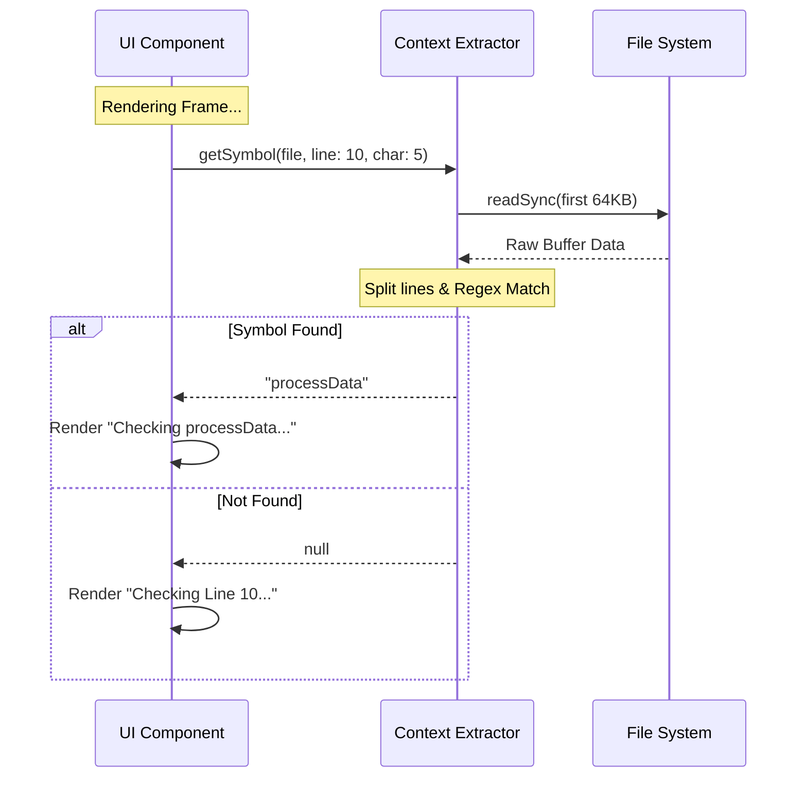

# Chapter 4: Context Extraction

Welcome back! In the previous chapter, [User Interface (UI) Components](03_user_interface__ui__components.md), we built a beautiful dashboard to display what our tool is doing. We learned how to render messages like "Checking definition..."

However, there is a small missing piece.

## The Motivation: The "Blind Finger" Problem

Imagine you are looking at a paper map with a friend.
*   **Friend (AI):** "I am pointing at Grid Coordinate X:15, Y:8."
*   **You:** "Okay... but what *town* is that?"

Coordinates alone are accurate, but they aren't **human-readable**.

When the AI decides to run a tool, it gives us coordinates:
```json
{ "file": "utils.ts", "line": 15, "character": 8 }
```

If we just show this to the user, they have to mentally map line 15 to their code. We want the UI to say:
> "Looking up definition for **'processData'** in utils.ts"

To do this, we need a utility that acts like a **Magnifying Glass**. It needs to peek at the file on the hard drive, go to that specific line, and extract the exact word sitting at that coordinate. We call this **Context Extraction**.

## Key Concepts

This might sound simple (just read the file, right?), but there are three specific challenges we need to solve to make it work in a real-time UI.

### 1. The "Snapshot" (Synchronous Reading)
Usually, reading files in JavaScript is *asynchronous* (using Promises/await) so the program doesn't freeze.

However, our UI library (Ink/React) renders **frames**. When it's time to draw a frame, we can't say "Wait a second, let me go check the hard drive." We need the data *instantly*, right now, in the middle of the render loop.

Therefore, we use **Synchronous** file reading (`readSync`). We grab the data immediately so the UI can display it in the very same frame.

### 2. The "Flashlight" (Partial Reading)
What if the file is a 500MB log file? If we try to read the whole thing instantly, the tool will freeze.

We only need to see one specific line. So, we use a "Flashlight" approach: we only read the first **64KB** of the file. This covers about 1,000 lines of code, which is enough for 99% of cases where a developer is actively working.

### 3. The "Word Boundary"
If the line of code is:
`const maxSpeed = 100;`

And the cursor is on the letter `S` in `Speed`, we don't just want the letter "S". We want the whole word `maxSpeed`. We need a way to detect where a word starts and ends.

## How to Use It

We use a function called `getSymbolAtPosition`.

**Input:**
*   File path: `src/app.ts`
*   Line: `10`
*   Character: `5`

**Internal Action:**
1.  Open `src/app.ts`.
2.  Jump to Line 10.
3.  Find the word surrounding character 5.

**Output:**
*   Result: `"myFunctionName"`

If the file doesn't exist or the line is empty, it simply returns `null`, and our UI falls back to just showing the line number.

## Code Walkthrough

Let's look at `symbolContext.ts` to see how this is implemented.

### 1. The Efficient Read
First, we setup our "Flashlight". We define a buffer limit so we never accidentally read a massive file into memory.

```typescript
// symbolContext.ts
const MAX_READ_BYTES = 64 * 1024 // 64KB limit

export function getSymbolAtPosition(path: string, line: number, char: number) {
  try {
    const fs = getFsImplementation()
    // expandPath resolves "~/" to the home directory
    const absPath = expandPath(path)

    // Read only the first 64KB synchronously
    const { buffer, bytesRead } = fs.readSync(absPath, {
      length: MAX_READ_BYTES,
    })
    // ... processing continues
```
*Explanation:* We use `fs.readSync`. This is dangerous in a web server, but essential here for a CLI tool's UI rendering. We cap the read at 64KB.

### 2. Locating the Line
We convert the raw bytes we read into text, split it by newlines, and find the specific line the AI asked for.

```typescript
    // Convert buffer to text string
    const content = buffer.toString('utf-8', 0, bytesRead)
    const lines = content.split('\n')

    // Safety check: Does this line exist?
    if (line < 0 || line >= lines.length) {
      return null
    }

    const lineContent = lines[line]
    // ... now we have the specific string of code
```
*Explanation:* If the AI asks for Line 500, but our 64KB read only got to Line 400, `lines[line]` will be undefined. We return `null` safely.

### 3. Finding the Symbol (Regex)
This is the trickiest part. We have a string like `"function init() {"`. We have a cursor position. We need to find which word the cursor is touching.

We use a **Regular Expression (Regex)** to iterate through every word in the line.

```typescript
    // Matches words (alphanumeric) or operators (+, -, *, etc.)
    const symbolPattern = /[\w$'!]+|[+\-*/%&|^~<>=]+/g
    let match

    // Loop through every word found in the line
    while ((match = symbolPattern.exec(lineContent)) !== null) {
      const start = match.index
      const end = start + match[0].length

      // Check: Is our target character inside this word?
      if (char >= start && char < end) {
        return match[0] // Found it! Return the word "init"
      }
    }
```
*Explanation:* 
1.  `symbolPattern`: Looks for "word-like" things (letters, numbers, underscores) OR "operator-like" things (`+`, `-`, `=`).
2.  `while`: We scan the line from left to right.
3.  `if`: If the cursor position (`char`) falls between the `start` and `end` of a match, that's our symbol!

## Under the Hood: The Flow

Let's visualize exactly what happens when the UI component tries to render a message.



### Why Graceful Failure Matters
Notice the `try...catch` block in the full code?

Because this function runs *during* a UI render, if it throws an error (crash), the entire interface would disappear.

If `fs.readSync` fails (maybe the file was deleted 1 second ago), we catch the error, log it quietly for debugging, and return `null`. The user just sees "Line 10" instead of the symbol name, but the tool keeps running smoothly.

```typescript
  } catch (error) {
    // If anything goes wrong, log it but don't crash the UI
    if (error instanceof Error) {
      logForDebugging(`Extraction failed: ${error.message}`)
    }
    return null
  }
}
```

## Summary

In this chapter, we added a layer of polish to our tool by implementing **Context Extraction**.

1.  **The Goal:** Turn raw coordinates into human-readable names.
2.  **The Method:** We use `readSync` to peek at the file content instantly during rendering.
3.  **The Safety:** We only read the start of the file (64KB) and handle all errors gracefully to prevent UI crashes.

Now, our UI is smart. It tells the user *what* code is being analyzed, not just *where* it is.

But what happens when the LSP server responds with complex data? How do we format that for the AI?

[Next Chapter: Response Formatting](05_response_formatting.md)

---

Generated by [Code IQ](https://github.com/adityasoni99/Code-IQ)