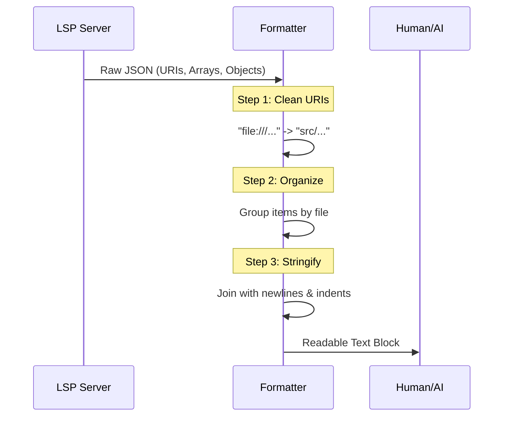

# Chapter 5: Response Formatting

Welcome back! in the previous chapter, [Context Extraction](04_context_extraction.md), we gave our tool a "Magnifying Glass" to read code surrounding a specific cursor position.

Now, we are at the final stage of the tool's execution. We sent a request, the LSP server processed it, and it sent back a result.

## The Motivation: The "Translator"

The Language Server Protocol is designed for machines, not humans. When it answers a question like "Where is this defined?", it replies with raw, technical data.

**The Raw Response (What the Server sends):**
```json
{
  "uri": "file:///c%3A/Users/Dev/projects/my-app/src/utils/helpers.ts",
  "range": {
    "start": { "line": 4, "character": 0 },
    "end": { "line": 4, "character": 15 }
  }
}
```

If we show this to a human (or an AI agent trying to read code), it's messy:
1.  **URI Encoding:** `%3A` instead of `:`.
2.  **Protocol:** `file:///` prefix.
3.  **Length:** Full absolute paths are hard to read quickly.
4.  **Zero-indexing:** Lines start at 0, but humans count from 1.

**The Goal:** We need a **Response Formatter**. It acts like a translator that turns that messy JSON into:
> `Defined in src/utils/helpers.ts:5:1`

## Key Concepts

To build this translator, we need to solve three specific formatting challenges.

### 1. URI Sanitization
LSP servers use **URIs** (Uniform Resource Identifiers). Operating systems use **File Paths**.
*   **URI:** `file:///project/space%20name/file.ts`
*   **Path:** `/project/space name/file.ts`

We need a helper to strip the protocol, decode special characters (like `%20`), and make the path relative to our current project folder so it's shorter.

### 2. Grouping
When you ask "Find References" for a popular function, you might get 50 results.
*   **Bad:** Listing the full filename 50 times (once for every match).
*   **Good:** Listing the filename *once*, followed by the 50 line numbers found inside it.

### 3. Tree Rendering
Code is hierarchical. A Class contains Methods. Methods contain Variables.
When we ask for "Document Symbols" (an outline of the file), we need to draw a tree structure using indentation so the user can understand the relationship.

## How to Use It

We don't call these formatters manually in the UI. Instead, the `LSPTool` calls them automatically right before returning data to the AI.

**Input (Code):**
```typescript
const result = await server.sendRequest('textDocument/definition', params);
return formatGoToDefinitionResult(result, process.cwd());
```

**Output (String):**
```text
Found 2 definitions:
  src/interfaces.ts:10:5
  src/impl/user.ts:22:1
```

## Under the Hood: The Formatting Flow

Let's visualize how raw data transforms into readable text.



## Code Walkthrough

Let's look at `formatters.ts` to see how we implement these concepts.

### 1. The URI Cleaner
This is the most used helper function. It handles the translation from "Computer Speak" (URI) to "Human Speak" (Relative Path).

```typescript
// formatters.ts
function formatUri(uri: string | undefined, cwd?: string): string {
  if (!uri) return '<unknown location>'

  // 1. Remove the 'file://' prefix
  let filePath = uri.replace(/^file:\/\//, '')
  
  // 2. Decode special characters (e.g., %20 becomes a space)
  filePath = decodeURIComponent(filePath)

  // 3. Make it relative to the project root (shorter is better)
  if (cwd) {
    const relativePath = relative(cwd, filePath)
    return relativePath
  }
  
  return filePath
}
```
*Explanation:* We strip the prefix, fix the encoding, and use Node.js's `relative` path function to chop off the messy start of the path.

### 2. Grouping References
When finding references, we want to group them by file. We use a `Map` where the key is the filename, and the value is a list of locations.

```typescript
// formatters.ts
function groupByFile(items: Location[], cwd?: string) {
  const byFile = new Map<string, Location[]>()
  
  for (const item of items) {
    const filePath = formatUri(item.uri, cwd)
    
    // If we haven't seen this file, start a new list
    if (!byFile.has(filePath)) {
      byFile.set(filePath, [])
    }
    // Add the location to that file's list
    byFile.get(filePath)!.push(item)
  }
  return byFile
}
```
*Explanation:* This transforms a flat list of 50 items into a neat collection where each file holds its own matches.

### 3. Rendering the Output
Finally, we iterate through our groups to build the final string.

```typescript
// formatters.ts
export function formatFindReferencesResult(result: Location[], cwd?: string) {
  // ... safety checks ...

  const byFile = groupByFile(result, cwd)
  const lines: string[] = []

  for (const [filePath, locations] of byFile) {
    lines.push(`\n${filePath}:`) // Print Filename once
    
    for (const loc of locations) {
      // Print every line number in that file
      const line = loc.range.start.line + 1 // Add 1 for humans
      lines.push(`  Line ${line}`)
    }
  }
  return lines.join('\n')
}
```
*Explanation:* We loop through the files, print the name, and then loop through the locations inside that file, indenting them for clarity.

### 4. Recursive Tree Symbols
For document symbols (the outline of a file), we deal with nested data. A Class has Children (Methods). We use **Recursion**—a function that calls itself.

```typescript
// formatters.ts
function formatDocumentSymbolNode(symbol: DocumentSymbol, indent: number = 0) {
  const prefix = '  '.repeat(indent) // Increase spaces based on depth
  const lines = [`${prefix}${symbol.name}`]

  // If this symbol has children, process them with indent + 1
  if (symbol.children) {
    for (const child of symbol.children) {
      // RECURSION: The function calls itself!
      lines.push(...formatDocumentSymbolNode(child, indent + 1))
    }
  }
  return lines
}
```
*Explanation:*
1.  Print the item with standard indentation.
2.  Check for children.
3.  If children exist, run the *same logic* on them, but increase the indentation level by 1.

## Summary

In this chapter, we learned how to be a polite "Translator" for the AI:
1.  **URI Cleaning:** We convert technical URIs into friendly relative paths.
2.  **Grouping:** We organize lists of references by file to reduce clutter.
3.  **Recursion:** We use recursive functions to draw beautiful tree structures for code outlines.

At this point, we have a fully functional LSP tool! It accepts input, validates it, talks to the server, extracts context, and formats the answer.

However, there is one final problem. In large projects, there are often thousands of files we *don't* care about (like `node_modules` or build artifacts). Searching them wastes time and tokens.

In the final chapter, we will learn how to ignore the noise.

[Next Chapter: Git-Aware Filtering](06_git_aware_filtering.md)

---

Generated by [Code IQ](https://github.com/adityasoni99/Code-IQ)