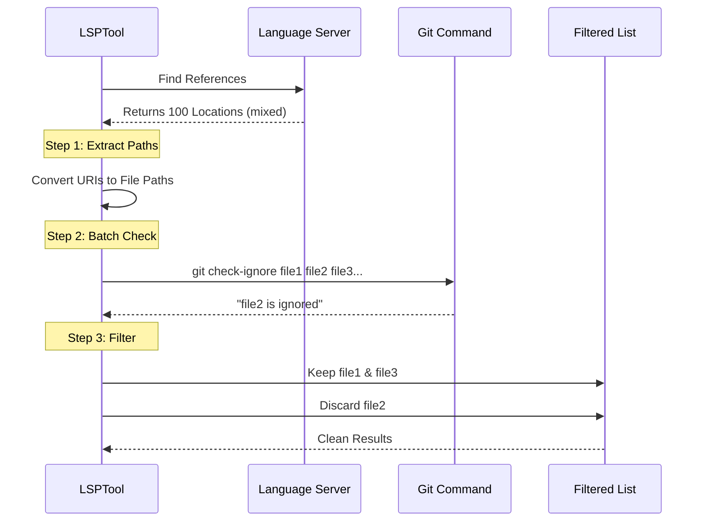

# Chapter 6: Git-Aware Filtering

Welcome to the final chapter of our **LSPTool** tutorial series! 

In the previous chapter, [Response Formatting](05_response_formatting.md), we learned how to translate raw server data into readable text. We made the output look good.

Now, we need to make sure the output is **relevant**.

## The Motivation: The "Junk Drawer" Problem

Imagine you are looking for your house keys. You ask a robot, "Find my keys."

*   **Robot A (Unfiltered):** dumps 500 keys on the table. 2 are your house keys, and 498 are old, rusty duplicates found in the junk drawer.
*   **Robot B (Filtered):** ignores the junk drawer and gives you just the 2 house keys.

In programming, the "junk drawer" is usually the `node_modules` folder (or `dist`, `build`, `target`). These folders contain millions of lines of code that belong to other people's libraries.

**The Problem:** When we ask the LSP to "Find References," it often finds hundreds of matches inside these library folders. This floods the AI with useless information and wastes money (tokens).

**The Solution:** We need **Git-Aware Filtering**. If a file is in your `.gitignore` file (meaning you don't track it), we shouldn't show it in the search results.

## Key Concepts

To solve this, we rely on the version control system itself: **Git**.

### 1. The Allow-list vs. Block-list
Instead of trying to guess which folders are bad ("Is it node_modules? Is it vendor?"), we ask the ultimate authority: the project's `.gitignore` file.

### 2. The Check-Ignore Command
Git has a specific command: `git check-ignore`.
You give it a list of files, and it replies with the ones that are ignored. We don't need to write complex logic; we just delegate the decision to Git.

### 3. Batching
Running a command line tool is "expensive" (slow). If we have 1,000 files to check, we shouldn't run the git command 1,000 times.
Instead, we **Batch** them. We send 50 files at once in a single command.

## How to Use It

This feature works automatically inside the `LSPTool`. You don't need to configure it.

**Input (from LSP Server):**
```json
[
  { "uri": "file:///src/user.ts" },
  { "uri": "file:///node_modules/react/index.js" },
  { "uri": "file:///dist/build.js" }
]
```

**Process:**
The tool asks Git: "Which of these are ignored?"
Git replies: "`node_modules/react/index.js` and `dist/build.js`".

**Output (to User/AI):**
```json
[
  { "uri": "file:///src/user.ts" }
]
```

## Under the Hood: The Filtering Flow

Let's visualize how the tool acts as a bouncer, checking files against the "Guest List" (Git).



## Code Walkthrough

This logic resides in `LSPTool.ts`. Let's break down how we implement this efficiently.

### 1. The Main Trigger
Inside the `call` method, after we get results from the server but *before* we format them, we run the filter.

```typescript
// LSPTool.ts

// 1. Get raw results from LSP
result = await manager.sendRequest(absolutePath, method, params)

// 2. If this is a search operation (references, definitions)...
if (input.operation === 'findReferences' /* ... or others */) {
  
  // 3. Extract just the locations
  const locations = (result as Location[]).map(toLocation)
  
  // 4. Run the Git Filter
  const filteredLocations = await filterGitIgnoredLocations(
    locations, 
    cwd // Current Working Directory
  )

  // 5. Update the result with only the good locations
  // ... (logic to replace result with filteredLocations)
}
```
*Explanation:* We intercept the data flow. If the operation is a "search" type, we pause to clean the data.

### 2. The Filter Function
This helper function manages the complexity of batching.

```typescript
// LSPTool.ts
async function filterGitIgnoredLocations(locations, cwd) {
  // 1. Get unique file paths (remove duplicates)
  const uriToPath = new Map()
  // ... (logic to populate map) ...
  const uniquePaths = uniq(uriToPath.values())

  const ignoredPaths = new Set()
  const BATCH_SIZE = 50

  // 2. Loop through paths in chunks of 50
  for (let i = 0; i < uniquePaths.length; i += BATCH_SIZE) {
    const batch = uniquePaths.slice(i, i + BATCH_SIZE)
    
    // 3. Run the git check
    await checkBatchWithGit(batch, ignoredPaths, cwd)
  }
  
  // 4. Return only locations NOT in the ignored set
  return locations.filter(loc => {
    const path = uriToPath.get(loc.uri)
    return !ignoredPaths.has(path)
  })
}
```
*Explanation:* We create a "Set" (a list of unique items) of ignored paths. We fill this set by asking Git, then we use it to filter our original list.

### 3. Calling Git
Finally, here is how we actually talk to the Git command line.

```typescript
// LSPTool.ts
// (Simplified logic inside the loop)
const result = await execFileNoThrowWithCwd(
  'git',
  ['check-ignore', ...batch], // Pass the files as arguments
  { cwd, timeout: 5000 }      // Run in project folder
)

if (result.code === 0 && result.stdout) {
  // Git returns the names of the files that ARE ignored
  const lines = result.stdout.split('\n')
  lines.forEach(line => ignoredPaths.add(line.trim()))
}
```
*Explanation:*
1.  We run `git check-ignore fileA fileB fileC`.
2.  If `fileB` is ignored, Git prints `fileB` to standard output (stdout).
3.  We add `fileB` to our `ignoredPaths` block-list.

## Why this matters for AI

When you pay for AI by the token (word), silence is golden.

By filtering out `node_modules`:
1.  **Cost:** You save money by not processing thousands of irrelevant lines.
2.  **Accuracy:** The AI doesn't get confused by 5 different versions of a function found in library backups.
3.  **Speed:** Less text to format and display means a snappier UI.

## Tutorial Conclusion

Congratulations! You have completed the **LSPTool Construction Tutorial**.

We have built a sophisticated tool that bridges the gap between AI and professional coding environments. Let's recap what we built:

1.  **[Orchestration](01_lsp_tool_orchestration.md):** The conductor that manages the server connection.
2.  **[Validation](02_operation_schemas___validation.md):** The security guard that ensures safe inputs.
3.  **[UI Components](03_user_interface__ui__components.md):** The dashboard that displays progress.
4.  **[Context Extraction](04_context_extraction.md):** The magnifying glass that reads code files.
5.  **[Formatting](05_response_formatting.md):** The translator that makes data readable.
6.  **Git-Aware Filtering:** The quality control that removes noise.

You now have a deep understanding of how to build robust, production-ready tools for AI agents. Happy coding!

---

Generated by [Code IQ](https://github.com/adityasoni99/Code-IQ)