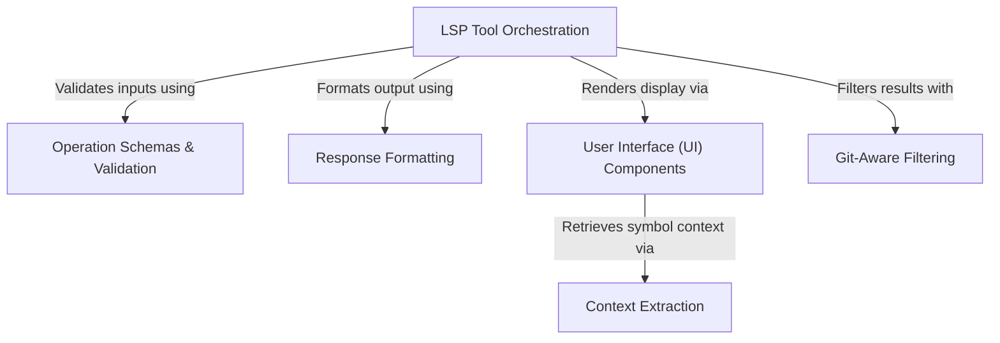

# Tutorial: LSPTool

This project implements a bridge between an AI model and **Language Server Protocol (LSP)** servers, enabling code intelligence features like *finding definitions*, *references*, and *symbols*. It orchestrates the entire workflow: validating user requests against strict schemas, querying the underlying LSP server, filtering out irrelevant (git-ignored) results, and converting complex technical responses into human-readable text and UI components.

## Chapters

1. [LSP Tool Orchestration](01_lsp_tool_orchestration.md)
2. [Operation Schemas & Validation](02_operation_schemas___validation.md)
3. [User Interface (UI) Components](03_user_interface__ui__components.md)
4. [Context Extraction](04_context_extraction.md)
5. [Response Formatting](05_response_formatting.md)
6. [Git-Aware Filtering](06_git_aware_filtering.md)

---

Generated by [Code IQ](https://github.com/adityasoni99/Code-IQ)