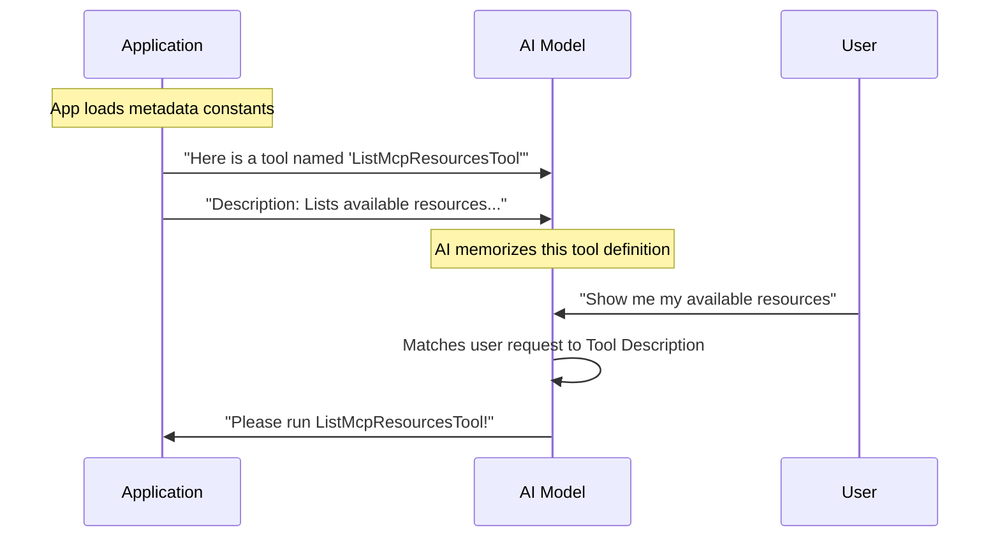

# Chapter 1: Tool Metadata

Welcome to the first chapter of building the `ListMcpResourcesTool`! Before we write complex logic or handle data, we need to start with the basics: **Identity**.

## Why do we need Metadata?

Imagine you hired a new assistant. On their first day, you hand them a toolbox containing a specialized gadget. If you don't tell them what the gadget is called, what it does, or how to hold it, they won't use it—even if it's exactly what they need to solve a problem.

**Tool Metadata** is exactly that: a user manual for the Artificial Intelligence (AI).

In this project, we are building a tool that lets the AI look up resources. Our metadata needs to answer three questions for the AI:
1.  **Name:** What do I call this tool?
2.  **Description:** When should I use this tool?
3.  **Prompt:** How do I use this tool correctly?

## The Code: Defining the Identity

We define these "identity" details as constant text strings. This keeps our code clean and makes it easy to update the instructions for the AI later.

We will be working in a file named `prompt.ts`.

### 1. The Tool Name
First, we give our tool a unique name.

```typescript
// --- File: prompt.ts ---

// The unique identifier for the tool
export const LIST_MCP_RESOURCES_TOOL_NAME = 'ListMcpResourcesTool'
```

**Explanation:**
This string is the unique ID. When the AI decides it wants to use this tool, it will ask the system to run `ListMcpResourcesTool`.

### 2. The Description
Next, we write a description. Think of this as the "Elevator Pitch" to the AI.

```typescript
export const DESCRIPTION = `
Lists available resources from configured MCP servers.
Each resource object includes a 'server' field indicating which server it's from.

Usage examples:
- List all resources from all servers: \`listMcpResources\`
- List resources from a specific server: \`listMcpResources({ server: "myserver" })\`
`
```

**Explanation:**
When the AI receives a user question (like "What files do I have access to?"), it scans the descriptions of all available tools. If this description matches the user's intent, the AI picks this tool. We also include small usage examples here to act as a quick hint.

### 3. The Prompt (Detailed Instructions)
Finally, we provide the full prompt. This is the detailed manual.

```typescript
export const PROMPT = `
List available resources from configured MCP servers.
Each returned resource will include all standard MCP resource fields plus a 'server' field 
indicating which server the resource belongs to.

Parameters:
- server (optional): The name of a specific MCP server to get resources from. If not provided,
  resources from all servers will be returned.
`
```

**Explanation:**
This text explains the **inputs** (Parameters) and the **outputs** (what the resource object looks like). It tells the AI specifically about the `server` parameter, teaching it that it can filter results if it wants to.

## Under the Hood: How the AI reads this

You might be wondering: *How does a simple string constant turn into AI behavior?*

Here is a simplified view of what happens when the application starts up.



### Implementation Details

In the actual code implementation, these constants are imported and packaged into a definition object. While we aren't writing the full definition logic yet, here is a preview of how these strings are consumed.

```typescript
import { 
  LIST_MCP_RESOURCES_TOOL_NAME, 
  DESCRIPTION, 
  PROMPT 
} from './prompt';

// Ideally, we package this into a definition object
const toolDefinition = {
  name: LIST_MCP_RESOURCES_TOOL_NAME,
  description: DESCRIPTION,
  instructions: PROMPT
};
```

**Explanation:**
1.  We import the constants we just created.
2.  We group them together.
3.  Later, this object is sent to the AI provider (like OpenAI or Anthropic) during the initialization phase.

## Summary

In this chapter, we defined the **Tool Metadata**. We learned that:
*   Metadata acts as a "User Manual" for the AI.
*   It consists of a **Name** (ID), **Description** (When to use it), and **Prompt** (How to use it).
*   These are just static text strings that guide the AI's decision-making process.

However, text descriptions aren't enough for the computer to actually validate data. We need a strict structure to ensure the AI sends the correct inputs.

In the next chapter, we will learn how to define the strict shape of our data using [Data Schemas](02_data_schemas.md).

---

Generated by [Code IQ](https://github.com/adityasoni99/Code-IQ)