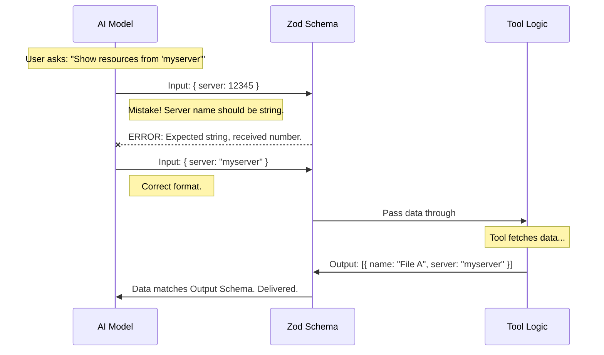

# Chapter 2: Data Schemas

In the previous [Chapter 1: Tool Metadata](01_tool_metadata.md), we gave our tool an identity (a name and a description). The AI now knows the tool exists and generally what it does.

However, a description is just text. It doesn't force the AI to speak our language.

## The Problem: The "Pizza Order" Chaos

Imagine you run a pizza shop. If you just tell customers "Order here," they might say:
*   "One pepperoni."
*   "Gimme a large pie."
*   "I want food."

Your kitchen (the code) will crash because it expects a specific format, like: `{ size: "large", topping: "pepperoni" }`.

To solve this, we need a **Data Schema**.

A Schema acts like a strict form or a **Bouncer**. It stands at the door of your tool and says: *"You cannot come in unless your data looks exactly like this."*

## The Solution: Zod

In this project, we use a library called **Zod**. Zod allows us to define blueprints for our data. If the data doesn't match the blueprint, Zod throws an error before our main code even runs.

We need to define two schemas:
1.  **Input Schema:** What parameters can the AI send us?
2.  **Output Schema:** What does the data look like that we send back?

We will be writing this logic in `ListMcpResourcesTool.ts`.

### 1. The Input Schema

Our use case is simple: We want the AI to list resources. Optionally, the AI might want to filter resources by a specific `server`.

Here is how we define that rule:

```typescript
import { z } from 'zod/v4'
import { lazySchema } from '../../utils/lazySchema.js'

const inputSchema = lazySchema(() =>
  z.object({
    server: z
      .string()
      .optional()
      .describe('Optional server name to filter resources by'),
  }),
)
```

**Explanation:**
*   `z.object({...})`: The input must be a JSON object.
*   `server`: This is the name of the allowed parameter.
*   `z.string()`: The value MUST be text (not a number).
*   `.optional()`: The AI doesn't *have* to provide this. It can leave it blank.
*   `.describe(...)`: This text is sent to the AI to help it understand the parameter's purpose.

*Note: We wrap this in `lazySchema`. This is a performance trick that says, "Don't build this object until the tool is actually used," which makes the app start faster.*

### 2. The Output Schema

When our tool finishes running, it returns a list of resources. We need to guarantee that this list follows a strict shape so the application doesn't crash when trying to display it.

```typescript
const outputSchema = lazySchema(() =>
  z.array(
    z.object({
      uri: z.string().describe('Resource URI'),
      name: z.string().describe('Resource name'),
      server: z.string().describe('Server that provides this resource'),
      // We also track mimeType and description (omitted for brevity)
    }),
  ),
)
```

**Explanation:**
*   `z.array(...)`: We are returning a list, not a single item.
*   `uri`, `name`, `server`: Every single item in the list MUST have these fields.
*   If our code accidentally tries to return a number for `name`, this schema will catch the bug immediately.

### 3. Type Inference (TypeScript Magic)

One of the best features of Zod is that it works with TypeScript. We don't have to write separate TypeScript interfaces. We can extract them directly from the schema.

```typescript
// Create a TypeScript type based on the Input definition
type InputSchema = ReturnType<typeof inputSchema>

// Create a TypeScript type based on the Output definition
type OutputSchema = ReturnType<typeof outputSchema>

// This helps us use the output type elsewhere in the app
export type Output = z.infer<OutputSchema>
```

**Explanation:**
*   `z.infer<...>`: This command looks at the Zod code we wrote above and automatically generates the TypeScript type (e.g., `{ uri: string, name: string }`).
*   This ensures our validation logic and our code logic never get out of sync.

## Under the Hood: The "Bouncer" Workflow

What happens when the AI tries to use our tool? Let's visualize the process.

The schema acts as a filter *before* and *after* the tool logic runs.



### Internal Implementation

In the actual file `ListMcpResourcesTool.ts`, these schemas are properties of the tool object.

When we eventually build the tool definition, we attach these schemas so the system can access them.

```typescript
// ... inside the tool definition object ...

  get inputSchema(): InputSchema {
    return inputSchema() // Calls the lazy loader
  },
  get outputSchema(): OutputSchema {
    return outputSchema() // Calls the lazy loader
  },
```

**Explanation:**
*   We use "getters" (`get inputSchema()`). This allows the system to ask for the schema only when it needs to perform validation.
*   This connects our Zod definitions to the broader [Tool Definition](03_tool_definition.md) which we will cover in the next chapter.

## Summary

In this chapter, we established the **Data Schemas**.

*   We learned that schemas act as a **contract** or **bouncer**.
*   We used **Zod** to strictly define that our input `server` must be a string.
*   We defined our output to ensure we always return a specific list format.

Now that we have the **Metadata** (Chapter 1) and the **Schemas** (Chapter 2), we have all the building blocks needed to construct the actual tool logic.

In the next chapter, we will combine these into the full **Tool Definition** and write the code that actually fetches the data.

[Next Chapter: Tool Definition](03_tool_definition.md)

---

Generated by [Code IQ](https://github.com/adityasoni99/Code-IQ)