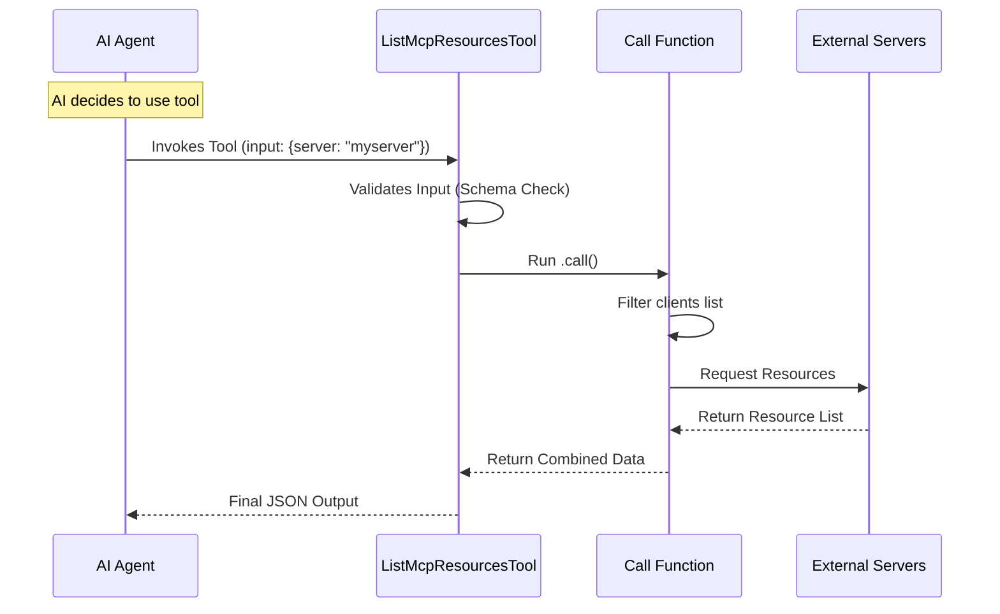

# Chapter 3: Tool Definition

Welcome to Chapter 3!

In [Chapter 1: Tool Metadata](01_tool_metadata.md), we wrote the **User Manual** (Name and Description) so the AI knows what our tool is.
In [Chapter 2: Data Schemas](02_data_schemas.md), we hired a **Bouncer** (Zod Schemas) to ensure only valid data gets in and out.

Now, we have a manual and a security guard, but we don't have a **Worker**. We have parts, but we haven't assembled the machine.

## The Motivation: Assembling the Robot

Imagine you are building a robot.
*   You have the label "Cleaner Bot 3000" (Metadata).
*   You have a filter that only accepts "AA Batteries" (Schema).
*   **But where is the engine? Where is the chassis that holds it all together?**

The **Tool Definition** is that chassis. It is the central object that bundles your metadata, your schemas, and your actual code logic into a single package that the application can run.

In this project, we use a helper function called `buildTool`. This function takes all our separate pieces and wraps them into a standard format.

## Step 1: The Configuration

We are working in `ListMcpResourcesTool.ts`. We start by calling `buildTool` and setting some basic behavior rules.

```typescript
export const ListMcpResourcesTool = buildTool({
  name: LIST_MCP_RESOURCES_TOOL_NAME,
  
  // Can multiple parts of the app use this at once?
  isConcurrencySafe() {
    return true
  },
  
  // Does this tool change data? No, it just reads (Lists) resources.
  isReadOnly() {
    return true
  },
  // ... (more properties follow)
```

**Explanation:**
*   `buildTool({...})`: This is our factory. Everything goes inside these curly braces.
*   `isConcurrencySafe`: We return `true` because listing files doesn't break if two people do it at the same time.
*   `isReadOnly`: We return `true` because this tool looks at data but doesn't delete or modify files. This is important for safety permissions.

## Step 2: Plugging in Metadata and Schemas

Next, we plug in the work we did in the previous chapters. We are attaching the "Manual" and the "Bouncer" to our Tool.

```typescript
  // Connect the Description (Chapter 1)
  async description() {
    return DESCRIPTION
  },
  
  // Connect the Prompt/Instructions (Chapter 1)
  async prompt() {
    return PROMPT
  },

  // Connect the Input Schema (Chapter 2)
  get inputSchema(): InputSchema {
    return inputSchema()
  },
```

**Explanation:**
*   We use the constants `DESCRIPTION` and `PROMPT` we created in Chapter 1.
*   We use a "getter" (`get inputSchema`) to attach the Zod validator we built in Chapter 2.
*   Now, when the AI tries to use this tool, `buildTool` automatically checks the Manual and runs the Bouncer.

## Step 3: The Engine (`call`)

This is the most important part. The `call` property is the heart of the tool. This is the function that actually **runs** when the AI invokes the tool.

It receives the `input` (which has passed the schema check) and performs the work.

```typescript
  async call(input, { options: { mcpClients } }) {
    const { server: targetServer } = input

    // Step A: Decide which servers to ask
    const clientsToProcess = targetServer
      ? mcpClients.filter(client => client.name === targetServer)
      : mcpClients

    // ... logic continues below
```

**Explanation:**
*   `input`: This contains `{ server: "..." }` (or nothing, if optional).
*   `mcpClients`: This is a list of all connections we have to external systems (like a database or a file server).
*   **Logic:** If the user asked for a specific server (e.g., "myserver"), we filter the list to only look at that one. Otherwise, we look at *all* connected clients.

## Step 4: Fetching the Data

Now that we know which clients to talk to, we ask them for their resources.

```typescript
    // Step B: Ask selected clients for their resources
    const results = await Promise.all(
      clientsToProcess.map(async client => {
        // If client isn't connected, skip it
        if (client.type !== 'connected') return []
        
        // Helper function to get data (Covered in Chapter 4)
        const fresh = await ensureConnectedClient(client)
        return await fetchResourcesForClient(fresh)
      }),
    )

    // Step C: Return the flattened list
    return {
      data: results.flat(),
    }
  }, // End of call function
```

**Explanation:**
*   `Promise.all(...)`: This runs the request for every server at the same time (parallel), making it fast.
*   `fetchResourcesForClient`: This is a helper that goes out to the network and gets the list.
*   `results.flat()`: If Server A gives us 3 files and Server B gives us 2 files, this combines them into one big list of 5 files.

## Under the Hood: The Execution Flow

What happens when the "GO" button is pressed?



## Step 5: Formatting for Humans

The AI reads JSON data comfortably, but humans prefer nice text. The `buildTool` definition allows us to define how this tool looks in the UI (User Interface).

```typescript
  // What name does the user see in the chat?
  userFacingName: () => 'listMcpResources',

  // How do we display the result?
  renderToolResultMessage,
  
  // How do we display the request?
  renderToolUseMessage,
```

**Explanation:**
*   `userFacingName`: A friendly name shown in the chat window.
*   `renderTool...`: These are special functions that turn the raw JSON data into pretty React components for the user. We will cover exactly how to write these in [Chapter 5: UI Presentation](05_ui_presentation.md).

## Summary

In this chapter, we built the **Tool Definition**.

1.  We used `buildTool` to create a container.
2.  We configured safety settings (`isReadOnly`).
3.  We attached our **Metadata** and **Schemas**.
4.  We wrote the `call` function to fetch and combine data from servers.

You now have a fully defined tool! The AI knows what it is, the data is validated, and the logic executes to return a list of resources.

 However, inside our `call` function, we used a magic variable called `mcpClients` and a helper `fetchResourcesForClient`. How do we actually manage these connections to outside servers?

In the next chapter, we will learn how the tool interacts with the outside world.

[Next Chapter: MCP Client Integration](04_mcp_client_integration.md)

---

Generated by [Code IQ](https://github.com/adityasoni99/Code-IQ)