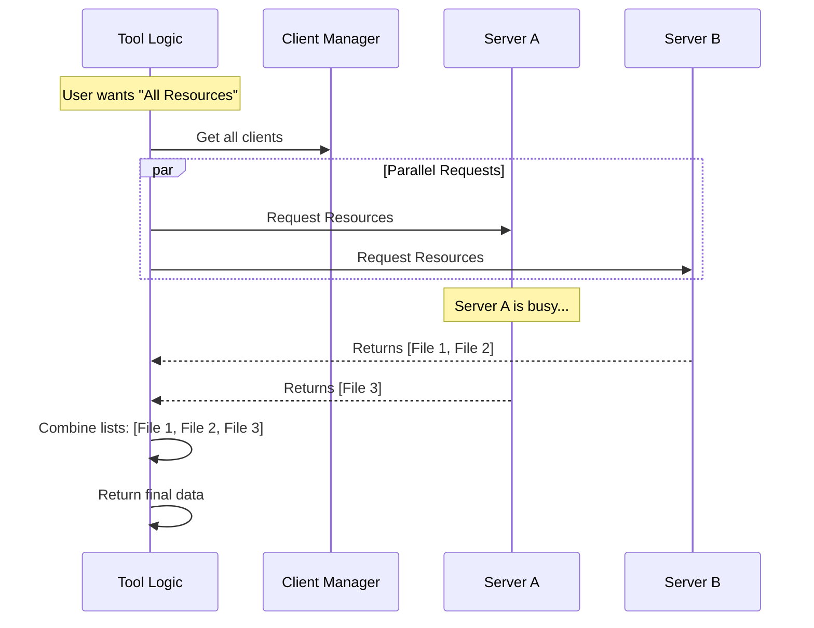

# Chapter 4: MCP Client Integration

Welcome to Chapter 4!

In the previous [Chapter 3: Tool Definition](03_tool_definition.md), we built the "body" of our tool. We defined how it receives instructions and structured the logic.

However, our tool is currently like a telephone operator sitting in an empty room. It knows *how* to answer a call, but it has no one to connect the caller to.

## The Motivation: The Switchboard Operator

The purpose of the `ListMcpResourcesTool` is to show the user what files or data they have access to. But the tool itself doesn't store that data. The data lives on external **MCP Servers** (like a database, a file system, or a cloud service).

We need a way to:
1.  **Identify** which servers are available.
2.  **Connect** to them reliably.
3.  **Fetch** the data (resources) from them.

This is **MCP Client Integration**. It acts as the switchboard, routing your request to the right destination to get the information you need.

## Concept 1: Selecting the Right Line

When the tool runs, it receives a list of all available connections (called `mcpClients`).

Sometimes the user wants everything (e.g., "List all files"). Other times, they want a specific source (e.g., "List files from the 'Work' server").

We need code to filter these connections.

```typescript
// Inside the call() function
const { server: targetServer } = input

// If user asked for a specific server, find it. 
// Otherwise, use all of them.
const clientsToProcess = targetServer
  ? mcpClients.filter(client => client.name === targetServer)
  : mcpClients
```

**Explanation:**
*   `mcpClients`: Imagine this is a phone book of everyone we can call.
*   `filter`: We look through the phone book. If `targetServer` is set, we keep only that one entry. If not, we keep everyone.

## Concept 2: The "Hello?" Check

Network connections are fragile. Just because a server is in our phone book doesn't mean the line is active. Before we ask for data, we need to ensure the connection is healthy.

We use a helper function called `ensureConnectedClient`.

```typescript
import { ensureConnectedClient } from '../../services/mcp/client.js'

// ... inside the processing loop ...
const freshClient = await ensureConnectedClient(client)
```

**Explanation:**
*   This function is like saying "Hello? Can you hear me?"
*   If the connection was lost, this function attempts to reconnect automatically.
*   It returns a `freshClient` object that is ready to receive commands.

## Concept 3: Fetching the Data

Once the line is open, we can finally ask for the resources. We use another helper: `fetchResourcesForClient`.

```typescript
import { fetchResourcesForClient } from '../../services/mcp/client.js'

// Ask the server for its list of resources
const resources = await fetchResourcesForClient(freshClient)
```

**Explanation:**
*   This sends a specific message (an MCP protocol request) to the server: *"Please send me your list of resources."*
*   The server responds with the list, and we store it in `resources`.

## Putting It Together: The Parallel Process

We often have multiple servers. If we call them one by one, it might be slow. Instead, we call them all at the same time using `Promise.all`.

Here is the simplified logic flow:

```typescript
const results = await Promise.all(
  clientsToProcess.map(async client => {
    // 1. Check if configured
    if (client.type !== 'connected') return []
    
    // 2. Ensure connection & Fetch
    const fresh = await ensureConnectedClient(client)
    return await fetchResourcesForClient(fresh)
  })
)
```

**Explanation:**
*   `Promise.all`: This tells the computer, "Do all these tasks at once, and wait until the last one finishes."
*   If we have 5 servers, we make 5 phone calls simultaneously. This makes our tool very fast.

## Handling "Dead Lines" (Error Handling)

What if one server is down? We don't want the entire tool to crash just because one connection failed. We wrap our call in a safety block.

```typescript
try {
  const fresh = await ensureConnectedClient(client)
  return await fetchResourcesForClient(fresh)
} catch (error) {
  // If this specific server fails, log it and return empty
  logMCPError(client.name, errorMessage(error))
  return []
}
```

**Explanation:**
*   `try...catch`: This is our safety net.
*   If `Server A` crashes, we catch the error, log a warning, and return an empty list `[]` for that server.
*   The tool continues running and successfully returns data from `Server B` and `Server C`.

## Under the Hood: The Sequence

Let's visualize exactly what happens when the tool requests data.



### Internal Implementation Details

The helper functions we used (`ensureConnectedClient` and `fetchResourcesForClient`) hide a lot of complexity to keep our tool code clean.

1.  **`ensureConnectedClient`**:
    *   It uses a "memoization" technique. If we just checked the connection 1 second ago, it remembers the result and doesn't check again immediately. This saves time.

2.  **`fetchResourcesForClient`**:
    *   It uses **Caching**. It remembers the list of files a server sent previously.
    *   It only asks for a new list if the server sends a notification saying, "Hey, my files changed!" or if the connection was restarted.
    *   This ensures that if the AI asks for resources 10 times in a row, we don't spam the external server 10 times. We mostly read from our local memory.

## Summary

In this chapter, we learned how to perform **MCP Client Integration**.

*   We act as a **Switchboard**, selecting which servers to talk to.
*   We ensure reliability by **verifying connections** before asking for data.
*   We use **parallel processing** to ask multiple servers at once.
*   We implement **error handling** so one bad connection doesn't break the whole app.

At this point, our tool works! It has a name, it validates input, it talks to servers, and it retrieves data.

However, the data we get back is raw code (JSON). If we just dumped this text onto the user's screen, it would look messy. We need to dress it up.

In the final chapter, we will learn how to make our results look beautiful for the user.

[Next Chapter: UI Presentation](05_ui_presentation.md)

---

Generated by [Code IQ](https://github.com/adityasoni99/Code-IQ)