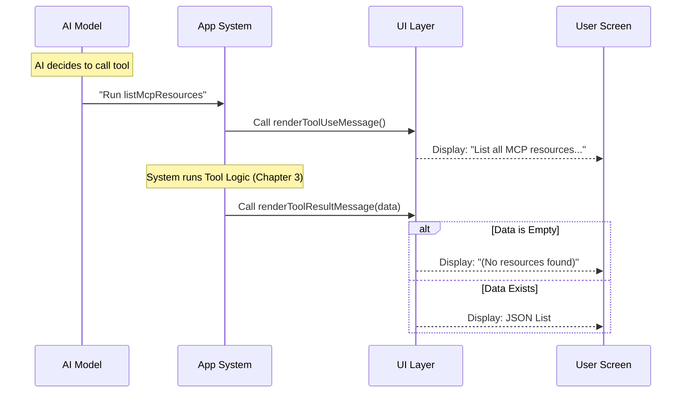

# Chapter 5: UI Presentation

Welcome to the final chapter of our tutorial!

In [Chapter 4: MCP Client Integration](04_mcp_client_integration.md), we connected our tool to the outside world. Our tool can now successfully fetch data from external servers.

However, we have a small problem. Currently, our tool behaves like a genius mathematician who only speaks in complex equations. When it finds files, it returns raw computer code (JSON).

## The Problem: Raw Data vs. Human Readability

If we don't build a User Interface (UI), the user might see this in their console:

```json
[{"uri":"file:///Users/demo/notes.txt","name":"notes.txt","server":"local"}]
```

While this is perfect for the AI, it is hard for a human to read quickly. We want to present the data elegantly, like a chef plating a meal after cooking it.

## The Solution: UI Components

In this project, we use **React** to build our interface. Even though this tool runs in a text terminal (like Command Prompt or Terminal), we use a library that lets us build "visual" components just like a website.

We need to handle two specific visual moments in `UI.tsx`:
1.  **The Announcement:** Telling the user "I am starting to look for files."
2.  **The Result:** Telling the user "Here is what I found."

### 1. The Announcement (`renderToolUseMessage`)

When the AI decides to run the tool, we want to show a friendly status update.

If the user asked for a specific server, we should say so. If not, we say we are checking everything.

```typescript
// --- File: UI.tsx ---

export function renderToolUseMessage(input: Partial<{
  server?: string;
}>): React.ReactNode {
  // If a server name exists, mention it
  return input.server 
    ? `List MCP resources from server "${input.server}"` 
    : `List all MCP resources`;
}
```

**Explanation:**
*   **Input:** We receive the `input` object (which we defined in [Chapter 2: Data Schemas](02_data_schemas.md)).
*   **Logic:** We use a simple "ternary" operator (`? :`). It checks: *Is there a server name?*
    *   **Yes:** Return "List MCP resources from server..."
    *   **No:** Return "List all MCP resources"

### 2. The Result (`renderToolResultMessage`)

Once the tool finishes (after [Chapter 3: Tool Definition](03_tool_definition.md) runs), we get the `output`. We need to decide how to display it.

First, we handle the case where we found **nothing**.

```typescript
export function renderToolResultMessage(
  output: Output, 
  _progressMessages, 
  { verbose }
): React.ReactNode {
  // 1. Handle empty results
  if (!output || output.length === 0) {
    return (
      <MessageResponse height={1}>
        <Text dimColor>(No resources found)</Text>
      </MessageResponse>
    );
  }
  // ... (code continues)
```

**Explanation:**
*   `output`: This is the list of files we fetched.
*   `if (!output ...)`: If the list is empty, we don't want to show a blank screen.
*   `<Text dimColor>`: We use a component to make the text gray ("dim"), indicating a minor status update.

### 3. Formatting the Success

If we *did* find resources, we want to format them nicely.

```typescript
  // 2. Format the valid output
  // We turn the object into a pretty text string
  const formattedOutput = jsonStringify(output, null, 2);

  // 3. Render it
  return <OutputLine content={formattedOutput} verbose={verbose} />;
}
```

**Explanation:**
*   `jsonStringify(..., 2)`: This takes the raw data and adds indentation (spacing), making it much easier to read than a single long line.
*   `<OutputLine />`: This is a custom component that handles things like word-wrapping and coloring for us.

## Under the Hood: The Rendering Flow

How does the application know when to run these functions? The system acts like a coordinator between the AI, the Tool Logic, and the Screen.



### Internal Implementation Details

The `UI.tsx` file imports several helper components that make our job easier:

1.  **`MessageResponse`**: A container that creates a standard box for tool outputs. It ensures all tools look consistent.
2.  **`Text`**: A component from the `ink` library. It allows us to style text (colors, bold, dim) in the terminal.
3.  **`OutputLine`**: A helper that manages large blocks of text, ensuring they don't break the layout if the list of resources is huge.

## Putting It All Together

Congratulations! You have completed the `ListMcpResourcesTool`. Let's review what we built across the five chapters:

1.  **[Tool Metadata](01_tool_metadata.md)**: We gave the tool a name and description so the AI knows it exists.
2.  **[Data Schemas](02_data_schemas.md)**: We created strict rules (Zod) to validate inputs and outputs.
3.  **[Tool Definition](03_tool_definition.md)**: We built the main logic engine to process requests.
4.  **[MCP Client Integration](04_mcp_client_integration.md)**: We connected that engine to real external servers to fetch data.
5.  **[UI Presentation](05_ui_presentation.md)**: We designed a friendly interface to display the results to the human user.

You now have a fully functional AI tool that allows a user to ask, "What files are on my server?" and receive a verified, accurate, and beautifully formatted response.

**End of Tutorial.**

---

Generated by [Code IQ](https://github.com/adityasoni99/Code-IQ)