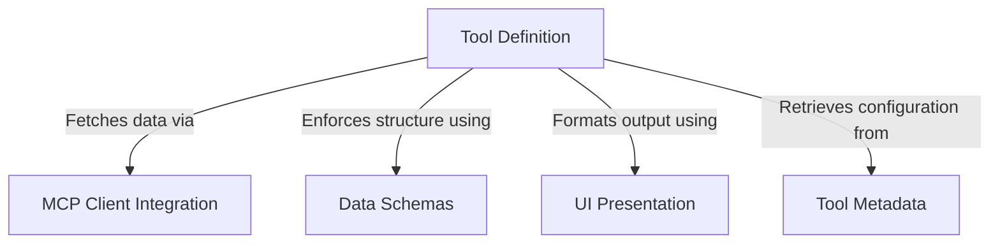

# Tutorial: ListMcpResourcesTool

This project implements a specific capability called **ListMcpResourcesTool**, which allows an AI agent to discover and list available *resources* (such as files or data streams) hosted on connected external servers. It bundles the execution logic, **strict data validation**, and user interface formatting into a single package that acts as a bridge between the AI model and the **Model Context Protocol (MCP)** infrastructure.

## Chapters

1. [Tool Metadata](01_tool_metadata.md)
2. [Data Schemas](02_data_schemas.md)
3. [Tool Definition](03_tool_definition.md)
4. [MCP Client Integration](04_mcp_client_integration.md)
5. [UI Presentation](05_ui_presentation.md)

---

Generated by [Code IQ](https://github.com/adityasoni99/Code-IQ)