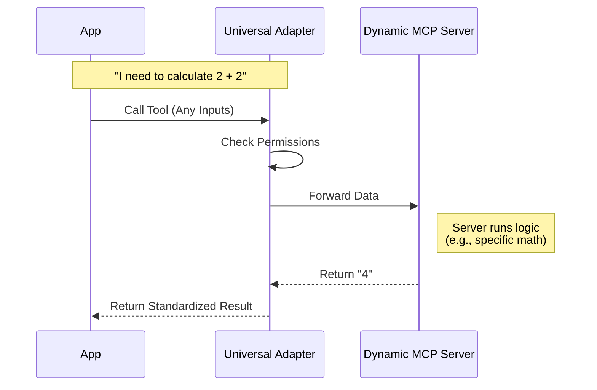

# Chapter 1: Universal Tool Adapter

Welcome to the **MCPTool** project tutorial! In this first chapter, we are going to build the foundation of our tool system: the **Universal Tool Adapter**.

## The Problem: Too Many Plugs

Imagine you are building an AI assistant. You want it to use a calculator, check the weather, and search GitHub.

Without a standard system, you might write code like this:
1.  Code to talk to the Calculator.
2.  Code to talk to the Weather API.
3.  Code to talk to GitHub.

If you want to add a fourth tool, you have to write *new* code again. This is hard to maintain.

## The Solution: A Universal Adapter

Instead of hardcoding every tool, we create a **Universal Tool Adapter**.

Think of this like a **universal international travel adapter** for wall sockets.
*   **The Wall Socket:** Your Application.
*   **The Devices:** Different tools (Calculator, Weather, GitHub) called "MCP Servers."
*   **The Adapter:** `MCPTool`.

No matter what device (tool) you have, you plug it into the Adapter, and the Adapter plugs into your App. Your App doesn't need to know the details of the device; it just talks to the Adapter.

### Key Concepts

1.  **MCP (Model Context Protocol):** A standard way for tools to describe themselves.
2.  **Generic Wrapper:** Our adapter doesn't know what the tool does yet. It just knows how to pass messages back and forth.
3.  **Passthrough Inputs:** The adapter allows *any* data to pass through it, letting the specific tool handle the details.

---

## Internal Implementation: How it Works

Before we look at the code, let's look at the flow. When your application wants to use a tool, it doesn't call the tool directly. It calls our Adapter.

1.  **Input:** The App sends data (arguments) to the Adapter.
2.  **Permission:** The Adapter checks if we are allowed to use this tool.
3.  **Forwarding:** The Adapter sends the data to the specific MCP Server.
4.  **Result:** The Server sends the answer back to the Adapter.
5.  **Output:** The Adapter formats it and gives it to the App.

Here is a simple diagram of this interaction:



---

## Deep Dive: The Code

Let's look at `MCPTool.ts`. This file defines the template for our adapter.

### 1. Flexible Input Schema
First, we need to tell our code what kind of inputs to accept. Since this is a *Universal* adapter, we need to accept **anything**.

We use a library called `zod` for validation.

```typescript
// File: MCPTool.ts

import { z } from 'zod/v4'
import { lazySchema } from '../../utils/lazySchema.js'

// Allow any input object. 'passthrough' means "don't filter out unknown fields"
export const inputSchema = lazySchema(() => z.object({}).passthrough())

type InputSchema = ReturnType<typeof inputSchema>
```

**Explanation:**
*   `z.object({})`: Expects an object (like a JSON).
*   `.passthrough()`: This is the magic. It tells the adapter, "If the tool requires specific arguments (like `city` for weather), just let them pass through. Don't block them."

### 2. Standardized Output Schema
Next, we define what the output looks like. Even though inputs vary, we always want the output to be a consistent string format for our App to read.

```typescript
// File: MCPTool.ts

export const outputSchema = lazySchema(() =>
  z.string().describe('MCP tool execution result'),
)

type OutputSchema = ReturnType<typeof outputSchema>
```

**Explanation:**
*   `z.string()`: We expect the result to be text (e.g., "The weather is sunny" or "4").

### 3. The Adapter Definition
Now we combine everything into the tool definition. This creates the "plug."

*Note: In the actual codebase, properties like `name`, `description`, and `call` are often overridden later when we connect to a specific real-world tool. This file acts as the generic template.*

```typescript
// File: MCPTool.ts

import { buildTool } from '../../Tool.js'

export const MCPTool = buildTool({
  isMcp: true,
  name: 'mcp', // A default name, usually replaced later
  
  // Connect the schemas we defined above
  get inputSchema(): InputSchema {
    return inputSchema()
  },
  
  // ... (continued below)
```

### 4. Handling Execution and Permissions
Finally, we define the default behavior for calling the tool and checking if it's safe.

```typescript
// File: MCPTool.ts (continued)

  // This is a placeholder. The real logic is injected when the client starts.
  async call() {
    return { data: '' }
  },

  // Default permission check
  async checkPermissions(): Promise<PermissionResult> {
    return {
      behavior: 'passthrough',
      message: 'MCPTool requires permission.',
    }
  },
})
```

**Explanation:**
*   `call()`: Currently returns empty data. Why? Because this is just the adapter shell. Later, when we connect a "Weather" server, this function is replaced with code that actually calls the Weather API.
*   `checkPermissions()`: Ensures the user approves the action before the tool runs.

---

## Summary

In this chapter, we created the **Universal Tool Adapter**.

*   **Motivation:** We needed a way to talk to *any* tool without rewriting code.
*   **Solution:** We built `MCPTool`, a wrapper that accepts any input (`passthrough`) and standardizes the output.
*   **Analogy:** It's the universal power adapter for your AI application.

But wait—if this adapter can handle *any* tool, how does the AI know which tool to pick? Or how to interpret the user's messy request?

We will solve that in the next chapter.

[Next Chapter: Interaction Classifier](02_interaction_classifier.md)

---

Generated by [Code IQ](https://github.com/adityasoni99/Code-IQ)