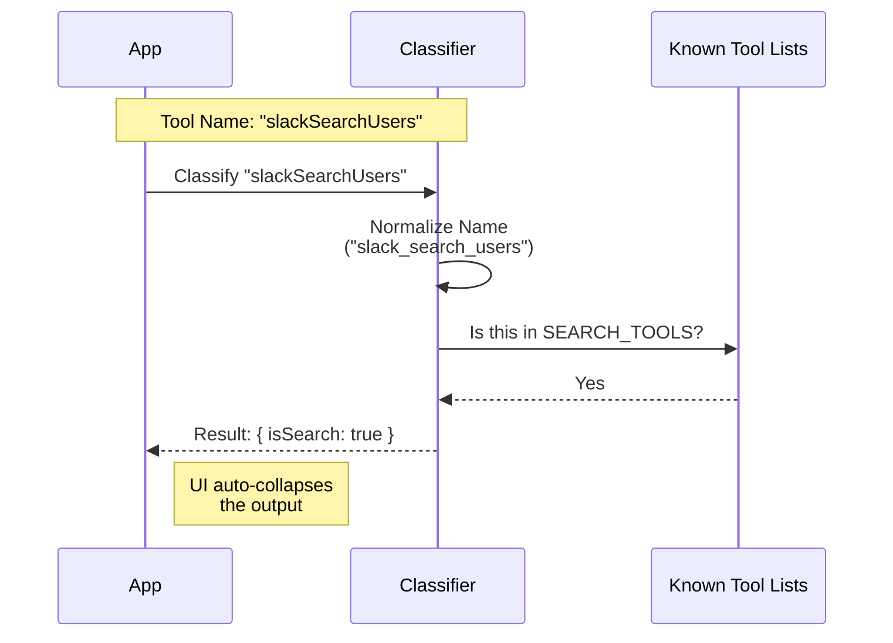

# Chapter 2: Interaction Classifier

Welcome back! In the previous chapter, we built the [Universal Tool Adapter](01_universal_tool_adapter.md). We successfully created a "universal plug" that allows our AI to talk to *any* tool, from a simple Calculator to complex GitHub integrations.

However, having access to everything creates a new problem: **Information Overload**.

## The Problem: The flooded chat history

Imagine you ask your AI assistant to: *"Fix the bug in the login page."*

To do this, the AI might perform the following steps:
1.  **Search** for files named "login" (Returns a list of 50 files).
2.  **Read** the content of `login.ts` (Returns 300 lines of code).
3.  **Read** the content of `auth.ts` (Returns 200 lines of code).
4.  **Edit** `login.ts` to fix the typo.

If we display all this raw data in the chat, your screen will be flooded with hundreds of lines of code and search results. You will have to scroll endlessly just to find the final message: *"I fixed the bug."*

## The Solution: The Interaction Classifier

We need a way to organize this "mail."

Think of the **Interaction Classifier** as a **Smart Mail Sorter**.
*   **Catalogs & Flyers (Search/Read):** These contain a lot of data but aren't urgent. The sorter puts them in a folder (Collapsed UI).
*   **Personal Letters (Actions):** These are actual changes or results. The sorter puts them right on your desk (Expanded UI).

By classifying tools, our UI can decide: *"Oh, this is a `read_file` tool? I'll hide the output unless the user clicks to expand it."*

---

## How it Works

We classify tools into three categories:

1.  **Search:** Looking for things (e.g., `search_code`, `slack_search`).
2.  **Read:** retrieving data (e.g., `get_file`, `read_message`).
3.  **Action:** Doing things (e.g., `send_email`, `write_file`). *Everything that isn't Search or Read is an Action.*

We don't need a complex AI to make this decision. Since tool names are usually descriptive, we can use a **fast, rule-based approach**.

### The Flow

Here is how the classifier decides what label to put on a tool:



---

## Deep Dive: The Code

Let's look at `classifyForCollapse.ts`. This file acts as our dictionary of known tools.

### 1. The Allowlists
Instead of guessing, we explicitly list the tools that produce verbose output. We use a `Set` for extremely fast lookups.

```typescript
// File: classifyForCollapse.ts

// A Set of tools that output long lists of results
const SEARCH_TOOLS = new Set([
  'search_code',             // GitHub
  'slack_search_users',      // Slack
  'google_drive_search',     // Google Drive
  'jira_search_issues',      // Jira
  // ... hundreds more
])
```

We do the same for "Read" tools, which usually dump large text files or data objects.

```typescript
// File: classifyForCollapse.ts

// A Set of tools that output large content
const READ_TOOLS = new Set([
  'read_file',               // Filesystem
  'get_issue',               // GitHub
  'slack_read_thread',       // Slack
  'notion_get_page',         // Notion
  // ... hundreds more
])
```

**Why hardcode lists?**
Reliability. Tool names from major providers (GitHub, Slack, Google) are stable. If we used an AI to guess if "get_user" is verbose, it might be slow or wrong. A static list is instant and deterministic.

### 2. Normalization
Different tools use different naming conventions.
*   Tool A: `getUserProfile` (camelCase)
*   Tool B: `get_user_profile` (snake_case)
*   Tool C: `Get-User-Profile` (kebab-case)

To match them against our list effectively, we convert everything to `snake_case`.

```typescript
// File: classifyForCollapse.ts

function normalize(name: string): string {
  return name
    // Add underscore between lowercase and Uppercase (camel -> snake)
    .replace(/([a-z])([A-Z])/g, '$1_$2')
    // Replace dashes with underscores
    .replace(/-/g, '_')
    .toLowerCase()
}
```

**Example:**
*   Input: `slackSearchUsers`
*   Output: `slack_search_users` (Now matches our list!)

### 3. The Classification Function
Finally, we expose a single function that our App calls. It takes a tool name and returns boolean flags.

```typescript
// File: classifyForCollapse.ts

export function classifyMcpToolForCollapse(
  _serverName: string, // We ignore server name for broader matching
  toolName: string,
): { isSearch: boolean; isRead: boolean } {
  
  const normalized = normalize(toolName)

  return {
    isSearch: SEARCH_TOOLS.has(normalized),
    isRead: READ_TOOLS.has(normalized),
  }
}
```

**How to use it:**

If `isSearch` or `isRead` is `true`, your UI knows this is a "heavy" operation and should probably start in a collapsed state to keep the chat clean.

If both are `false` (e.g., for `send_message`), it's an **Action**. The UI should keep this expanded so the user sees the confirmation immediately.

---

## Summary

In this chapter, we added logic to the chaos:

1.  **Motivation:** Raw tool outputs are too messy for a chat interface.
2.  **Concept:** We categorize tools into **Search**, **Read**, and **Action**.
3.  **Implementation:** We used `classifyForCollapse.ts` to check tool names against a known list of verbose tools, using normalization to handle different naming styles.

Now our AI can talk to tools (Chapter 1) and we know *which* tools produce messy output (Chapter 2).

But knowing *that* the output is messy is only half the battle. We still need to display the result. If a tool returns a massive JSON object, simply collapsing it isn't enough—we need to make it look good when the user *does* open it.

[Next Chapter: Result Visualization Engine](03_result_visualization_engine.md)

---

Generated by [Code IQ](https://github.com/adityasoni99/Code-IQ)