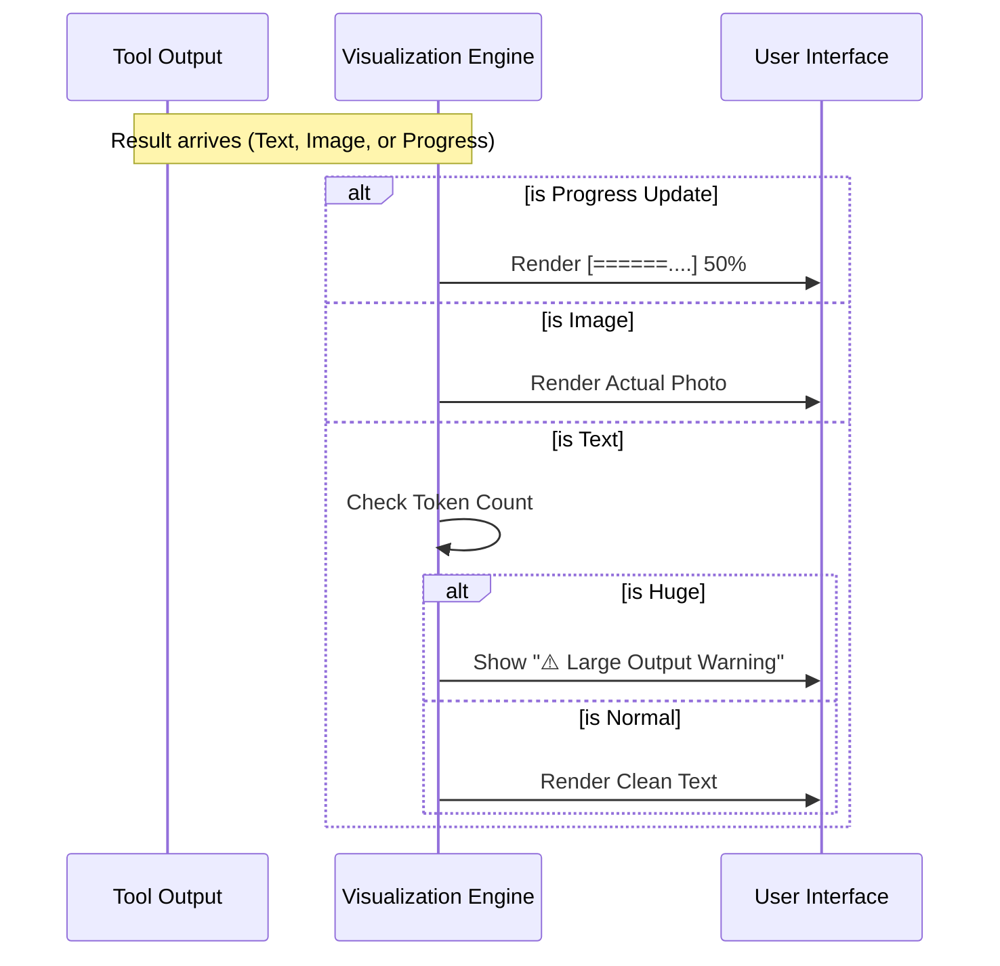

# Chapter 3: Result Visualization Engine

Welcome back! In the previous chapter, the [Interaction Classifier](02_interaction_classifier.md), we taught our AI how to sort tools into "Search," "Read," and "Action" to keep our chat history tidy.

Now that we have sorted the tools, we face a new challenge: **How do we actually display the results?**

## The Problem: Raw Data is Ugly

Imagine you ask your AI: *"Generate an image of a sunset"* or *"Download this large file."*

Without a visualization engine, the tool might return raw data like this:
*   **Image:** `"data:image/png;base64,iVBORw0KGgoAAAANSUhEUgAAAAU..."` (A million random characters).
*   **Download:** `{"progress": 50, "total": 100}` (Repeated 50 times in your chat).
*   **Large File:** A 50-page text dump that fills your entire screen.

This is overwhelming and unusable for a human.

## The Solution: A Smart Monitor

We need a **Result Visualization Engine**. Think of this like a **Universal Media Player** on your computer.
*   If you open a music file, it shows a play button.
*   If you open a photo, it displays the image.
*   If you open a document, it shows text.

Our engine looks at the raw data coming from the tool and automatically decides the best way to show it to you.

### Key Capabilities

1.  **Rich Media Support:** Renders images directly instead of showing code.
2.  **Progress Tracking:** Converts numerical updates into visual progress bars.
3.  **Safety Warnings:** Warns you if a result is too big (e.g., 50,000 words) so it doesn't crash your context window.
4.  **Smart Formatting:** Turns messy JSON objects into clean, readable text.

---

## Internal Implementation: The Flow

Before looking at the code, let's trace what happens when a tool finishes its job.

1.  **Input:** The tool returns a `Result` object.
2.  **Analysis:** The Engine scans the result. Is it an image? Is it text? Is it a progress update?
3.  **Safety Check:** It counts the "tokens" (size) of the text. If it's huge, it prepares a warning.
4.  **Render:** It chooses the correct visual component (Bar, Image, or Text).

Here is the decision process:



---

## Deep Dive: The Code

Let's look at `UI.tsx`. This file acts as the brain of our visualization engine.

### 1. Visualizing Progress
When a tool takes a long time (like downloading a file), we don't want to spam the chat. We want a smooth bar.

```typescript
// File: UI.tsx

export function renderToolUseProgressMessage(lastProgress: any) {
  const { progress, total, progressMessage } = lastProgress.data;

  // If we know the total (e.g., 50 out of 100), show a percentage bar
  if (total !== undefined && total > 0) {
    const ratio = Math.min(1, Math.max(0, progress / total)); // Calculate 0.0 to 1.0
    
    return (
      <Box flexDirection="row">
        <ProgressBar ratio={ratio} width={20} />
        <Text>{Math.round(ratio * 100)}%</Text>
      </Box>
    );
  }

  // If we don't know the total, just show "Processing..."
  return <Text>Running... {progress}</Text>;
}
```

**Explanation:**
*   **`ProgressBar`**: A custom component that draws characters like `[████░░░░░░]`.
*   **Logic:** The engine checks if `total` exists. If yes, it calculates the percentage. If no, it just shows the current number.

### 2. Handling Images and Text
Tools can return a mix of text and images. We need to loop through the output and handle each part differently.

```typescript
// File: UI.tsx

export function renderToolResultMessage(output: any) {
  // If the output is a list of blocks (Standard MCP format)
  if (Array.isArray(output)) {
    return output.map((item) => {
      
      // CASE A: It is an image
      if (item.type === 'image') {
        return <Text>[Image Displayed Here]</Text>; 
      }

      // CASE B: It is text
      return <OutputLine content={item.text} />;
    });
  }
}
```

**Explanation:**
*   **`item.type === 'image'`**: We identify the data type. In a real app, we would render the base64 string as an `` tag. Here, we show a placeholder.
*   **`OutputLine`**: A helper that ensures text wraps nicely on the screen.

### 3. The Safety Mechanism
Large Language Models have a limit on how much they can read (Context Window). If a tool returns a 100,000-word essay, it might push important instructions out of the AI's memory.

We add a safety check:

```typescript
// File: UI.tsx

const MCP_OUTPUT_WARNING_THRESHOLD_TOKENS = 10_000;

// inside renderToolResultMessage...
const estimatedTokens = getContentSizeEstimate(mcpOutput);
const showWarning = estimatedTokens > MCP_OUTPUT_WARNING_THRESHOLD_TOKENS;

if (showWarning) {
  return (
    <Box flexDirection="column">
      <Text color="warning">
        ⚠️ Large response (~{estimatedTokens} tokens). This fills context quickly.
      </Text>
      {/* Still show the content below the warning */}
      {contentElement}
    </Box>
  );
}
```

**Explanation:**
*   **Threshold:** We set a limit (10,000 tokens).
*   **Warning:** We do **not** hide the content (in case the user really needs it), but we print a bright warning message so the user knows why the AI might start forgetting things.

### 4. Smart Formatting (The Slack Example)
Sometimes tools return raw JSON that looks technical. Our engine tries to detect specific tools and make them pretty.

Take sending a Slack message.
*   **Raw Output:** `{"ok": true, "channel": "C0245...", "message_link": "http..."}`
*   **Desired Output:** "Sent a message to #general"

```typescript
// File: UI.tsx

export function trySlackSendCompact(output: any, input: any) {
  // Check if the output contains a specific Slack link pattern
  if (output.includes('"message_link"')) {
    
    // Extract the URL and Channel name using logic helper
    const { channel, url } = parseSlackDetails(output, input);
    
    // Return a pretty, clickable sentence
    return (
      <Text>
        Sent a message to <Link url={url}>{channel}</Link>
      </Text>
    );
  }
  return null; // Not a slack message, do nothing
}
```

**Explanation:**
*   **Pattern Matching:** We look for specific keys (like `message_link`) to identify the tool.
*   **Compact UI:** We replace the ugly JSON block with a simple, human-readable sentence.

---

## Summary

In this chapter, we built the **Result Visualization Engine**.

*   **Motivation:** Raw tool data is often ugly, huge, or unintelligible.
*   **Solution:** A smart rendering system that adapts based on the data type.
*   **Features:** It renders **Progress Bars** for waiting, **Images** for viewing, and **Warnings** for safety.

We have handled the Tools (Chapter 1), the Organization (Chapter 2), and the Visuals (Chapter 3).

However, there is one final piece of the puzzle. Sometimes, an AI *tries* to send a JSON command, but it messes up the format (e.g., adding extra text or forgetting quotes). If our system is too strict, it will crash. We need a way to "repair" broken JSON.

[Next Chapter: Intelligent JSON Unwrapper](04_intelligent_json_unwrapper.md)

---

Generated by [Code IQ](https://github.com/adityasoni99/Code-IQ)