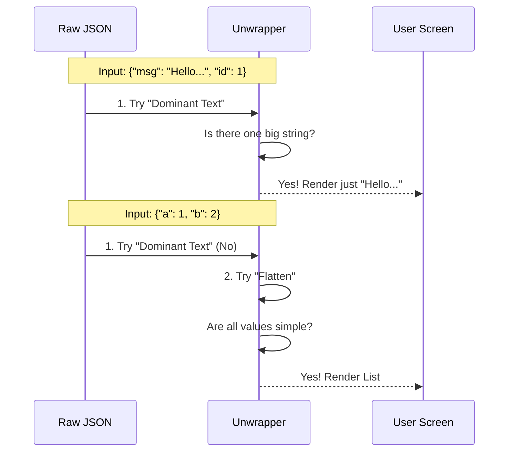

# Chapter 4: Intelligent JSON Unwrapper

Welcome to the final chapter of our beginner tutorial!

In the previous chapter, the [Result Visualization Engine](03_result_visualization_engine.md), we learned how to display images and progress bars. But there is one final, annoying problem we need to fix to make our chat truly human-friendly.

## The Problem: The "Wrapper" Noise

Tools and APIs communicate using **JSON** (JavaScript Object Notation). It is great for computers, but rigid for humans.

Imagine you ask your AI to "Summarize this file."
The tool might return this valid JSON:

```json
{
  "status": "success",
  "code": 200,
  "content": "The file contains a list of shopping items...",
  "metadata": { "time": "12ms" }
}
```

If we display this raw JSON in the chat, it looks like a robotic log file. You have to mentally ignore `"status": "success"` and hunt for the actual text inside `"content"`.

## The Solution: Intelligent JSON Unwrapper

We need a system that acts like a **Translator**.

*   **Raw Input:** A formal, structured "legal document" (JSON).
*   **The Unwrapper:** Reads the document, realizes 90% of it is boilerplate, and extracts just the important paragraph.
*   **Output:** "The file contains a list of shopping items..."

This system uses **heuristics** (smart guesses) to decide when to strip away the JSON syntax and when to keep it.

---

## The Concept: Two Strategies

Our Unwrapper tries to clean up the mess using two main strategies:

### Strategy 1: The "Dominant Text" Hunt
If a JSON object contains one really long string (like a message body) and a bunch of tiny metadata, the Unwrapper assumes you only care about the text.

*   **Input:** `{"id": 1, "msg": "This is a very long and important message that..."}`
*   **Decision:** "The field `msg` is huge. The field `id` is tiny. I'll just show the message."

### Strategy 2: The "Flat List" View
If the JSON is a simple list of settings or data (Key: Value), the Unwrapper strips the brackets and quotes to make a clean list.

*   **Input:** `{"temperature": 72, "city": "Paris", "cloudy": true}`
*   **Decision:** "This is a simple list. I will format it nicely."
*   **Output:**
    ```text
    temperature: 72
    city: Paris
    cloudy: true
    ```

---

## Internal Implementation: How it Works

Let's visualize the decision process. When a tool returns text, we don't just print it. We pass it through our Unwrapper functions.



---

## Deep Dive: The Code

Let's look at `UI.tsx` to see how these heuristics are written in code.

### 1. The Dominant Text Heuristic
We look for a "Dominant" string. We define dominant as "Longer than 200 characters" OR "Contains newlines (like a paragraph)."

```typescript
// File: UI.tsx

export function tryUnwrapTextPayload(content: string) {
  const entries = parseJsonEntries(content); // Convert JSON string to Object
  
  let body = null;

  for (const [key, value] of entries) {
    if (typeof value === 'string') {
      // Is this string "Dominant"? (Long or multi-line)
      const isDominant = value.length > 200 || (value.includes('\n') && value.length > 50);
      
      if (isDominant) {
        body = value; // We found our main content!
      }
    }
  }
  return body ? { body } : null;
}
```

**Explanation:**
1.  We loop through every key in the JSON.
2.  We check if the value is a string.
3.  We check if it is "Dominant" (big enough to be the main point).
4.  If found, we return *only* that text, discarding the rest of the JSON wrapper.

### 2. The Flattening Heuristic
If there is no dominant text, we check if the object is "flat" (simple key-value pairs).

```typescript
// File: UI.tsx

export function tryFlattenJson(content: string) {
  const entries = parseJsonEntries(content);
  const result = [];

  for (const [key, value] of entries) {
    // We only want simple values: Strings, Numbers, or Booleans
    if (typeof value === 'string' || typeof value === 'number' || typeof value === 'boolean') {
      result.push([key, String(value)]);
    } else {
      // If we find a complex nested object, abort! It's not flat.
      return null; 
    }
  }
  return result;
}
```

**Explanation:**
1.  We iterate through the keys.
2.  If every value is simple (like `123`, `"Hello"`, `true`), we add it to our list.
3.  If we encounter a complex nested item (like `{"sub_object": ...}`), we assume this data is too complex to flatten, so we return `null` and let the fallback system handle it.

### 3. Putting it together in the UI
Now we use these helper functions in our main render component.

```typescript
// File: UI.tsx (Simplified)

function MCPTextOutput({ content }) {
  // Strategy 1: Try to just show the text
  const unwrapped = tryUnwrapTextPayload(content);
  if (unwrapped) {
    return <Text>{unwrapped.body}</Text>;
  }

  // Strategy 2: Try to show a clean list
  const flat = tryFlattenJson(content);
  if (flat) {
    return flat.map(([key, val]) => (
       <Text>{key}: {val}</Text>
    ));
  }

  // Fallback: Just show the raw content (safest option)
  return <Text>{content}</Text>;
}
```

This logic ensures the user always gets the cleanest possible view, but if the data is weird or complex, we play it safe and show the raw data so nothing is lost.

---

## Tutorial Conclusion

Congratulations! You have completed the **MCPTool** architecture tutorial.

Let's recap what we built:

1.  **[Universal Tool Adapter](01_universal_tool_adapter.md):** The plug that lets our AI connect to *any* tool.
2.  **[Interaction Classifier](02_interaction_classifier.md):** The librarian that sorts tools into "Search," "Read," and "Action."
3.  **[Result Visualization Engine](03_result_visualization_engine.md):** The artist that renders images, progress bars, and warnings.
4.  **Intelligent JSON Unwrapper (This Chapter):** The translator that turns robotic JSON into human text.

By combining these four layers, `MCPTool` creates a seamless bridge between raw code execution and a smooth, human-friendly chat interface.

You are now ready to explore the codebase and build your own tools! Happy coding!

---

Generated by [Code IQ](https://github.com/adityasoni99/Code-IQ)