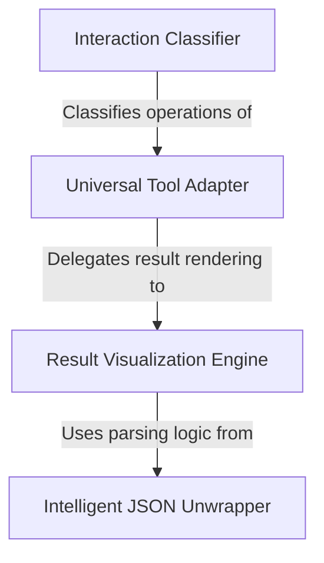

# Tutorial: MCPTool

This project implements a flexible **Universal Tool Adapter** that allows an AI assistant to connect with any external service using the **Model Context Protocol (MCP)**, functioning like a universal power plug for different software tools. It includes a smart **Result Visualization Engine** that automatically formats outputs—using an **Intelligent JSON Unwrapper** to translate complex data into readable text—and an **Interaction Classifier** that categorizes actions (like searching or reading) to keep the chat interface clean.

## Chapters

1. [Universal Tool Adapter](01_universal_tool_adapter.md)
2. [Interaction Classifier](02_interaction_classifier.md)
3. [Result Visualization Engine](03_result_visualization_engine.md)
4. [Intelligent JSON Unwrapper](04_intelligent_json_unwrapper.md)

---

Generated by [Code IQ](https://github.com/adityasoni99/Code-IQ)