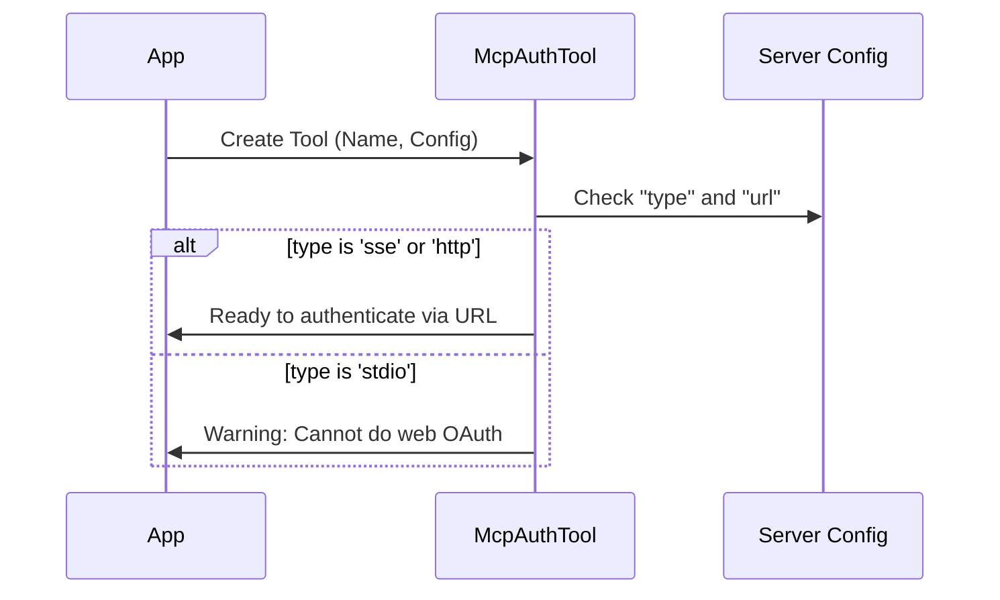

# Chapter 1: MCP Server Configuration

Welcome to the first chapter of the **McpAuthTool** tutorial! In this series, we will build a mental model of how an application manages authentication for Model Context Protocol (MCP) servers.

## Motivation: The "Contact Card" Problem

Imagine you want your application to talk to a specific service, like a **Weather Server** or a **GitHub Server**. Before the app can send messages or ask for data, it needs to know basic details:

1.  **Who** is it talking to?
2.  **How** does it connect (via the internet? via a command line?)?
3.  **Where** does the server live?

In our project, we solve this using the **MCP Server Configuration**.

Think of this configuration as a digital **Contact Card**. Before we try to log in or run tools, we check this card. If the card says the server is "Offline" or uses a communication method we don't understand, we can stop early. If the card looks good, we know exactly where to send the user to log in.

## Key Concepts

The configuration is represented in code by types like `ScopedMcpServerConfig`. Let's break down the essential parts of this "Contact Card."

### 1. Transport Type (`type`)
This tells us the *method* of communication.
*   **`http` / `sse`**: The server is on the web (Server-Sent Events).
*   **`stdio`**: The server runs locally on your computer as a background process.

### 2. Location (`url`)
If the transport is `http` or `sse`, we need a web address (URL) to find it.

### 3. Scope
(Implicit in the name `Scoped...`) This tells us if this configuration applies to the whole app ("global") or just one specific project.

## Usage: Solving the Connection

Let's look at how we define these configurations in a simple way.

### Example: The Weather Server
Here is what a configuration object looks like for a server running over the web.

```typescript
// A generic contact card for a web-based server
const weatherServerConfig = {
  type: 'sse',               // HOW: Server-Sent Events
  url: 'http://localhost:3000/sse', // WHERE: Local address
  scope: 'global'            // WHO: Available everywhere
};
```
*Explanation: This object tells our app to look for the Weather Server at a specific URL using the SSE protocol.*

### Helper Function: Getting the URL
In our code, we often need to extract the URL safely. Since not all servers have URLs (some are local commands), we write a small helper.

```typescript
// From McpAuthTool.ts
function getConfigUrl(config: ScopedMcpServerConfig): string | undefined {
  // Check if the config object actually has a 'url' property
  if ('url' in config) {
    return config.url
  }
  // If not (e.g., it's a local command), return nothing
  return undefined
}
```
*Explanation: This function looks at the "Contact Card". If there is a website address written on it, it returns it. Otherwise, it returns `undefined`.*

## Internal Implementation

How does the `McpAuthTool` use this configuration?

When our tool tries to authenticate a server, it acts like a gatekeeper. It reads the configuration to decide if it's even *possible* to start an authentication flow (like logging in via a browser).

### The Decision Flow

1.  The Tool receives the **Server Name** and **Configuration**.
2.  It reads the `type` from the configuration.
3.  **If** the type is `sse` or `http`: It prepares a login URL.
4.  **If** the type is `stdio` (command line): It often stops, because we can't easily open a web browser login page for a command-line tool.



### Code Deep Dive

Let's look at the real code in `McpAuthTool.ts` where this logic happens.

First, we determine the **Location** to show the user description:

```typescript
// Inside createMcpAuthTool function
export function createMcpAuthTool(serverName: string, config: ScopedMcpServerConfig) {
  // 1. Get the URL using our helper
  const url = getConfigUrl(config)
  // 2. Get the transport type (default to stdio if missing)
  const transport = config.type ?? 'stdio'
  
  // 3. Create a readable string like "sse at http://..."
  const location = url ? `${transport} at ${url}` : transport
  // ...
}
```
*Explanation: We build a friendly string describing where the server is. This helps the AI understand what it is looking at.*

Second, we check the **Compatibility** before running:

```typescript
// Inside the tool's call() method
if (config.type !== 'sse' && config.type !== 'http') {
  return {
    data: {
      status: 'unsupported',
      message: `Server uses ${transport} transport. No OAuth support.`
    },
  }
}
```
*Explanation: This is the gatekeeper. If the configuration says the server is not web-based (`sse` or `http`), the tool refuses to run the OAuth flow because it doesn't know how to handle it.*

## Conclusion

In this chapter, we learned about **MCP Server Configuration**. It acts as a "Contact Card" that tells our application:
1.  **How** to talk to a server (Transport).
2.  **Where** the server is (URL).

The `McpAuthTool` relies on this configuration to determine if it can safely start an authentication process for the user.

Now that we know *who* we are talking to, we need to define *how* the AI interacts with this authenticator.

[Next Chapter: Tool Interface](02_tool_interface.md)

---

Generated by [Code IQ](https://github.com/adityasoni99/Code-IQ)