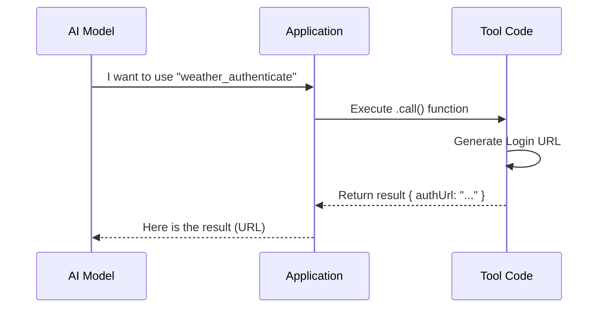

# Chapter 2: Tool Interface

Welcome to the second chapter of the **McpAuthTool** tutorial!

In the previous chapter, [MCP Server Configuration](01_mcp_server_configuration.md), we learned how to read the "Contact Card" of a server to know where it lives. Now, we need to teach our AI how to interact with that server.

## Motivation: The "Skill" Manual

Imagine you have a super-smart robot butler (the AI). It wants to help you, but it doesn't know how to use your new fancy coffee machine.

To fix this, you don't rewrite the robot's brain. Instead, you hand it a **manual** (an Interface) that says:
1.  **Name:** "Brew Coffee"
2.  **Description:** "Use this when the user asks for caffeine."
3.  **Inputs:** "Requires: cup size (small/large) and roast type."
4.  **Action:** "When you decide to do this, press the green button."

In our project, this manual is called a **Tool Interface**.

The `McpAuthTool` acts as a specific skill: **"Authenticate Server"**. We need to package the code that handles logging in so the AI understands *when* and *how* to use it.

## Key Concepts

In our codebase, a Tool is just a TypeScript object with four main parts.

### 1. Name & Description
This is the text the AI reads.
*   **Name**: A unique ID (e.g., `weather-server_authenticate`).
*   **Description**: Natural language text explaining the tool's purpose. The better the description, the smarter the AI behaves.

### 2. Input Schema
This acts like a generic form. It defines what data the AI needs to provide.
*   *Example:* A weather tool might need `{ city: "London" }`.
*   *Our Case:* Since we are just asking to "Log In," we usually don't need extra arguments.

### 3. Execution (`call`)
This is the actual code that runs when the AI decides to use the tool. This is where the magic happens.

## Usage: Defining the Auth Tool

Let's look at how we construct this object in `McpAuthTool.ts`. We wrap the creation in a function called `createMcpAuthTool`.

### The Skeleton
Here is the simplified structure of our tool. Notice how it maps to the "Manual" analogy.

```typescript
// Ideally, this returns a Tool object
export function createMcpAuthTool(serverName: string, config: any) {
  return {
    name: `${serverName}_authenticate`, // Unique ID
    
    // The "Manual" for the AI
    async description() {
      return `The ${serverName} server needs login. Call this to get an auth URL.`
    },

    // The "Form" (Empty, because we don't need arguments)
    get inputSchema() {
      return z.object({}) 
    },

    // The "Action" button
    async call(input, context) {
      // Code to start the login process goes here...
      return { data: { message: "Here is your login URL..." } }
    }
  }
}
```
*Explanation: We are returning an object that adheres to the `Tool` contract. The AI platform (like Claude) will receive the `name`, `description`, and `inputSchema` to understand what this tool does.*

## Internal Implementation

What happens when the AI actually uses this tool?

### The Conversation Flow

The AI doesn't run code itself. It just sends a text message saying, "I want to run tool X." The application acts as the executor.

1.  **AI Analysis**: The AI reads the `description`. It realizes the server requires authentication.
2.  **Tool Request**: The AI sends a request: "Please run `weather_authenticate`."
3.  **Execution**: The App runs the `call()` function we defined.
4.  **Result**: The App returns a result (e.g., a URL) to the AI.



### Code Deep Dive

Let's look at the real implementation in `McpAuthTool.ts` to see how the `call` function works.

#### Step 1: Validation
First, the tool checks if it *can* actually perform the action based on the config we learned about in [Chapter 1](01_mcp_server_configuration.md).

```typescript
async call(_input, context) {
  // We check the config type from Chapter 1
  if (config.type !== 'sse' && config.type !== 'http') {
    return {
      data: {
        status: 'unsupported',
        message: `Server uses ${config.type}. No OAuth support.`
      },
    }
  }
  // ... continue to auth logic
}
```
*Explanation: Just like a physical machine might have safety sensors, our code checks if the transport type allows for web-based logging in.*

#### Step 2: Doing the Work
If the check passes, we perform the OAuth flow. We need to get a URL to show the user.

```typescript
  // Start the background process to get the URL
  const authUrlPromise = new Promise<string>(resolve => {
    // This logic extracts the URL from the OAuth service
    performMCPOAuthFlow(serverName, config, (url) => resolve(url), /*...*/)
  })

  // Wait for the URL to be ready
  const authUrl = await authUrlPromise
```
*Explanation: We start the authentication process. This code waits until the system generates a clickable link (the `authUrl`).*

#### Step 3: Returning the Output
Finally, we return the data in a format the AI understands.

```typescript
  return {
    data: {
      status: 'auth_url',
      authUrl,
      // Instructions for the AI to tell the user
      message: `Ask the user to open this URL: ${authUrl}`
    },
  }
}
```
*Explanation: This is the return value of the function. The AI receives this message and will likely say to the user: "Please click this link to log in."*

## Conclusion

In this chapter, we explored the **Tool Interface**. We learned that a Tool is simply a standard contract containing:
1.  **Description**: Telling the AI *what* it is.
2.  **Schema**: Telling the AI *what inputs* it needs.
3.  **Call**: The code that runs to *do the work*.

However, there is something unique about this specific tool. It's not a permanent tool like "Calculator" or "Weather". It only exists *until* the user logs in, and then it should disappear to be replaced by the real server tools.

How do we handle a tool that is meant to be temporary? We'll discuss this special behavior in the next chapter.

[Next Chapter: Pseudo-Tool Pattern](03_pseudo_tool_pattern.md)

---

Generated by [Code IQ](https://github.com/adityasoni99/Code-IQ)