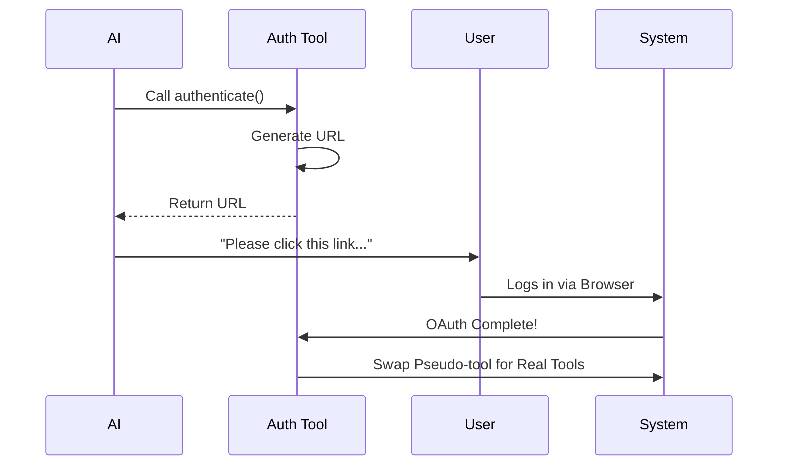

# Chapter 3: Pseudo-Tool Pattern

Welcome to the third chapter of the **McpAuthTool** tutorial!

In the previous chapter, [Tool Interface](02_tool_interface.md), we learned how to define the "manual" that teaches an AI how to use a specific function. We learned that every tool has a name, a description, and a `call()` function.

Now, we face a logical problem. We want the AI to use tools from a server (like "Get Weather"), but the server won't let us until we log in. If we show the AI the "Get Weather" tool too early, it will try to use it and get a "Permission Denied" error.

We solve this with the **Pseudo-Tool Pattern**.

## Motivation: The "Login Screen"

Think of your favorite video streaming app.

When you open the app but haven't signed in yet, do you see the "Play Movie" buttons? No. If you did, clicking them would just result in errors.

Instead, you see a **Login Screen**. It is a temporary placeholder.
1.  It sits where the content usually is.
2.  Its only purpose is to get you authenticated.
3.  Once you log in, it **disappears** and is replaced by the actual movies.

In our system, the "Play Movie" button is a Real Tool. The "Login Screen" is the **Pseudo-Tool**.

## Key Concepts

This pattern relies on swapping what the AI sees based on the state of the system.

### 1. The Placeholder
When a server is installed but not authenticated, we hide all its real capabilities. We generate a single, artificial tool—the **Auth Tool**.

### 2. The Description Strategy
We must write the description of this Pseudo-Tool carefully. It must tell the AI:
*   "I represent the Server X."
*   "I am here because you are not logged in."
*   "Use me to fix that."

### 3. The Self-Destruct
This tool is designed to be temporary. Once it successfully runs, it triggers a refresh that removes itself from the list and loads the real tools.

## Usage: Creating the Placeholder

Let's look at how we build this specific tool in `McpAuthTool.ts`. It follows the interface we learned in Chapter 2, but the logic inside is unique.

### Defining the Purpose
First, we define a description that explains the situation to the AI.

```typescript
// Inside createMcpAuthTool
const description = 
  `The ${serverName} server is installed but requires authentication. ` +
  `Call this tool to start the OAuth flow. ` +
  `Once authorized, the server's real tools will become available.`
```
*Explanation: We are explicit. We tell the AI that the real tools are missing on purpose and this tool is the key to unlocking them.*

### Handling the Call
When the AI calls this tool, we don't fetch data. We generate an **Authorization URL**.

```typescript
// Inside the tool's call() method
return {
  data: {
    status: 'auth_url',
    // We get this URL from our OAuth service (covered in Chapter 4)
    authUrl: 'https://example.com/login?token=123',
    message: `Ask the user to open this URL: https://example.com/login...`
  }
}
```
*Explanation: The output of this tool is a request for human help. The AI will read this message and type to the user: "Please click this link to log in."*

## Internal Implementation

How does the system handle this flow step-by-step?

### The Sequence

The Pseudo-Tool acts as a bridge between the AI's intent and the User's browser.

1.  **AI** sees only the `authenticate` tool.
2.  **AI** calls the tool.
3.  **Tool** generates a URL and sends it back to the AI.
4.  **AI** shows the URL to the **User**.
5.  **User** logs in via the browser.
6.  **Tool** detects success and swaps itself for the real tools.



### Code Deep Dive

Let's look at the implementation details in `createMcpAuthTool`.

#### 1. The Wait for URL
When the tool is called, we kick off the OAuth process. We need to wait for the system to generate a valid login link.

```typescript
// We create a Promise that waits for the URL
const authUrlPromise = new Promise<string>(resolve => {
  // performMCPOAuthFlow is the engine (Chapter 4)
  // We pass 'resolve' so the engine can give us the URL
  performMCPOAuthFlow(serverName, config, (url) => resolve(url), /*...*/)
})
```
*Explanation: We are pausing the tool's execution here until the internal OAuth engine (which we will build in the next chapter) hands us the link.*

#### 2. The Background Swap
While the AI is waiting for the user to click the link, the code sets up a "listener" for when the process finishes.

```typescript
// This runs in the background
void oauthPromise.then(async () => {
  // 1. Reconnect to the server to get real tools
  const result = await reconnectMcpServerImpl(serverName, config)
  
  // 2. Update the application state (remove Auth Tool, add Real Tools)
  setAppState(prev => ({
    ...prev,
    // (Complex state update logic to swap tools...)
  }))
})
```
*Explanation: This is the "Self-Destruct" mechanism. As soon as the login finishes, this code runs to update the application's memory, removing the Auth Tool and adding the real ones.*

#### 3. Returning the Instruction
Finally, we return the result to the AI so it can speak to the user.

```typescript
const authUrl = await authUrlPromise

return {
  data: {
    status: 'auth_url',
    authUrl,
    message: `Ask the user to open this URL: ${authUrl}`
  }
}
```
*Explanation: The cycle is complete. The AI has done its job (getting the link), and now the user must do theirs.*

## Conclusion

In this chapter, we explored the **Pseudo-Tool Pattern**.

We learned that instead of letting the AI fail with "Unauthorized" errors, we guide it by:
1.  **Hiding** the real tools initially.
2.  **Exposing** a single "Authenticate" placeholder tool.
3.  **Swapping** them automatically once the user logs in.

However, we glazed over a very complex part: *How* did we actually generate that URL? *How* does the system know when the user has finished logging in on their browser?

That "magic" is handled by the **OAuth Flow**, which is the topic of our next chapter.

[Next Chapter: OAuth Flow Orchestration](04_oauth_flow_orchestration.md)

---

Generated by [Code IQ](https://github.com/adityasoni99/Code-IQ)