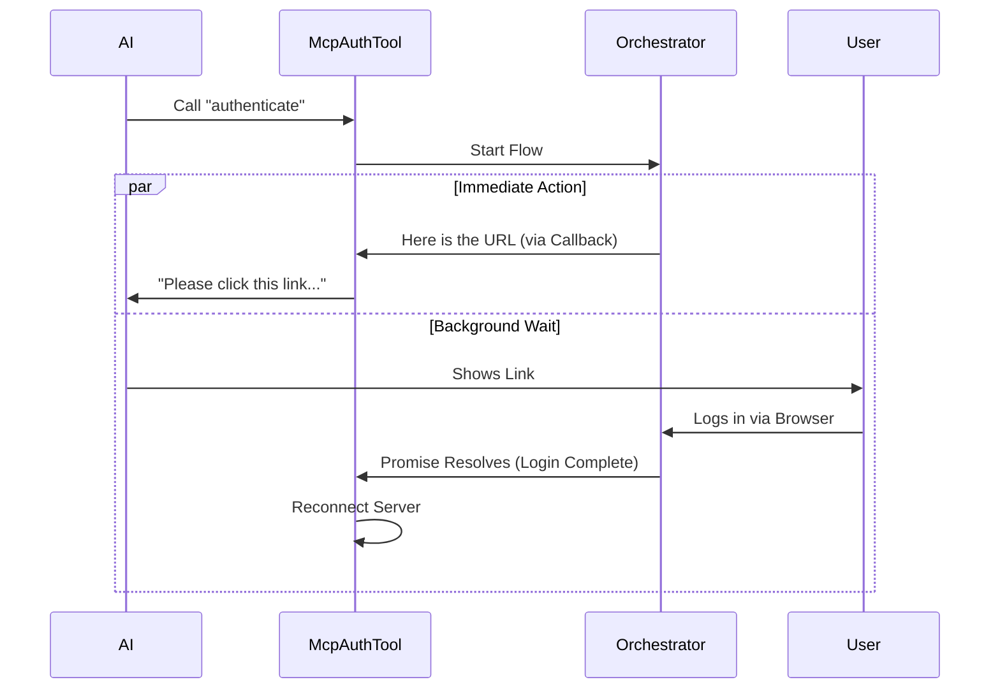

# Chapter 4: OAuth Flow Orchestration

Welcome to the fourth chapter of the **McpAuthTool** tutorial!

In the previous chapter, [Pseudo-Tool Pattern](03_pseudo_tool_pattern.md), we built a "fake" tool that acts as a placeholder. It promises to give the AI a login link.

But how do we actually generate that link? And more importantly, how does our code know when the user has finished logging in on their browser?

This requires **OAuth Flow Orchestration**.

## Motivation: The "Coat Check" Problem

Authentication is a complex dance. It is **asynchronous** (it takes time) and involves multiple parties (The App, The User, The Browser, The Server).

Think of this process like a **Coat Check** at a secure facility:

1.  **Request:** You (The Tool) walk up to the counter and ask to enter.
2.  **Ticket:** The attendant gives you a ticket (The Auth URL) and says, "Go get this stamped by security."
3.  **The Wait:** You leave to find security. The attendant doesn't close the shop; they stay open, waiting for your specific return.
4.  **Verification:** Once security (The Browser) approves you, you return.
5.  **Entry:** The attendant sees the stamp, unlocks the door (Reconnects Server), and lets you in.

We need a code structure that can hand out the ticket (URL) immediately, but keep the "attendant" waiting in the background until the user returns.

## Key Concepts

To handle this in code, we use a specific pattern involving **Promises** and **Callbacks**.

### 1. The Orchestrator
We have a function called `performMCPOAuthFlow`. This is the Coat Check Attendant. It manages the entire lifecycle of the login.

### 2. The Callback (The Ticket Handover)
Since generating the URL happens quickly, but the user logging in takes a long time, we can't just `return` the final result immediately. Instead, we provide a **Callback function**.
*   *Concept:* "Call this specific function as soon as you have the URL, even if the user hasn't logged in yet."

### 3. The Background Promise (The Wait)
The orchestrator returns a **Promise**. In JavaScript/TypeScript, a Promise represents a future event.
*   *Concept:* This Promise will strictly resolve (finish) only **after** the user has successfully logged in via the browser.

## Usage: The Two-Step Process

Let's look at how we use this orchestration in a simplified way.

We need to extract two things from the orchestrator:
1.  **The URL** (to show the AI/User immediately).
2.  **The Completion Signal** (to know when to refresh the server).

```typescript
// 1. We create a variable to hold the 'resolve' function
let sendUrlToAI;

// 2. We start the orchestration
const whenUserIsDone = performMCPOAuthFlow(
  serverName, 
  config, 
  // This is the Callback: It runs immediately when the URL is ready
  (url) => { sendUrlToAI(url) }
);

// 3. 'whenUserIsDone' is a Promise that finishes much later
whenUserIsDone.then(() => {
  console.log("User finished logging in! We can now connect.");
});
```
*Explanation: We start the flow. We instruct it to hand us the URL via a callback. Meanwhile, the code continues running, holding onto the `whenUserIsDone` promise for later.*

## Internal Implementation

How does the data flow through the system?

### The Sequence Diagram

Here is the "Coat Check" flow visualized. Notice how the Tool sends the URL to the AI *before* the User finishes logging in.



### Code Deep Dive

Let's look at the real code in `McpAuthTool.ts`. This can be tricky because we are mixing immediate actions with background actions.

#### Step 1: capturing the URL
We need to "pause" our Tool logic until we get the URL. We use a manual Promise for this.

```typescript
// Create a holder for the URL
let resolveAuthUrl: ((url: string) => void) | undefined

// Create a Promise that waits for the URL to arrive
const authUrlPromise = new Promise<string>(resolve => {
  resolveAuthUrl = resolve
})
```
*Explanation: We create a "parking spot" (`authUrlPromise`). The code will wait here until `resolveAuthUrl` is called.*

#### Step 2: Starting the Orchestrator
Now we call the main engine: `performMCPOAuthFlow`.

```typescript
// Start the flow
const oauthPromise = performMCPOAuthFlow(
  serverName,
  config,
  // The Callback: When the system generates a URL, send it to our parking spot
  (u) => resolveAuthUrl?.(u),
  controller.signal,
  { skipBrowserOpen: true } // We want the AI to show the link, not open it automatically
)
```
*Explanation: We pass the `resolveAuthUrl` function into the orchestrator. As soon as the orchestrator generates a login link, it calls this function, which releases the "parking spot" we made in Step 1.*

#### Step 3: Handling the Completion (The Background Wait)
While the AI is busy showing the link to the user, we need to handle what happens when the user actually finishes.

```typescript
// This runs in the BACKGROUND (void means we don't await it here)
void oauthPromise.then(async () => {
  // 1. Clear old data
  clearMcpAuthCache()
  
  // 2. Reconnect the server (now that we are logged in)
  const result = await reconnectMcpServerImpl(serverName, config)
  
  // 3. Update the app state (Swap fake tool for real tools)
  // ... (Covered in Chapter 5)
})
```
*Explanation: This `.then()` block is a set of instructions for the future. We are saying: "I am going to return the URL to the AI now, BUT... whenever the user finishes logging in, come back and run this code to reconnect the server."*

#### Step 4: Returning the URL to the AI
Finally, we wait for that first "parking spot" (the URL) to fill up, and then we give it to the AI.

```typescript
// Wait for the URL to appear
const authUrl = await authUrlPromise

// Return it to the AI
return {
  data: {
    status: 'auth_url',
    authUrl,
    message: `Ask the user to open this URL...`
  },
}
```
*Explanation: The AI gets the message. The user gets the link. And unbeknownst to them, a background process is silently waiting for the "Success" signal.*

## Conclusion

In this chapter, we learned about **OAuth Flow Orchestration**.

We solved the "Coat Check" problem by splitting our logic into two parallel tracks:
1.  **The Fast Track:** Getting the URL and giving it to the user immediately.
2.  **The Slow Track:** Waiting in the background for the user to finish, so we can unlock the door.

We have successfully coordinated the login. The user has clicked the link, authenticated, and our background promise has resolved. The server is ready!

But how do we update the application to show the new tools without restarting the whole program?

[Next Chapter: Dynamic State Management](05_dynamic_state_management.md)

---

Generated by [Code IQ](https://github.com/adityasoni99/Code-IQ)