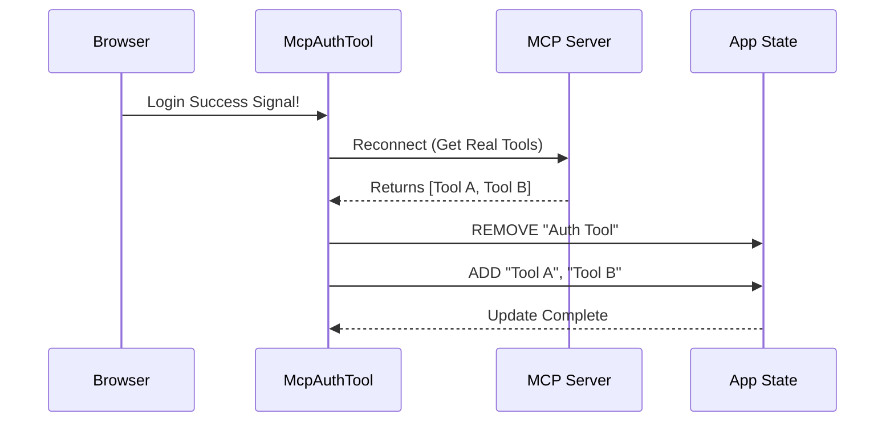

# Chapter 5: Dynamic State Management

Welcome to the fifth and final chapter of the **McpAuthTool** tutorial!

In the previous chapter, [OAuth Flow Orchestration](04_oauth_flow_orchestration.md), we solved the "Coat Check" problem. We successfully waited for the user to log in via their browser, and our code received a signal that the process was complete.

Now, we have one final challenge. The AI still sees the "Login" tool. We need to seamlessly replace that "Login" tool with the *actual* server tools (like "Get Weather" or "List Files") without restarting the application.

We call this **Dynamic State Management**.

## Motivation: The Stage Manager

Imagine a stage manager in a theater.

1.  **Scene 1:** The stage is set up as a **Lobby**. The only prop is a "Login Booth" (the Auth Tool).
2.  **Action:** The actor (User) enters the booth and successfully identifies themselves.
3.  **Scene Change:** The stage manager doesn't stop the play and ask the audience to leave. Instead, they rush onto the stage, **remove** the Login Booth, and **bring in** the scenery for the next act (the Real Tools).

In our application, the "Stage" is the **Application State**. We need to swap the props so the AI can continue working immediately.

## Key Concepts

To understand how we do this in code, we need to understand `appState`.

### 1. Global State (`appState`)
This is the application's memory. It holds a list of everything the AI can use:
*   **Clients:** The connections to servers.
*   **Tools:** The functions the AI can call.
*   **Resources:** Data files the AI can read.

### 2. Atomic Updates
When we swap tools, we must do it **Atomically**. This means we change everything at the exact same instant. We don't want a millisecond where the AI sees *no* tools, or a mix of old and new tools.

### 3. Immutability (The Snapshot)
In modern application design (like React), we don't just "erase" an item from a list. We create a **new copy** of the list with the item removed.
*   *Analogy:* Think of the State as a photograph. To change the scene, we don't draw on the photo. We take a **new photograph** of the new scene and replace the old photo on the wall.

## Usage: The State Updater

In our code, we use a function called `setAppState`. It allows us to take the "Old Photo" (`prev`), make changes, and save the "New Photo".

### Conceptual Example

Imagine our state looks like this:
```javascript
{ tools: ["Login_Tool"] }
```

We want it to look like this:
```javascript
{ tools: ["Weather_Tool", "City_Search_Tool"] }
```

Here is how we express that transformation in code:

```typescript
// We call the "Setter" function
setAppState(prev => ({
  // 1. Copy everything else from the old state
  ...prev, 
  
  // 2. Replace the 'tools' list entirely
  tools: ["Weather_Tool", "City_Search_Tool"] 
}))
```
*Explanation: We are telling the system to keep all other settings the same, but overwrite the `tools` list with our new items.*

## Internal Implementation

Let's trace the full lifecycle of this "Scene Change" inside the `McpAuthTool`.

### The Sequence Diagram

This happens *after* the user finishes logging in (from Chapter 4).



### Code Deep Dive

The logic for this swap lives inside the `.then()` block of our OAuth promise. We break it down into three specific steps.

#### Step 1: Fetching the Real Props
First, we need to talk to the server again. Now that we are logged in, the server will agree to give us the real tool definitions.

```typescript
// Inside the background .then() block
void oauthPromise.then(async () => {
  // 1. Clear any old cached login data
  clearMcpAuthCache()

  // 2. Ask the server for the fresh configuration
  const result = await reconnectMcpServerImpl(serverName, config)
  
  // 'result' now contains the real tools!
  // ...
})
```
*Explanation: `reconnectMcpServerImpl` is the truck bringing the new scenery to the theater. It returns the new tools we want to show.*

#### Step 2: Identifying What to Remove
We need to remove the "Auth Tool". But the `appState` might contain tools from *other* servers (like GitHub or Google Drive) that we must not touch.

We use a **Prefix** to identify our own tools.

```typescript
// ... inside .then()

// Get the unique ID prefix for this server (e.g., "mcp__weather__")
const prefix = getMcpPrefix(serverName)

// We will use this 'prefix' to find and delete the old auth tool
// ...
```
*Explanation: Every tool belonging to this server starts with a specific name. We will use this name tag to filter them out.*

#### Step 3: The Atomic Swap
This is the most critical part. We update the state. We use a helper function `reject` (from a library called Lodash) which means "Keep everything EXCEPT items that match this rule."

```typescript
setAppState(prev => ({
  ...prev, // Keep other app settings
  mcp: {
    ...prev.mcp,
    // THE SWAP LOGIC:
    tools: [
      // 1. Keep tools from OTHER servers (reject our own old ones)
      ...reject(prev.mcp.tools, t => t.name?.startsWith(prefix)),
      
      // 2. Add the NEW tools we just fetched
      ...result.tools,
    ],
    // We do the same for commands, resources, etc...
  },
}))
```
*Explanation: This is the magic moment. In one single operation, the "Authenticate" tool vanishes (rejected) and the real server tools appear (`...result.tools`).*

### The Result

As soon as `setAppState` runs:
1.  The AI's context is updated.
2.  The "Authenticate" tool is gone.
3.  The AI can now "see" the new tools and will likely immediately say: *"I see the authentication worked. I will now fetch the weather for you."*

## Conclusion

Congratulations! You have completed the **McpAuthTool** tutorial.

We have built a sophisticated system that:
1.  **Reads Configuration** ([Chapter 1](01_mcp_server_configuration.md)) to know who to talk to.
2.  **Defines Interfaces** ([Chapter 2](02_tool_interface.md)) so the AI understands the tool.
3.  **Uses Pseudo-Tools** ([Chapter 3](03_pseudo_tool_pattern.md)) to hide complexity behind a placeholder.
4.  **Orchestrates OAuth** ([Chapter 4](04_oauth_flow_orchestration.md)) to handle the asynchronous user login.
5.  **Manages State** (Chapter 5) to dynamically swap the placeholder for the real capabilities.

You now understand how to build a seamless authentication bridge between an AI model and a secure server. The "Contact Card" leads to the "Ticket," the "Ticket" leads to the "Verification," and the "Verification" leads to the "Show."

**End of Tutorial.**

---

Generated by [Code IQ](https://github.com/adityasoni99/Code-IQ)