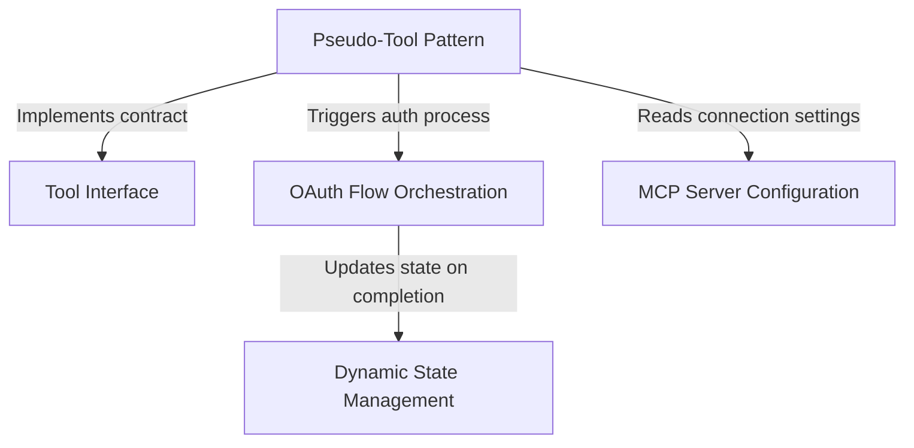

# Tutorial: McpAuthTool

This project implements a **Pseudo-Tool Pattern** to handle authentication for **MCP servers** within an AI assistant. Instead of exposing unusable tools, the system presents a temporary "authenticate" tool that the AI can invoke to start an **OAuth flow**. Once the user successfully logs in, **Dynamic State Management** seamlessly swaps this placeholder for the server's actual capabilities, allowing the "conversation" to proceed without interruption.

## Chapters

1. [MCP Server Configuration](01_mcp_server_configuration.md)
2. [Tool Interface](02_tool_interface.md)
3. [Pseudo-Tool Pattern](03_pseudo_tool_pattern.md)
4. [OAuth Flow Orchestration](04_oauth_flow_orchestration.md)
5. [Dynamic State Management](05_dynamic_state_management.md)

---

Generated by [Code IQ](https://github.com/adityasoni99/Code-IQ)