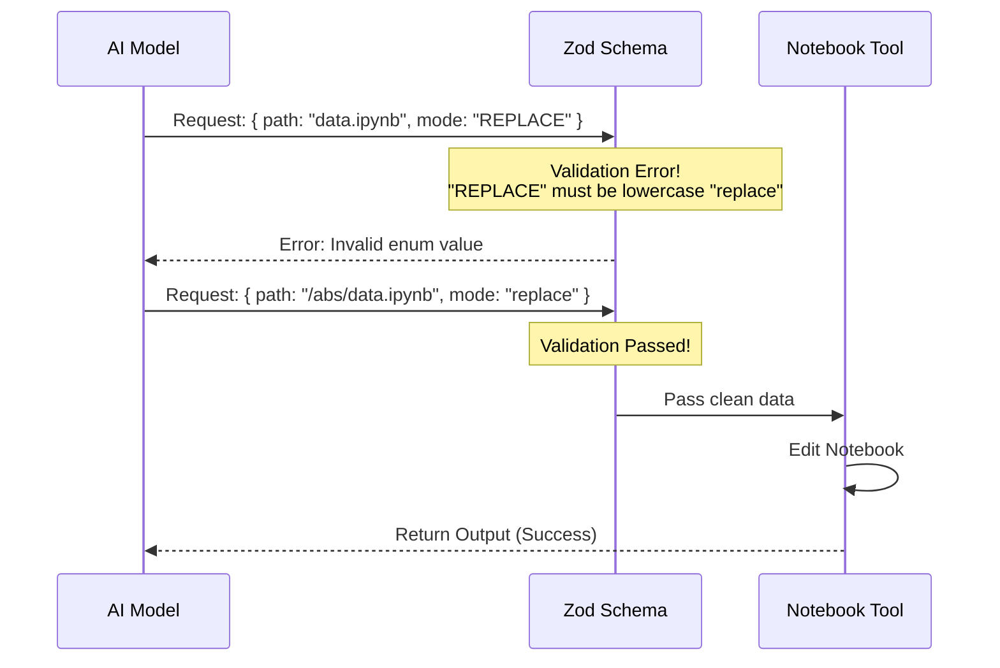

# Chapter 1: Schema Definitions

Welcome to the **NotebookEditTool** project! 

In this series, we will build a tool that allows an AI to read and modify Jupyter Notebooks (`.ipynb` files). Before we can write any logic to edit files, we need to establish the ground rules.

This chapter covers **Schema Definitions**.

## The Problem: Speaking the Same Language

Imagine you are ordering a custom pizza. You need to tell the kitchen the size, the crust type, and the toppings. If you just yell "Pizza!" into the phone, the kitchen won't know what to make.

The same applies to AI tools. When an AI wants to edit a notebook, it needs to provide specific details:
1.  **Which file** to edit?
2.  **Which cell** inside that file?
3.  **What changes** to make?

If the AI sends a number when we expect a text string, or a relative path when we need an absolute one, the tool will crash.

## The Solution: Zod Schemas

To solve this, we use a library called **zod**. It acts like a strict form validator. It defines a **Schema**—a contract that the AI must follow.

There are two sides to this contract:
1.  **Input Schema:** The "Order Form" (What the AI sends us).
2.  **Output Schema:** The "Receipt" (What we send back to the AI).

### 1. The Input Schema

The input schema acts as a bouncer at the door of our tool. It rejects any request that doesn't look right.

Here is the high-level structure of our input using `zod`.

```typescript
// Define a strict object - no unknown fields allowed!
z.strictObject({
  notebook_path: z.string(),
  new_source: z.string(),
  edit_mode: z.enum(['replace', 'insert', 'delete']),
  // ... other fields
})
```
*Explanation: We are telling the system that `notebook_path` MUST be text (string) and `edit_mode` MUST be one of three specific options.*

#### Breaking Down the Fields

Let's look at the specific rules for the inputs.

**1. The File Path**
```typescript
notebook_path: z
  .string()
  .describe(
    'The absolute path to the Jupyter notebook file...',
  ),
```
*The description is crucial! The AI reads this description to understand what data to provide.*

**2. The Edit Mode**
```typescript
edit_mode: z
  .enum(['replace', 'insert', 'delete'])
  .optional()
  .describe('The type of edit to make... Defaults to replace.'),
```
*We restrict the AI to only three actions. It cannot try to "move" or "copy" because we haven't programmed those.*

**3. The Content**
```typescript
new_source: z.string().describe('The new source for the cell'),
```
*This is the actual Python code or Markdown text the AI wants to write into the notebook.*

### 2. The Output Schema

After the tool finishes its job, it needs to report back. This is the **Output Schema**. It ensures the system gets consistent data for logging and history.

```typescript
export const outputSchema = lazySchema(() =>
  z.object({
    new_source: z.string(),
    error: z.string().optional(),
    original_file: z.string(),
    updated_file: z.string(),
    // ... metadata
  }),
)
```
*Explanation: We promise to return the `new_source` we wrote, any `error` that occurred, and snapshots of the file before and after the edit (for safety/undo features).*

---

## How It Works: The Flow

Before looking at the final code, let's visualize what happens when the AI tries to use the tool.



## Internal Implementation

Now, let's look at the actual code implementation in `NotebookEditTool.ts`.

### Lazy Loading
You might notice we wrap our schemas in `lazySchema`.

```typescript
import { lazySchema } from '../../utils/lazySchema.js'
import { z } from 'zod/v4'

export const inputSchema = lazySchema(() =>
  z.strictObject({
    // ... definitions
  })
)
```
*Why?* Performance. If we have 100 tools, we don't want to build all their schema objects the moment the app starts. `lazySchema` waits until the tool is actually needed before building the validator.

### The Complete Input Definition
Here is the robust input definition used in the project:

```typescript
export const inputSchema = lazySchema(() =>
  z.strictObject({
    notebook_path: z.string().describe('Absolute path to .ipynb file'),
    cell_id: z.string().optional().describe('ID of cell to edit'),
    new_source: z.string().describe('New source code'),
    // ...
  }),
)
```

### The Type Inference Magic
One of the best features of `zod` is that it creates TypeScript types for us automatically. We don't have to manually write an interface.

```typescript
// This extracts the TypeScript type from the validation logic!
type InputSchema = ReturnType<typeof inputSchema>
```
*Now, `InputSchema` is a TypeScript type we can use throughout our code to ensure type safety.*

## Summary

In this chapter, we defined the "contracts" for our tool:

1.  We used `z.strictObject` to define exactly what parameters the AI must provide.
2.  We used `z.enum` to restrict the `edit_mode` to safe operations.
3.  We defined an `outputSchema` to structure our response.

By setting these rules up front, we prevent many bugs and security issues before the tool logic even runs.

In the next chapter, we will take these schemas and build the "shell" of our tool.

[Next Chapter: NotebookEditTool Core](02_notebookedittool_core.md)

---

Generated by [Code IQ](https://github.com/adityasoni99/Code-IQ)