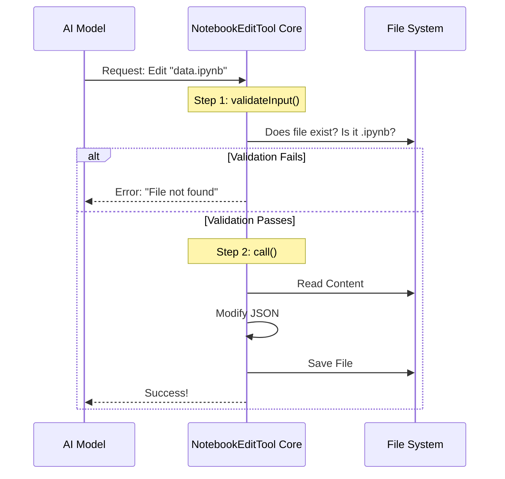

# Chapter 2: NotebookEditTool Core

Welcome back! In the previous chapter, [Schema Definitions](01_schema_definitions.md), we designed the "Order Form" (Input Schema) that the AI must fill out to request a notebook edit.

Now, we need to build the **Chef** who actually receives that order and cooks the meal.

This chapter covers **NotebookEditTool Core**.

## The Motivation: The Brain of the Operation

Having a schema is great, but a schema is just a piece of paper. It doesn't *do* anything. We need a central controller that:
1.  **Identifies itself** to the AI ("Hi, I am the Edit Notebook tool").
2.  **Checks safety** ("Wait, does this file actually exist?").
3.  **Executes the work** ("Okay, writing new code to Cell #3").

In our project, we use a function called `buildTool` to create this controller. It ties the input schema, the validation logic, and the execution logic into one neat package.

## The Solution: `buildTool`

The `NotebookEditTool` is defined as a single object. Think of it as a robot. We build this robot by giving it a name, a description, and a set of instructions.

Here is the skeleton of our tool in `NotebookEditTool.ts`:

```typescript
export const NotebookEditTool = buildTool({
  name: 'notebook_edit_tool', 
  userFacingName: 'Edit Notebook',
  
  // Connect the schemas we made in Chapter 1
  get inputSchema() { return inputSchema() },
  get outputSchema() { return outputSchema() },

  // ... Lifecycle methods (validate, call) go here
})
```
*Explanation: We are telling the system, "This tool is named 'Edit Notebook', and it expects data matching `inputSchema`."*

## The Lifecycle: How the Tool Thinks

When the AI wants to use this tool, the request goes through a specific lifecycle. It acts like a security checkpoint at an airport.



Let's break down the two main steps: **Validation** and **Execution**.

### 1. The Bouncer: `validateInput`

Before we touch any files, we must ensure the request is safe and logical. This happens in `validateInput`.

**Check A: Is it the right file type?**
We don't want the AI trying to edit a `.jpg` image as if it were a notebook.

```typescript
async validateInput({ notebook_path }, context) {
  // Check file extension
  if (extname(notebook_path) !== '.ipynb') {
    return {
      result: false,
      message: 'File must be a Jupyter notebook (.ipynb file).',
    }
  }
  // ... more checks
}
```

**Check B: The "Read-First" Rule**
This is a crucial safety feature. We require the AI to *read* a file before it tries to *edit* it. This prevents the AI from guessing what's in a file (hallucinating) and accidentally overwriting data it didn't know about.

```typescript
const readTimestamp = context.readFileState.get(fullPath)

if (!readTimestamp) {
  return {
    result: false,
    message: 'File has not been read yet. Read it first.',
  }
}
```
*Explanation: We check the tool context to see if this file is in our "recently read" list. If not, we reject the edit.*

### 2. The Worker: `call`

If validation passes, the `call` method runs. This is where the magic happens.

The `call` method orchestrates the entire editing process. Note that Jupyter Notebooks are technically just complex JSON text files.

**Step A: Read and Parse**
```typescript
async call({ notebook_path, new_source }, context) {
  // Read the raw text from the hard drive
  const { content } = readFileSyncWithMetadata(fullPath)
  
  // Parse the text into a JSON object
  let notebook = jsonParse(content)
  
  // ... proceed to edit
}
```

**Step B: Modify the Data**
Depending on what the AI asked for (`replace`, `insert`, or `delete`), we modify the JSON object in memory.

```typescript
// Example: Replacing source code in a specific cell
const targetCell = notebook.cells[cellIndex]

targetCell.source = new_source
targetCell.execution_count = null // Reset this because code changed
```
*Explanation: We find the specific cell in the array and update its `source` property with the new code provided by the AI.*

**Step C: Save to Disk**
Finally, we turn the JSON object back into text and save it.

```typescript
// Convert back to string with nice indentation
const updatedContent = jsonStringify(notebook, null, 1)

// Write to disk
writeTextContent(fullPath, updatedContent, encoding, lineEndings)

return { data: { /* success message */ } }
```

## Internal Implementation Details

Let's look deeper into `NotebookEditTool.ts` to see how we handle permissions and specific logic.

### Permission Checks
Before `validateInput` even runs, there is a hidden step: `checkPermissions`. We don't want the AI editing system files or files outside the project folder.

```typescript
async checkPermissions(input, context) {
  return checkWritePermissionForTool(
    NotebookEditTool,
    input,
    context.getAppState().toolPermissionContext,
  )
}
```
*Explanation: This delegates the security check to a helper function. If the user hasn't granted write access to this folder, the tool stops here.*

### Handling "Insert" vs "Replace"
The core logic has to handle different `edit_mode` instructions differently.

1.  **Delete:** Remove an item from the `notebook.cells` array.
2.  **Insert:** Add a new item to the array at a specific index.
3.  **Replace:** Find an item and update its properties.

This logic is vital because the AI sees a notebook as a list of cells, but the computer sees a JSON object. The Core translates the AI's intent into array operations.

## Summary

In this chapter, we built the **NotebookEditTool Core**.

1.  We used `buildTool` to define the tool's identity.
2.  We implemented `validateInput` to act as a safety guard (enforcing file types and the "read-first" rule).
3.  We implemented `call` to perform the actual file I/O and JSON manipulation.

This Core is the bridge between the AI's abstract request and the physical file system.

However, the AI won't know *how* to use this tool unless we explain it clearly in natural language. That is the job of the **Prompt**.

[Next Chapter: Tool Prompts and Metadata](03_tool_prompts_and_metadata.md)

---

Generated by [Code IQ](https://github.com/adityasoni99/Code-IQ)