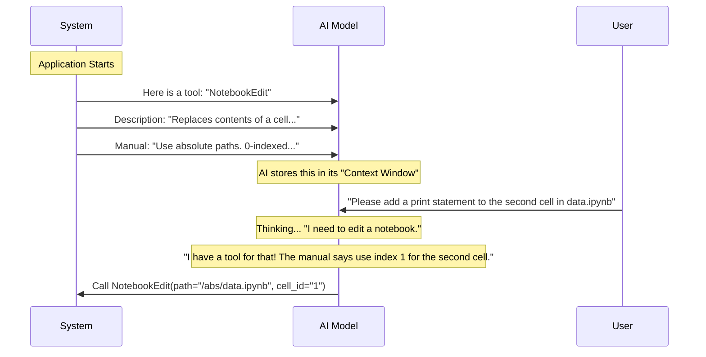

# Chapter 3: Tool Prompts and Metadata

Welcome back! 

In [Chapter 1: Schema Definitions](01_schema_definitions.md), we created the input forms (schemas). In [Chapter 2: NotebookEditTool Core](02_notebookedittool_core.md), we built the robot (the tool logic) that processes those forms.

However, we have a problem. We have a robot, and we have a form, but the AI **doesn't know they exist.**

Imagine buying a complex kitchen gadget that comes in a blank white box with no label and no instruction manual. You wouldn't know if it's a toaster or a blender, or which buttons to press.

This chapter covers **Tool Prompts and Metadata**—the labels and instruction manuals we write so the AI understands how to use our tool.

## The Motivation: giving the AI an "Instruction Manual"

Large Language Models (LLMs) are smart, but they aren't psychic. When a user asks, "Fix the code in my notebook," the AI needs to know:
1.  **What tools do I have?** (Is there a notebook editor?)
2.  **How do I use them?** (Do I send a filename or a file ID?)
3.  **What are the rules?** (Can I use relative paths?)

We solve this by defining **Metadata** (names/labels) and **Prompts** (text instructions).

## Key Concepts

We need to define three specific things for the `NotebookEditTool`.

### 1. The Tool Name
This is the unique ID used by the computer code. It must be precise.
*   **Our Value:** `notebook_edit_tool`

### 2. The Description
This is a short, tweet-sized summary. The AI reads this to decide *if* it should use this tool.
*   **Our Value:** "Replace the contents of a specific cell in a Jupyter notebook."

### 3. The System Prompt
This is the detailed "Instruction Manual." It explains edge cases, formatting rules, and limitations.

## Implementing the Prompt

We keep our text strings in a separate file called `prompt.ts` to keep our code clean.

Let's look at `prompt.ts`.

### The Description
```typescript
export const DESCRIPTION =
  'Replace the contents of a specific cell in a Jupyter notebook.'
```
*Explanation: Short and sweet. It tells the AI the primary function.*

### The Prompt (The Manual)
This is where we have to be very specific. If we are vague here, the AI will make mistakes.

```typescript
export const PROMPT = `Completely replaces the contents of a specific cell...
The notebook_path parameter must be an absolute path, not a relative path.
The cell_number is 0-indexed.
Use edit_mode=insert to add a new cell...
Use edit_mode=delete to delete the cell...`
```
*Explanation: Look at the specific rules we included:*
1.  **"Absolute path":** We explicitly tell the AI not to use shortcuts like `./file.ipynb`.
2.  **"0-indexed":** We remind the AI that counting starts at 0, not 1.
3.  **"edit_mode":** We explain what the different modes (`insert`, `delete`) actually do.

## Connecting Metadata to the Tool

Now we need to attach these strings to the tool we built in the previous chapter. Open `NotebookEditTool.ts`.

In the `buildTool` configuration, we add these fields:

### 1. Naming the Tool
```typescript
import { NOTEBOOK_EDIT_TOOL_NAME } from './constants.js'

export const NotebookEditTool = buildTool({
  name: NOTEBOOK_EDIT_TOOL_NAME, // 'notebook_edit_tool'
  userFacingName: 'Edit Notebook',
  // ...
})
```
*Explanation: `name` is for the AI/System. `userFacingName` is for the human user interface (e.g., a button label).*

### 2. Attaching the Manual
We wire up the descriptions we wrote in `prompt.ts`.

```typescript
import { DESCRIPTION, PROMPT } from './prompt.js'

export const NotebookEditTool = buildTool({
  // ...
  async description() {
    return DESCRIPTION
  },
  async prompt() {
    return PROMPT
  },
  // ...
})
```
*Explanation: We provide functions that return our strings. They are `async` because, in advanced tools, the description might change based on the situation. Here, they are static.*

## How the AI Reads the Manual

It helps to understand "when" the AI reads this. This happens *before* the user even asks a question. This is often called "System Context Injection."



## Why "Prompt Engineering" Matters Here

You might wonder why we need to say "The notebook_path parameter must be an absolute path" in the prompt. Can't the code just handle relative paths?

We *could* write code to handle relative paths (using `path.resolve`), and we actually did in the previous chapter!

```typescript
// From Chapter 2: NotebookEditTool.ts
const fullPath = isAbsolute(notebook_path)
  ? notebook_path
  : resolve(getCwd(), notebook_path)
```

**So why put it in the prompt?**

It is a best practice called **Defense in Depth**.
1.  **Layer 1 (The Prompt):** We tell the AI, "Please give us absolute paths." This guides the AI to be precise and look up the full path before calling the tool.
2.  **Layer 2 (The Code):** If the AI ignores the instruction and sends a relative path anyway, our code catches it and fixes it.

By aligning the Prompt (instruction) with the Code (logic), we create a much more reliable tool.

## Summary

In this chapter, we learned how to document our tool for the AI:

1.  We defined a **Description** (`DESCRIPTION`) so the AI knows what the tool does.
2.  We defined a **System Prompt** (`PROMPT`) that acts as a strict instruction manual (e.g., "Use absolute paths").
3.  We attached these to our tool definition using `buildTool`.

Now the AI knows the tool exists, knows how to use it, and sends the request to our Core logic.

But wait—Jupyter Notebooks aren't simple text files. They are complex JSON structures. When the AI says "Update cell 2," how do we technically perform that surgery on the file content without breaking the JSON format?

That is the topic of the next chapter.

[Next Chapter: Notebook Manipulation Logic](04_notebook_manipulation_logic.md)

---

Generated by [Code IQ](https://github.com/adityasoni99/Code-IQ)