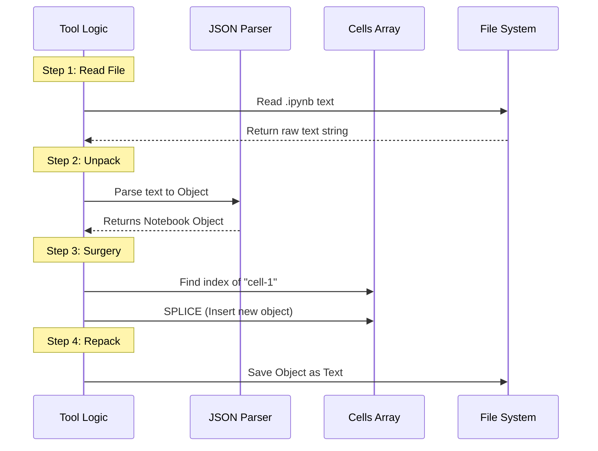

# Chapter 4: Notebook Manipulation Logic

Welcome back! 

In [Chapter 3: Tool Prompts and Metadata](03_tool_prompts_and_metadata.md), we taught the AI how to ask for a notebook edit. It now knows to send us a request like: *"Please insert a code cell at index 2."*

But how do we actually *do* that?

A Jupyter Notebook isn't a normal text file. You can't just open it and type. It is a fragile **JSON** structure. If you miss a single comma or bracket, the whole notebook breaks, and Jupyter won't open it.

This chapter covers **Notebook Manipulation Logic**—the surgical procedures we use to safely modify notebook files without killing the patient.

## The Motivation: Performing Surgery on JSON

Imagine a Jupyter Notebook file (`.ipynb`) as a bookshelf.
- The **File** is the bookshelf.
- The **Cells** are the books on that shelf.

If you want to replace the 3rd book, you can't just smash a new book into the wood. You have to:
1.  Take all the books off the shelf (Parse).
2.  Pull out the 3rd book (Locate).
3.  Put a new book in its place (Modify).
4.  Put all the books back on the shelf (Save).

The **Notebook Manipulation Logic** is the code responsible for these four steps. It ensures that when we add a "book," the shelf doesn't collapse.

## Key Concepts

To understand the code, we need to understand three concepts:

### 1. The Object Structure
To the computer, a notebook looks like this:

```json
{
  "cells": [
    { "cell_type": "code", "source": "print('hello')" },
    { "cell_type": "markdown", "source": "# Chapter 1" }
  ],
  "metadata": { ... }
}
```
Our goal is almost always to modify that `cells` list (array).

### 2. The Array "Splice"
Since `cells` is just a list, we use a JavaScript method called `.splice()`. It is a Swiss Army Knife for lists. It can:
*   **Remove** items.
*   **Insert** items.
*   **Replace** items.

### 3. Metadata Cleanup
When you run a code cell in Jupyter, it gets a number, like `In [5]`. This is called the `execution_count`.
If we change the code in that cell, the number `5` is no longer true (the new code hasn't run yet). Our logic must automatically reset this to `null`.

## Use Case: The "Insert" Operation

Let's say the AI wants to **Insert** a new code cell.

**The Input:**
*   **Mode:** `insert`
*   **Position:** After cell ID "cell-1"
*   **Content:** `print("New Cell")`

**The Goal:**
We need to find "cell-1" in the list, create a new JSON object for the new cell, and squeeze it into the list right after "cell-1".

## High-Level Logic Flow

Before looking at the code, let's trace the path of the data.



## Internal Implementation

Now, let's look at the actual code inside `NotebookEditTool.ts`. We will break the `call` method down into small, digestible pieces.

### Step 1: Parsing the Content
First, we turn the text file into a usable object.

```typescript
// Read the raw text
const { content } = readFileSyncWithMetadata(fullPath)

// Turn text into a JavaScript Object
let notebook = jsonParse(content) as NotebookContent
```
*Explanation: `notebook` is now an object we can manipulate in memory.*

### Step 2: Finding the Target
The AI might give us a Cell ID (a string like "829d8a") or an Index (a number like "2"). We need to find the numerical index (`0, 1, 2...`) for the array operation.

```typescript
// Find the cell index by looking for the ID
let cellIndex = notebook.cells.findIndex(cell => cell.id === cell_id)

// If the AI wants to INSERT, we usually target the spot AFTER the found cell
if (edit_mode === 'insert') {
  cellIndex += 1 
}
```
*Explanation: `findIndex` scans the list. If it finds the ID, it gives us the number. If we are inserting, we move the target one spot to the right.*

### Step 3: executing the Edit
This is the heart of the chapter. We handle the three modes: `delete`, `insert`, and `replace`.

#### A. The Delete Operation
Deleting is the simplest operation.

```typescript
if (edit_mode === 'delete') {
  // Remove 1 item at the specific index
  notebook.cells.splice(cellIndex, 1)
}
```
*Explanation: `splice(index, 1)` means "Start at `cellIndex` and remove **1** item."*

#### B. The Insert Operation
Inserting requires creating a new cell object first.

```typescript
} else if (edit_mode === 'insert') {
  // 1. Create the new cell object
  const new_cell = {
    cell_type: 'code',
    source: new_source,
    metadata: {},
    execution_count: null, // New cells haven't run yet!
    outputs: []
  }
  
  // 2. Insert it into the array
  notebook.cells.splice(cellIndex, 0, new_cell)
}
```
*Explanation: `splice(cellIndex, 0, new_cell)` means "Start at `cellIndex`, remove **0** items, and add `new_cell`."*

#### C. The Replace Operation
Replacing involves updating the existing object.

```typescript
} else {
  // Get the existing cell
  const targetCell = notebook.cells[cellIndex]
  
  // Update the source code
  targetCell.source = new_source
  
  // CLEANUP: Reset execution state because code changed
  if (targetCell.cell_type === 'code') {
    targetCell.execution_count = null
    targetCell.outputs = [] 
  }
}
```
*Explanation: We modify the object in place. Crucially, we clear `execution_count` and `outputs`. If we didn't do this, the notebook would show old results for new code, which is confusing and dangerous.*

### Step 4: Saving the Patient
Finally, we package the object back into text and write it to the disk.

```typescript
// Convert Object back to text with nice formatting (indentation)
const updatedContent = jsonStringify(notebook, null, 1)

// Write to the hard drive
writeTextContent(fullPath, updatedContent, encoding, lineEndings)
```
*Explanation: `jsonStringify` takes our modified memory object and turns it back into the strict JSON format the file system expects.*

## Why This Matters

This logic abstracts away the complexity of the file format.
*   The AI doesn't need to know how to format JSON.
*   The AI doesn't need to worry about `execution_count`.
*   The AI just says "Change code," and this tool handles the surgical details safely.

## Summary

In this chapter, we explored the **Notebook Manipulation Logic**:

1.  We learned that Notebooks are **JSON lists** of cells.
2.  We used `findIndex` to locate where to work.
3.  We used `splice` to **Delete** or **Insert** cells.
4.  We learned the importance of **resetting metadata** (like `execution_count`) when modifying code.

We have now built the entire backend of our tool! The AI can request edits, and our code safely performs them.

But wait—how does the human user know what's happening? They need to see the results. In the final chapter, we will build the user interface components to display these changes nicely.

[Next Chapter: UI Rendering Components](05_ui_rendering_components.md)

---

Generated by [Code IQ](https://github.com/adityasoni99/Code-IQ)