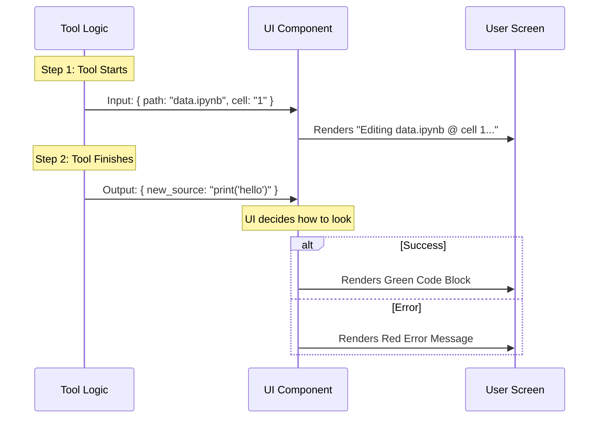

# Chapter 5: UI Rendering Components

Welcome to the final chapter of our series!

In the previous chapter, [Chapter 4: Notebook Manipulation Logic](04_notebook_manipulation_logic.md), we wrote the complex code that surgically edits a JSON notebook file.

However, if we stopped there, the tool would be an "invisible worker." The AI would say "I edited the file," but the user wouldn't see *what* changed or *where*.

This chapter covers **UI Rendering Components**. We will build the visual interface that shows the user exactly what is happening, turning invisible logic into visible action.

## The Motivation: Trust but Verify

Imagine ordering a meal at a restaurant.
1.  **The Order:** You tell the waiter what you want.
2.  **The Kitchen:** The chef cooks it (This was Chapter 4).
3.  **The Presentation:** The waiter brings the plate to your table so you can see it.

The **UI Rendering Components** are the waiter. They handle:
1.  **Summaries:** Telling the user "I am currently editing `data.ipynb`."
2.  **Results:** Showing the new code snippet right in the chat window so the user doesn't have to open the file to verify it.
3.  **Errors:** displaying a red warning if something goes wrong.

## Key Concepts

We use a library called **React** to build these visuals. If you are new to React, here are the basics:

### 1. Components
A component is a small, reusable chunk of the User Interface (UI). It’s like a LEGO brick. We have bricks for "File Links," "Code Blocks," and "Error Messages."

### 2. Props
"Props" (short for properties) are the data we pass into the component. It's like telling a Pizza Component: `toppings="pepperoni"`.

### 3. Ink (CLI UI)
Since our tool runs in a terminal (Command Line), we use a special library called **Ink**. It allows us to use React components like `<Box>` and `<Text>` to draw layouts inside a black-and-white terminal window.

## Visualizing the Flow

Before writing code, let's see how the data flows from the tool logic to the screen.



## Internal Implementation

We define our UI logic in a file named `UI.tsx`. Let's build the three main stages of the UI.

### 1. The Summary (`getToolUseSummary`)
This is the simplest part. When the tool is minimized or in a history list, we just want a one-line summary.

```typescript
export function getToolUseSummary(input) {
  // If we don't have a path, we can't summarize
  if (!input?.notebook_path) return null;

  // Return a clean version of the file path
  return getDisplayPath(input.notebook_path);
}
```
*Explanation: If the AI is editing `C:/Users/Docs/Project/data.ipynb`, this function might simply return `Project/data.ipynb` to save space.*

### 2. The "In-Progress" View (`renderToolUseMessage`)
While the tool is running (the "spinner" phase), we want to show the user what parameters the AI chose.

```typescript
export function renderToolUseMessage(input, { verbose }) {
  // Use a helper component to make the path clickable
  return (
    <>
      <FilePathLink filePath={input.notebook_path}>
        {getDisplayPath(input.notebook_path)}
      </FilePathLink>
      {` @${input.cell_id}`} 
    </>
  );
}
```
*Explanation: We render a clickable link to the file and the ID of the cell being edited. The `<>` symbols are "Fragments," used to group items together in React.*

### 3. The Result View (`renderToolResultMessage`)
This is the most important part. When the tool finishes, we show the result.

**Handling Errors:**
If the tool returned an error string, we show it in red.

```typescript
if (error) {
  return (
    <MessageResponse>
      <Text color="error">{error}</Text>
    </MessageResponse>
  );
}
```
*Explanation: `<Text color="error">` is an Ink component that makes the text red in the terminal.*

**Handling Success:**
If it worked, we show the new code using syntax highlighting.

```typescript
return (
  <MessageResponse>
    <Box flexDirection="column">
      <Text>Updated cell <Text bold>{cell_id}</Text>:</Text>
      
      {/* Show the code with syntax highlighting */}
      <Box marginLeft={2}>
        <HighlightedCode code={new_source} filePath="notebook.py" />
      </Box>
    </Box>
  </MessageResponse>
);
```
*Explanation:*
1.  We create a `Box` (like a `<div>` in HTML) to hold our content vertically (`column`).
2.  We display "Updated cell **[ID]**".
3.  We use `<HighlightedCode />` to show the Python code with pretty colors, so it's easy to read.

## Putting It Together

By defining these three functions, we hook into the application's display system. The main app doesn't know *how* `NotebookEditTool` works, but it knows that if it calls `renderToolResultMessage`, it will get a nice React component back.

## Conclusion of the Series

Congratulations! You have built a complete AI Tool from scratch.

Let's review the journey:
1.  **[Schema Definitions](01_schema_definitions.md):** We defined the "Contract" (Inputs/Outputs).
2.  **[NotebookEditTool Core](02_notebookedittool_core.md):** We built the "Controller" to handle validation and flow.
3.  **[Tool Prompts and Metadata](03_tool_prompts_and_metadata.md):** We wrote the "Instruction Manual" for the AI.
4.  **[Notebook Manipulation Logic](04_notebook_manipulation_logic.md):** We implemented the "Surgery" to modify JSON files safely.
5.  **[UI Rendering Components](05_ui_rendering_components.md):** We created the "Visuals" for the human user.

You now have a fully functional tool that allows an Artificial Intelligence to open a Jupyter Notebook, understand its structure, modify specific cells, and present the results back to you.

Happy coding!

---

Generated by [Code IQ](https://github.com/adityasoni99/Code-IQ)