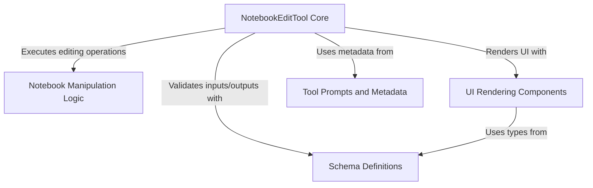

# Tutorial: NotebookEditTool

This project defines a specialized **tool** enabling an AI assistant to edit *Jupyter Notebooks* (`.ipynb` files). It safely parses the notebook's complex JSON structure to **insert**, **replace**, or **delete** specific cells based on user instructions. The tool includes strict **schema validation** to ensure data integrity and custom *UI components* to render the editing actions and results clearly in the chat interface.

## Chapters

1. [Schema Definitions](01_schema_definitions.md)
2. [NotebookEditTool Core](02_notebookedittool_core.md)
3. [Tool Prompts and Metadata](03_tool_prompts_and_metadata.md)
4. [Notebook Manipulation Logic](04_notebook_manipulation_logic.md)
5. [UI Rendering Components](05_ui_rendering_components.md)

---

Generated by [Code IQ](https://github.com/adityasoni99/Code-IQ)