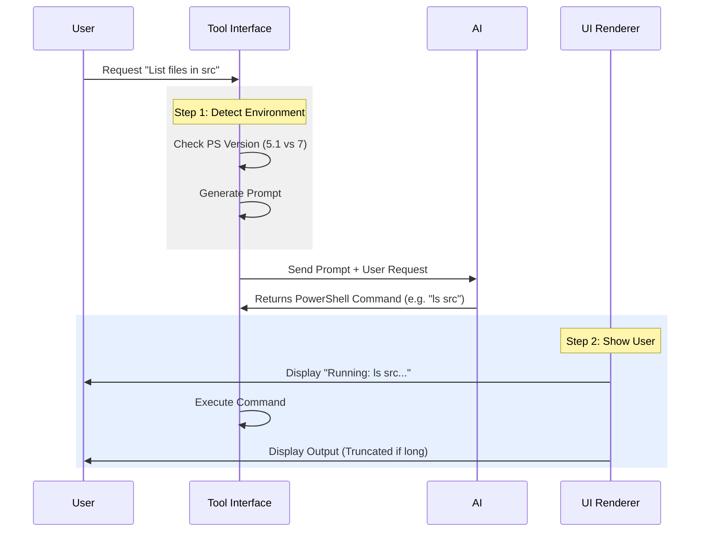

# Chapter 1: Tool Interface & Prompting

Welcome to the **PowerShellTool** project! This tool is a bridge between an advanced AI model (like Claude) and the raw power of the PowerShell terminal.

In this first chapter, we will explore the **Tool Interface & Prompting**. Think of this as the "User Experience" layer—but for two different users:
1.  **The AI:** It needs a strict "Guidebook" (Prompt) to know how to behave.
2.  **The Human:** You need a clean "Dashboard" (UI) to see what's happening without getting overwhelmed.

---

## The Motivation: The Diplomat

Imagine you are trying to give instructions to a super-intelligent robot, but that robot has never seen *your specific computer* before.
- It doesn't know if you are using an old version of Windows or the latest Linux server.
- It doesn't know that typing 1,000 lines of code will clutter your screen.

If we just let the AI guess, it might try to use features that don't exist on your computer, causing errors. Or, it might flood your screen with text.

**The Solution:** We create an interface that:
1.  **Detects your environment** and generates a custom instruction manual (Prompt) for the AI.
2.  **Intercepts the output** and renders a pretty, readable display (UI) for you.

---

## Concept 1: The Dynamic Guidebook (Prompting)

PowerShell comes in two main flavors:
1.  **Windows PowerShell (Desktop):** The classic version (v5.1). It's older and missing some modern features.
2.  **PowerShell Core (pwsh):** The modern, cross-platform version (v7+). It acts more like Bash.

The biggest challenge is that the AI knows *both*, but it doesn't know which one *you* are running.

### Solving the Version Problem
We use a function called `getEditionSection` in `prompt.ts`. This checks your version and tells the AI specifically what it is allowed to do.

```typescript
// prompt.ts (simplified)
function getEditionSection(edition: PowerShellEdition | null): string {
  if (edition === 'desktop') {
    return `PowerShell edition: Windows PowerShell 5.1
   - Pipeline chain operators && and || are NOT available.
   - Use "if ($?) { B }" instead.`
  }
  // ... handling for 'core' edition
}
```
*What's happening here?*
If the tool detects "Desktop" edition, it explicitly bans the `&&` operator. If the AI tries to use `cmd1 && cmd2` on Windows PowerShell 5.1, it crashes. This prompt prevents that crash before it happens.

### Assembling the Master Prompt
Once we know the edition, we build the full system prompt. This acts as the "Rules of Engagement" for the AI.

```typescript
// prompt.ts (simplified)
export async function getPrompt(): Promise<string> {
  const edition = await getPowerShellEdition()
  
  return `Executes a PowerShell command.
  
${getEditionSection(edition)}

1. Directory Verification: Verify parent directory exists.
2. Command Execution: Always quote file paths.`
}
```
*What's happening here?*
We fetch the edition rules and inject them into a larger template. We also add safety rules, like "Always quote file paths," to prevent simple syntax errors.

---

## Concept 2: The Visual Dashboard (UI)

Now that the AI knows what to do, we need to show *you* the results. We use a library called **Ink** (which is like React, but for terminals) to render the UI components in `UI.tsx`.

### Preventing Screen Flooding
If the AI decides to run a script that is 200 lines long, we don't want to scroll past a wall of text just to see if it worked.

```typescript
// UI.tsx (renderToolUseMessage)
if (!verbose) {
  const lines = displayCommand.split('\n');
  // If command is too long, cut it off
  if (lines.length > MAX_COMMAND_DISPLAY_LINES) {
     let truncated = lines.slice(0, MAX_COMMAND_DISPLAY_LINES).join('\n');
     return <Text>{truncated.trim()}…</Text>;
  }
}
```
*What's happening here?*
This code checks if the command is huge. If it is, it only shows the first 2 lines and adds an ellipsis (`...`). It keeps your terminal clean.

### Displaying Results Clearly
When the command finishes, we receive `stdout` (success output) and `stderr` (error output). We render them differently so you can spot errors instantly.

```typescript
// UI.tsx (renderToolResultMessage)
return <Box flexDirection="column">
  {stdout !== '' ? <OutputLine content={stdout} verbose={verbose} /> : null}
  
  {/* If there is an error, show it! */}
  {stderr.trim() !== '' ? 
     <OutputLine content={stderr} verbose={verbose} isError /> 
  : null}
</Box>;
```
*What's happening here?*
We use a `<Box>` component to stack the output. `stdout` is shown normally. `stderr` is passed a flag `isError`, which usually colors it red in the terminal so you can't miss it.

---

## Internal Implementation Flow

Here is how the Tool Interface coordinates the interaction between you, the Tool, and the AI.



1.  **Detection:** The tool figures out *where* it is running.
2.  **Prompting:** It creates a safe set of instructions for the AI.
3.  **Execution & UI:** It runs the command and uses React components to make the result look good.

---

## Summary

In this chapter, we learned that the **Tool Interface** is the critical first step in the `PowerShellTool`. It acts as:
1.  **A Teacher:** Telling the AI specific syntax rules for your PowerShell version via `prompt.ts`.
2.  **A Presenter:** using `UI.tsx` to keep your terminal output clean and readable.

This ensures that the AI doesn't write incompatible code and you don't drown in text.

Now that the AI knows *how* to write the commands and we know how to display them, we need to understand exactly how the tool executes those commands and handles the results.

[Next Chapter: Command Semantics & Interpretation](02_command_semantics___interpretation.md)

---

Generated by [Code IQ](https://github.com/adityasoni99/Code-IQ)