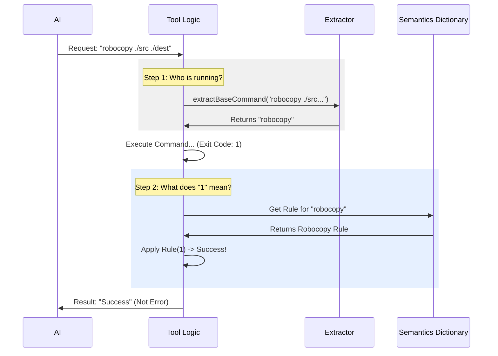

# Chapter 2: Command Semantics & Interpretation

In the previous [Tool Interface & Prompting](01_tool_interface___prompting.md) chapter, we learned how to generate the perfect "Guidebook" for the AI so it knows *how* to write commands.

But what happens **after** the command runs?

You might think it's simple: if the computer says "Exit Code 0", it worked. If it says "Exit Code 1", it failed. Unfortunately, Windows is not that simple.

Welcome to **Command Semantics**. This chapter explains how we translate the confusing "dialects" of different Windows tools into a universal language the AI can understand.

---

## The Motivation: The "Head Nod" Problem

Imagine you are traveling. In most countries, nodding your head up and down means "Yes." But in some countries, nodding actually means "No." If you don't know the local custom, you will get very confused.

Computer programs are the same way.

### The Central Use Case: Robocopy vs. Grep

Let's look at two common tools the AI might use:

1.  **Grep** (Search tool):
    *   If it finds text, it returns **0** (Success).
    *   If it finds *nothing*, it returns **1** (Error?).
2.  **Robocopy** (File copy tool):
    *   If it copies nothing (already synced), it returns **0**.
    *   If it successfully copies files, it returns **1**.

**The Problem:**
If we use the standard rule ("1 means Error"), the AI will run `robocopy`, successfully back up your files, receive Exit Code 1, and then panic thinking it broke something.

**The Solution:**
We need an interpreter layer—**Command Semantics**—that looks at *which* command ran and decides if the result was actually a success or failure.

---

## Concept 1: The Translator (Command Semantics)

We define a "Semantic" as a small function that takes the raw result and translates it into a clear boolean: `isError`.

### The Default Rule
Most tools follow the standard rule. We start with this default.

```typescript
// commandSemantics.ts (Simplified)
const DEFAULT_SEMANTIC = (exitCode) => ({
  // If exit code is NOT 0, we assume it failed
  isError: exitCode !== 0,
  message: exitCode !== 0 ? `Failed with code ${exitCode}` : undefined,
})
```
*Explanation:* This is the fallback. If we don't know the specific tool, we assume 0 is good and anything else is bad.

### The Robocopy Rule
Now we create a special rule just for `robocopy`.

```typescript
// commandSemantics.ts (Simplified)
[
  'robocopy',
  (exitCode) => ({
    // Robocopy uses codes 0-7 for various types of SUCCESS.
    // Only code 8 or higher is a real failure.
    isError: exitCode >= 8,
    
    // We can even provide a helpful message!
    message: exitCode === 1 ? 'Files copied successfully' : undefined
  }),
]
```
*Explanation:* When `robocopy` returns `1`, our tool intercepts it. Instead of throwing an error, it tells the AI: "Success: Files copied successfully."

---

## Concept 2: The Safety Inspector (Destructive Analysis)

Before we even run a command, we want to check if it looks dangerous. The AI is smart, but it can make mistakes. We don't want it to accidentally wipe your hard drive.

We use **Regex** (pattern matching) to scan commands for dangerous combinations.

### Defining Danger
We look for specific patterns, like `Remove-Item` combined with `-Recurse`.

```typescript
// destructiveCommandWarning.ts (Simplified)
const DESTRUCTIVE_PATTERNS = [
  {
    // Look for "rm" or "Remove-Item" AND "-Recurse"
    pattern: /Remove-Item.*-Recurse/i,
    warning: 'Note: may recursively remove files',
  },
  {
    // Look for "Stop-Computer"
    pattern: /\bStop-Computer\b/i,
    warning: 'Note: will shut down the computer',
  }
]
```
*Explanation:* We create a list of "Red Flags." If the command matches one of these, we generate a warning.

### Using the Warning
We don't block the command (sometimes you *want* to delete files), but we add a warning label to the permission dialog so you, the human, can double-check.

```typescript
// destructiveCommandWarning.ts
export function getDestructiveCommandWarning(command: string): string | null {
  for (const { pattern, warning } of DESTRUCTIVE_PATTERNS) {
    if (pattern.test(command)) {
      return warning // Found a match! Return the warning text.
    }
  }
  return null // No danger detected
}
```
*Explanation:* This function loops through our list of red flags. The first one that matches determines the warning message.

---

## Internal Implementation Flow

How does the tool know which rule to apply? Here is the flow when the AI tries to run a command.



### 1. Identify the Command
First, we need to strip away arguments to find the program name.
`& "C:\Windows\System32\robocopy.exe" /E` $\rightarrow$ `robocopy`

```typescript
// commandSemantics.ts (simplified)
function extractBaseCommand(segment: string): string {
  // remove leading '&' or '.'
  const clean = segment.trim().replace(/^[&.]\s+/, '') 
  // get the first word (the program name)
  const firstToken = clean.split(/\s+/)[0]
  // remove .exe and convert to lowercase
  return firstToken.toLowerCase().replace(/\.exe$/, '')
}
```
*Explanation:* This helper function cleans up the command string so we can look it up in our dictionary.

### 2. Apply the Logic
Finally, we put it all together in the main interpretation function.

```typescript
// commandSemantics.ts (simplified)
export function interpretCommandResult(cmd, exitCode, stdout, stderr) {
  // 1. Figure out what program ran
  const baseCommand = extractBaseCommand(cmd)
  
  // 2. Find its specific rule (or use Default)
  const semantic = COMMAND_SEMANTICS.get(baseCommand) ?? DEFAULT_SEMANTIC
  
  // 3. Run the rule against the exit code
  return semantic(exitCode, stdout, stderr)
}
```
*Explanation:* This is the entry point used by the main tool. It connects the command name to the specific logic defined in Concept 1.

---

## Summary

In this chapter, we solved the "Language Barrier" of Windows exit codes.

1.  **Semantics:** We learned that `Exit Code 1` doesn't always mean error. We built a dictionary (`COMMAND_SEMANTICS`) to translate specific tool results into a universal Success/Fail for the AI.
2.  **Safety:** We implemented `getDestructiveCommandWarning` to scan for dangerous patterns like `rm -Recurse`, ensuring the user is warned before big changes happen.

Now that we can safely interpret the results and warn about dangers, we need to decide: **Who is allowed to run these commands?**

[Next Chapter: Permission Orchestration](03_permission_orchestration.md)

---

Generated by [Code IQ](https://github.com/adityasoni99/Code-IQ)