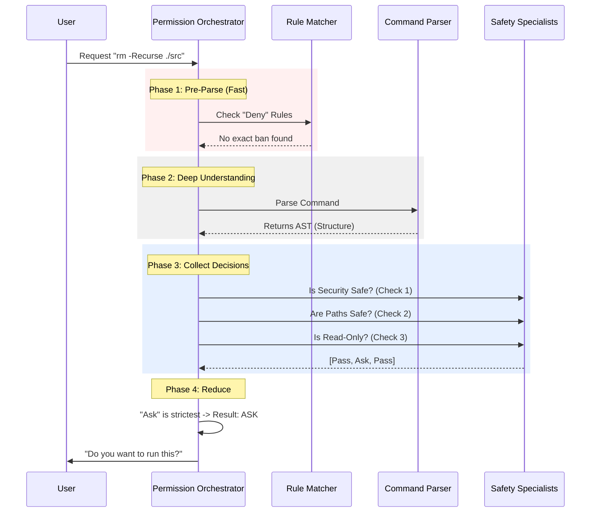

# Chapter 3: Permission Orchestration

In the previous [Command Semantics & Interpretation](02_command_semantics___interpretation.md) chapter, we learned how to translate the confusing results of a command after it runs.

But wait! Before we even run a command, shouldn't we check if it is safe?

Welcome to **Permission Orchestration**. This is the "Brain" of the tool. It decides whether a command gets a "Green Light" (Allow), a "Red Light" (Deny), or if it needs to check with you first (Ask).

---

## The Motivation: The Security Guard

Imagine a high-security building. At the entrance, there is a head security guard.

If a visitor arrives, the guard doesn't just glance at them and say "Go ahead."
1.  **The Blacklist Check:** Is this person banned? (Deny Rules)
2.  **The Bag Check:** Are they carrying dangerous items? (Security Scan)
3.  **The Area Check:** Are they trying to enter a restricted room? (Path Validation)

Crucially, **the order matters**. If the person is on the Blacklist, the guard sends them away immediately—they don't waste time checking their bag.

**The Problem:**
If we check rules in the wrong order, we might accidentally allow a dangerous command.
*   *Bad Scenario:* We see the user "Allowed" `git`. We see the command is `git status`. We allow it. BUT, we missed that the command was actually `cd /secret; git status`.

**The Solution:**
We need an **Orchestrator** that coordinates all these checks in a strict hierarchy.

---

## Concept 1: The "Collect-Then-Reduce" Strategy

In early versions of permission tools, the logic was often: "Check Rule A. If safe, return Allow. If not, Check Rule B."

This is dangerous. Why? Because Rule A might say "Safe" while Rule B screams "DANGER!"

In `PowerShellTool`, we use a strategy called **Collect-Then-Reduce**.

1.  **Collect:** We run *every* relevant check and throw the results into a pile (an array called `decisions`).
2.  **Reduce:** We look at the pile and pick the *strictest* result.

### The Hierarchy of "No"
When looking at our pile of decisions, the priority is strict:
1.  **DENY** (Highest Priority): If *any* check says Deny, the command is blocked. Period.
2.  **ASK**: If nothing is denied, but one check is unsure, we Ask the human.
3.  **ALLOW**: We only auto-allow if explicit rules say so AND no one raised a red flag.

---

## Concept 2: The Parsing Gate

We cannot trust a command string just by looking at it. PowerShell is tricky.
*   `Get-Process` looks safe.
*   `Get-Process; Remove-Item /` looks safe at the start, but is destructive at the end.

To handle this, the Orchestrator works in two phases:

1.  **Pre-Parse (The Fast Check):** We check simple text rules against the raw string. If you explicitly banned `rm`, we block `rm` immediately.
2.  **Post-Parse (The Deep Check):** We use a **Parser** to break the command into pieces (Abstract Syntax Tree). This lets us see hidden dangers inside pipelines or logic loops.

---

## Internal Implementation Flow

Here is how the Orchestrator handles a request like `rm -Recurse ./src`.



---

## Code Walkthrough

The logic lives in `powershellPermissions.ts`. Let's walk through the `powershellToolHasPermission` function.

### Step 1: Immediate Deny (Pre-Parse)
Before we do anything expensive, check if the user strictly banned this command.

```typescript
// powershellPermissions.ts
export async function powershellToolHasPermission(input, context) {
  const command = input.command.trim()

  // 1. Check strict rules on the raw text
  const exactMatch = powershellToolCheckExactMatchPermission(input, context)

  // If the user explicitly banned this, STOP immediately.
  if (exactMatch.behavior === 'deny') {
    return exactMatch
  }
```
*Explanation:* This is the bouncer checking the "Banned List" at the door. If you are banned, you don't get in, even if you are just here to deliver pizza.

### Step 2: Parsing & The Collection Bucket
If the command passes the first check, we parse it and prepare to collect opinions.

```typescript
  // 2. Parse the command to understand its structure
  const parsed = await parsePowerShellCommand(command)

  // 3. Create a bucket to hold all our safety checks
  const decisions: PermissionResult[] = []
```
*Explanation:* `parsed` is now a map of the command structure. `decisions` is an empty array where we will throw every "Allow", "Deny", or "Ask" we generate.

### Step 3: Collecting Opinions (The Specialists)
Now we call our specialist modules. (We will learn about these in the next chapters).

```typescript
  // Check A: Is the command fundamentally dangerous? (Chapter 6)
  const safetyResult = powershellCommandIsSafe(command, parsed)
  if (safetyResult.behavior !== 'passthrough') {
    decisions.push(safetyResult)
  }

  // Check B: Are the file paths safe? (Chapter 4)
  const pathResult = checkPathConstraints(input, parsed, ...);
  if (pathResult.behavior !== 'passthrough') {
    decisions.push(pathResult)
  }
```
*Explanation:* We ask [Security & Threat Detection](06_security___threat_detection.md) and [Path & Filesystem Validation](04_path___filesystem_validation.md) for their opinions. We push their answers into the `decisions` bucket.

### Step 4: The "Reduce" (Making the Call)
Finally, we look at everything in the bucket and apply the hierarchy.

```typescript
  // 4. REDUCE: Deny > Ask > Allow
  
  // Did ANY check say Deny?
  const denied = decisions.find(d => d.behavior === 'deny')
  if (denied) return denied

  // Did ANY check say Ask?
  const asked = decisions.find(d => d.behavior === 'ask')
  if (asked) return asked

  // Did explicit Allow rules match?
  const allowed = decisions.find(d => d.behavior === 'allow')
  if (allowed) return allowed
```
*Explanation:* This is the core logic. Even if 5 checks say "Allow", if one check says "Deny", the result is **Deny**. This ensures that a loophole in one check doesn't compromise the whole system.

---

## Summary

In this chapter, we explored the **Permission Orchestrator**, the central brain of the PowerShell tool.

1.  **Hierarchy:** We learned that "Deny" always beats "Ask", and "Ask" always beats "Allow".
2.  **Phases:** We learned we check rules *before* parsing (for speed/safety) and *after* parsing (for accuracy).
3.  **Collection:** We collect all safety concerns before making a final decision.

Now that the Orchestrator is running, it needs to consult its specialists. The most important specialist is the one that prevents the AI from writing over your important files.

[Next Chapter: Path & Filesystem Validation](04_path___filesystem_validation.md)

---

Generated by [Code IQ](https://github.com/adityasoni99/Code-IQ)