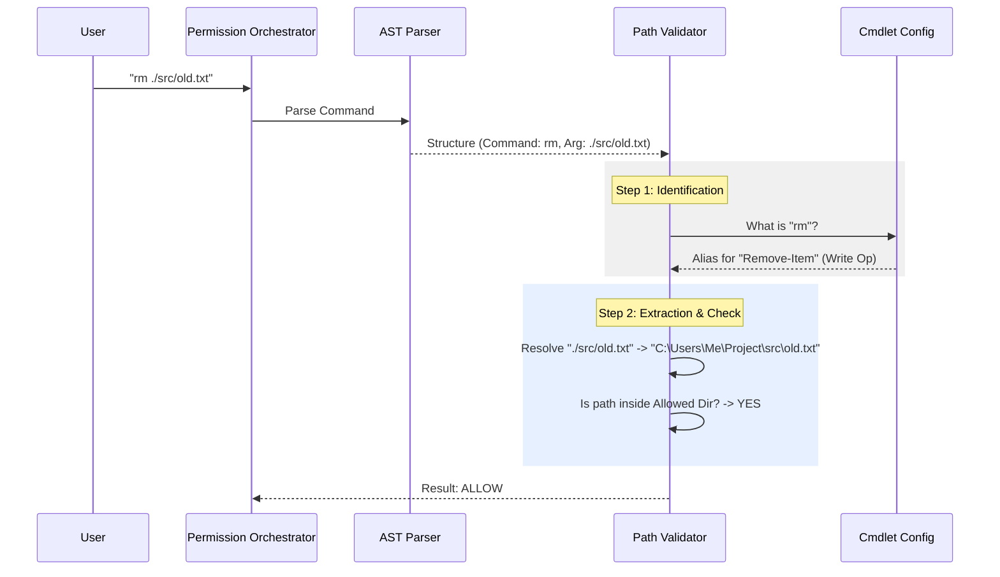

# Chapter 4: Path & Filesystem Validation

In the previous [Permission Orchestration](03_permission_orchestration.md) chapter, we built the "Brain" that decides if a command runs. We learned that the Orchestrator relies on "Specialists" to check specific dangers.

Now, we meet the most important specialist: **The Path Validator**.

When the AI tries to read or write a file, how do we ensure it doesn't accidentally reach outside the folder we gave it? How do we stop it from reading your passwords or deleting your operating system?

Welcome to **Path & Filesystem Validation**.

---

## The Motivation: The Robotic Arm

Imagine you are controlling a robotic arm in a warehouse. You tell it: *"Pick up the box in Aisle 3."*

If the robot is dumb, it might just swing its arm blindly toward "Aisle 3," knocking over expensive vases in Aisle 2 on the way.

**PowerShell is that robot.**
In Bash (Linux), commands are often simple strings of text. But in PowerShell, commands are complex objects with named parameters, aliases, and weird syntax.

### The Central Use Case
The user allows the AI to work in `C:\MyProject`.
The AI runs:
`Get-Content -Path "..\Windows\System32\drivers\etc\hosts"`

If we just looked for the word "Windows", the AI could trick us by writing `"Wi" + "ndows"`. We need a precise way to identify exactly *which* part of the command is the file path, extract it, and measure it against our allowed boundary.

---

## Concept 1: Surgical Extraction (AST)

We don't scan the command string with Regex (pattern matching) because it is too easily fooled. Instead, we use the **Abstract Syntax Tree (AST)**.

Think of the AST as an X-Ray of the command. It tells us the *structure*, not just the text.

### How it works
If the command is: `Set-Content -Path ./log.txt -Value "Error"`

1.  **Regex sees:** `Set-Content`, `-Path`, `./log.txt`, `-Value`, `"Error"`. It doesn't know which is which.
2.  **AST sees:**
    *   **Command:** `Set-Content`
    *   **Parameter:** `-Path` points to value `./log.txt`
    *   **Parameter:** `-Value` points to value `"Error"`

By using the AST, we can surgically extract `./log.txt` and ignore `"Error"`, ensuring we validate the right thing.

---

## Concept 2: The Configuration Map

PowerShell has hundreds of commands. `Get-Content` reads files. `New-Item` creates them. `Copy-Item` reads *and* creates.

We need a map that tells our tool exactly how to handle each command. We call this the `CMDLET_PATH_CONFIG`.

```typescript
// pathValidation.ts (simplified)
'set-content': {
  // This command changes files (WRITE)
  operationType: 'write',
  
  // These parameters accept file paths
  pathParams: ['-path', '-literalpath', '-pspath'],
  
  // These are safe switches (ignore them)
  knownSwitches: ['-force', '-passthru'],
  
  // These take values, but are NOT paths (ignore them)
  knownValueParams: ['-value', '-encoding'],
}
```
*Explanation:*
This configuration tells the tool: "If you see `Set-Content`, look at the `-Path` argument. That is the file. Check if that file is safe to write to. Ignore `-Value`."

---

## Concept 3: The Reality Check (Canonicalization)

The AI is tricky. It might try to use "Relative Paths" to escape the sandbox.

*   **The Trap:** `Get-Content ./safe-folder/../../Windows/System32`
*   **The Check:** We must "Resolve" the path before checking permissions.

**Canonicalization** means turning a messy path into its true, absolute form.
`./safe-folder/../../Windows` $\rightarrow$ `C:\Windows`

If the final path (`C:\Windows`) is not inside our allowed directory (`C:\MyProject`), we block it.

---

## Internal Implementation Flow

Here is the step-by-step process when the AI runs a command like `rm ./src/old.txt`.



---

## Code Walkthrough

Let's look at the actual code that powers this logic in `pathValidation.ts`.

### 1. The Extraction Loop
This function looks at every argument in the command to find the paths.

```typescript
// pathValidation.ts (simplified)
function extractPathsFromCommand(cmd) {
  const config = CMDLET_PATH_CONFIG[cmd.name];
  const paths = [];

  for (let i = 0; i < cmd.args.length; i++) {
    const arg = cmd.args[i];

    // Is this a known path parameter? (e.g. -Path)
    if (matchesParam(arg, config.pathParams)) {
       // Grab the NEXT argument as the value
       const value = cmd.args[i + 1];
       paths.push(value);
    }
    // Handle positional arguments (e.g. "rm file.txt")
    else if (isPositional(arg)) {
       paths.push(arg);
    }
  }
  return paths;
}
```
*Explanation:* We iterate through the command arguments. If we see `-Path`, we grab the *next* word because we know it's the filename. If we see a loose word (positional argument), we assume it's a path too, based on the command configuration.

### 2. The Validation Logic
Once we have the path string, we check if it is safe.

```typescript
// pathValidation.ts (simplified)
function validatePath(filePath, cwd, context) {
  // 1. Resolve to absolute path (handle .. and .)
  const absolutePath = resolve(cwd, filePath);
  
  // 2. Security Check: Block Glob patterns in writes
  // You cannot say "Delete *.txt" blindly.
  if (filePath.includes('*')) {
     return { allowed: false, reason: "No globs in write ops" };
  }

  // 3. Check if it is inside allowed directories
  if (pathInAllowedWorkingPath(absolutePath, context)) {
     return { allowed: true };
  }

  return { allowed: false }; // Blocked!
}
```
*Explanation:*
1.  **Resolve:** We calculate where the path actually goes.
2.  **Safety:** We block wildcards (`*`) for dangerous operations like delete/write. We don't want the AI deleting everything by accident.
3.  **Boundary:** We check if the final path is inside our "Safe Zone."

### 3. The Orchestrator Hook
Finally, this function ties it all together for the Orchestrator.

```typescript
// pathValidation.ts (checkPathConstraints)
export function checkPathConstraints(input, parsed, context) {
  // Loop through every command in the pipeline
  for (const statement of parsed.statements) {
    
    // Extract paths using AST
    const { paths, operationType } = extractPathsFromCommand(statement);

    // Validate every path found
    for (const path of paths) {
      const result = validatePath(path, getCwd(), context, operationType);
      
      // If ANY path is bad, stop and ASK the user.
      if (!result.allowed) {
        return { behavior: 'ask', message: result.message };
      }
    }
  }
  
  return { behavior: 'passthrough' }; // All good!
}
```
*Explanation:* This function is the entry point. It loops through every command found by the parser (handling even complex scripts), extracts paths, and validates them. If *anything* is suspicious, it returns `ask`, forcing the tool to pause and get human permission.

---

## Summary

In this chapter, we learned how **Path & Filesystem Validation** acts as a robotic arm controller.

1.  **AST Extraction:** We use the command's structure (not just text) to find file paths reliably.
2.  **Configuration:** We map every PowerShell command (like `Set-Content`) to know which parameters affect files.
3.  **Validation:** We resolve paths to their true location to prevent the AI from reaching outside its sandbox.

This ensures that even if the AI writes complex PowerShell code, it can only touch the specific "boxes" (files) allowed on the shelf.

But what about commands that *don't* take paths? What if the AI just runs `Get-Process`? It doesn't touch a file, but is it safe?

[Next Chapter: Read-Only Command Analysis](05_read_only_command_analysis.md)

---

Generated by [Code IQ](https://github.com/adityasoni99/Code-IQ)