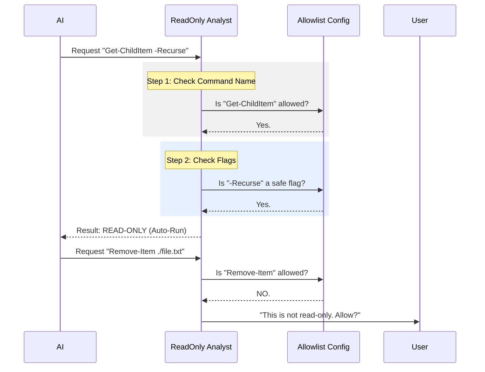

# Chapter 5: Read-Only Command Analysis

In the previous [Path & Filesystem Validation](04_path___filesystem_validation.md) chapter, we built a secure fence around the files the AI is allowed to touch. We know *where* it can go.

But knowing *where* it is doesn't tell us *what* it's doing.

If the AI is in your `Documents` folder, running `Get-Content` (reading a file) is harmless. Running `Remove-Item` (deleting a file) is a disaster.

Welcome to **Read-Only Command Analysis**. This is the component that tells the difference between "Looking" and "Touching."

---

## The Motivation: The Library Pass

Imagine a historic library with rare, fragile books.
*   **Read-Only Pass:** You can take a book off the shelf and read it. You can take notes on your own paper.
*   **Write Access:** You are allowed to write inside the books, tear out pages, or burn them.

Obviously, we want to give the AI a **Read-Only Pass** by default. We want it to be able to look up information without us constantly approving every single action. But if it tries to write, delete, or change settings, we want the security guard to stop it and ask for permission.

### The Central Use Case
The AI wants to check your computer's IP address.
*   **Command:** `Get-NetIPAddress -AddressFamily IPv4`
*   **Result:** This is safe. It just reads information. The tool should run it automatically.

Later, the AI tries to *change* your IP address.
*   **Command:** `New-NetIPAddress -IPAddress 192.168.1.50`
*   **Result:** This changes the system state. The tool must **PAUSE** and ask you: *"Do you want to run this?"*

---

## Concept 1: The VIP Guest List (The Allowlist)

PowerShell has thousands of commands (Cmdlets). We cannot possibly know if all of them are safe just by looking at their names.

Instead of trying to guess which ones are dangerous (a "Blacklist"), we do the opposite. We maintain a strict **Allowlist** (a "Whitelist"). Only commands explicitly known to be safe are allowed to run automatically.

We store this in a dictionary called `CMDLET_ALLOWLIST`.

```typescript
// readOnlyValidation.ts (Simplified)
export const CMDLET_ALLOWLIST = {
  // Reading files is safe
  'get-content': { 
     safeFlags: ['-Path', '-Tail', '-Encoding'] 
  },
  
  // Listing files is safe
  'get-childitem': { 
     safeFlags: ['-Path', '-Recurse', '-File'] 
  },
  
  // Checking processes is safe
  'get-process': { 
     safeFlags: ['-Name', '-Id'] 
  }
}
```
*Explanation:* If the AI tries to run `Remove-Item`, the tool looks at this list. `Remove-Item` is not there. Therefore, it is **not** Read-Only.

---

## Concept 2: The Bag Check (Flag Validation)

Being on the VIP list isn't enough. We also have to check what "baggage" (flags/arguments) the command is carrying.

Some commands are safe *unless* you use a specific flag.
*   **Example:** `Get-WmiObject` looks like a "Get" command, but it can trigger network requests or run code if passed complex filters.
*   **Example:** `Git` is generally safe, but `git clean` deletes files.

We solve this by defining `safeFlags` for every command.

```typescript
// Example Logic
function validateFlags(args, config) {
  for (const arg of args) {
    // If it looks like a flag (starts with -)
    if (arg.startsWith('-')) {
      // Check if this flag is in our allowed list
      if (!config.safeFlags.includes(arg)) {
         return false; // Unknown flag! Block it.
      }
    }
  }
  return true; 
}
```
*Explanation:* If the AI runs `Get-ChildItem -DestroyEverything`, the tool sees that `-DestroyEverything` is not in the `safeFlags` list for `Get-ChildItem`. It immediately revokes the Read-Only status.

---

## Concept 3: The Pipeline Chain

PowerShell is powerful because you can chain commands together using the pipe `|` symbol. This passes the output of one command to the next.

**The Rule:** A chain is only as safe as its weakest link.

1.  `Get-Process | Sort-Object`
    *   `Get-Process`: Safe.
    *   `Sort-Object`: Safe (it just reorganizes data).
    *   **Result:** Safe.

2.  `Get-Process | Stop-Process`
    *   `Get-Process`: Safe.
    *   `Stop-Process`: **Dangerous**.
    *   **Result:** Dangerous (Ask User).

The tool must loop through *every* segment of the pipeline. If even one command is not on the Allowlist, the whole chain stops.

---

## Internal Implementation Flow

How does the tool make this decision?



---

## Code Walkthrough

The logic lives in `readOnlyValidation.ts`. Let's look at the main function `isReadOnlyCommand`.

### 1. The Safety Loop
We use the parsed command (from Chapter 3) to look at every command in the pipeline.

```typescript
// readOnlyValidation.ts (Simplified)
export function isReadOnlyCommand(command, parsed) {
  // 1. Get all parts of the pipeline (e.g. "Get-Date | Write-Host")
  const segments = getPipelineSegments(parsed);

  // 2. Loop through every single command
  for (const pipeline of segments) {
    const cmd = pipeline.commands[0];

    // 3. Check if the command is on the Guest List AND checks flags
    if (!isAllowlistedCommand(cmd, command)) {
      return false; // Found a stranger! Not read-only.
    }
  }

  return true; // All checks passed.
}
```
*Explanation:* This function is the "Manager." It iterates through the chain. If everyone behaves, it returns `true`.

### 2. The Specific Check
This helper function checks a specific command against the configuration.

```typescript
// readOnlyValidation.ts (Simplified)
export function isAllowlistedCommand(cmd, originalText) {
  // 1. Look up the rules for this specific command
  const config = CMDLET_ALLOWLIST[cmd.name.toLowerCase()];
  
  if (!config) return false; // Not on the list

  // 2. Check every argument
  for (const arg of cmd.args) {
    if (isFlag(arg)) {
      // 3. Ensure the flag is in safeFlags
      if (!config.safeFlags.includes(arg)) {
        return false; // Illegal flag detected
      }
    }
  }
  
  return true;
}
```
*Explanation:* This is the "Bouncer." It checks the ID (name) and the bag (flags).

### 3. External Tools (Git, Docker, etc.)
We also support external tools like `git`. Because `git` doesn't use standard PowerShell flags, we have custom logic for it.

```typescript
// readOnlyValidation.ts (Simplified)
function isGitSafe(args) {
  // git [subcommand] [flags]
  const subcommand = args[0]; 

  // Check strict list of safe subcommands
  const safeGitCommands = ['status', 'log', 'diff', 'show'];
  
  if (!safeGitCommands.includes(subcommand)) {
    return false; // "git push" is NOT safe
  }

  return true;
}
```
*Explanation:* For tools like Git, the "Command" is actually the first argument (`status`, `push`). We handle these with special helper functions.

---

## Summary

In this chapter, we learned how **Read-Only Command Analysis** acts as the library rules for the AI.

1.  **Allowlist:** We rely on an explicit list of safe commands (`CMDLET_ALLOWLIST`). If it's not on the list, it's blocked.
2.  **Flag Validation:** We check every parameter to ensure no dangerous switches (like `-Force` or `--delete`) are sneaking in.
3.  **Pipeline Safety:** We validate the entire chain of commands to ensure a safe command isn't feeding data into a dangerous one.

Now the AI can safely Read files and Run harmless commands without bothering you. But what if the AI tries to run a command that is theoretically safe, but contains a hidden malicious script inside a variable?

[Next Chapter: Security & Threat Detection](06_security___threat_detection.md)

---

Generated by [Code IQ](https://github.com/adityasoni99/Code-IQ)