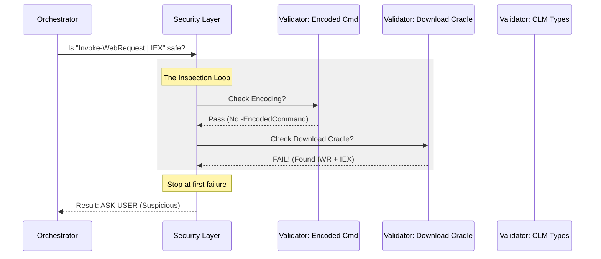

# Chapter 6: Security & Threat Detection

In the previous [Read-Only Command Analysis](05_read_only_command_analysis.md) chapter, we learned how to let the AI safely read files without letting it delete them.

But what if the AI tries to trick us?

Hackers (and sometimes confused AIs) use special techniques to hide their true intentions. They might scramble their code so it looks like gibberish, or try to download a virus from the internet and run it immediately.

Welcome to **Security & Threat Detection**. This layer acts like an **Antivirus** and **X-Ray Scanner** for the `PowerShellTool`.

---

## The Motivation: The Airport Security Scanner

Imagine you are at airport security.
1.  **Ticket Check (Permission):** Do you have a ticket? (We covered this in Chapter 3).
2.  **Bag Check (Path Validation):** Are you carrying allowed items? (We covered this in Chapter 4).
3.  **Body Scanner (Threat Detection):** Are you hiding something under your clothes?

If a passenger walks in wearing a thick trench coat in summer and refuses to take it off, security gets suspicious.

### The Central Use Case: The "Hidden Blade"
The AI sends this command:
`powershell -EncodedCommand RwBlAHQALQBQAHIAbwBjAGUAcwBzAA==`

To a human, this looks like random letters. But to PowerShell, this translates to `Get-Process`. If the AI uses encoding, we can't easily see what it's doing. It might be harmless, or it might be a command to delete your files.

**The Solution:**
We detect these "suspicious patterns" (like encoding, downloading files, or accessing system memory) and immediately **STOP** and ask the human for permission.

---

## Concept 1: Anti-Obfuscation (No Secret Codes)

"Obfuscation" is the art of making code difficult for humans to read. Malware uses this all the time.

One common trick is **Base64 Encoding**. The attacker wraps the command in a code so our other security layers (like Path Validation) can't read it.

We simply forbid the AI from using these "cloaking devices."

```typescript
// powershellSecurity.ts (Simplified)
function checkEncodedCommand(parsed) {
  // Look for parameters like -EncodedCommand or -e
  if (psExeHasParamAbbreviation(cmd, '-encodedcommand', '-e')) {
      return {
        behavior: 'ask',
        message: 'Command uses encoded parameters which obscure intent',
      }
  }
  return { behavior: 'passthrough' } // Looks safe
}
```
*Explanation:* We check the command arguments. If we see `-EncodedCommand` (or its short version `-e`), we flag it immediately. We tell the AI: "Speak plainly, or don't speak at all."

---

## Concept 2: Blocking "Download Cradles"

A "Download Cradle" is a script that does two things in one line:
1.  Downloads a file from the internet.
2.  Executes it immediately in memory (without saving it to disk).

This is dangerous because it bypasses file scanners.

**The Pattern:**
It usually combines a **Downloader** (like `Invoke-WebRequest`) with an **Executor** (like `Invoke-Expression`).

```typescript
// powershellSecurity.ts (Simplified)
function checkDownloadCradles(parsed) {
  // Check if command has BOTH a downloader AND an executor
  const hasDownloader = cmds.some(c => isDownloader(c.name)) // e.g., curl/iwr
  const hasExecutor = cmds.some(c => isIex(c.name))          // e.g., iex

  if (hasDownloader && hasExecutor) {
    return {
      behavior: 'ask',
      message: 'Command downloads and executes remote code',
    }
  }
}
```
*Explanation:* We look for the combination. Downloading a file is okay. Running a command is okay. But downloading *and* running in the same breath is suspicious behavior that requires human approval.

---

## Concept 3: Constrained Language Mode (No Dark Magic)

PowerShell is built on **.NET**, a powerful programming framework. If you know .NET, you can do almost anything on Windows—even things that bypass normal PowerShell rules.

We want to allow "White Magic" (standard types like Strings, Numbers, Dates) but prevent "Dark Magic" (Reflection, Memory Manipulation).

We check every "Type" the AI tries to use against a strict allowlist defined in `clmTypes.ts`.

```typescript
// powershellSecurity.ts (Simplified)
function checkTypeLiterals(parsed) {
  // Loop through all types used, e.g. [System.IO.File]
  for (const t of parsed.typeLiterals) {
    
    // Check our "White Magic" list
    if (!isClmAllowedType(t)) {
      return {
        behavior: 'ask',
        message: `Command uses unsafe .NET type [${t}]`,
      }
    }
  }
  return { behavior: 'passthrough' }
}
```
*Explanation:* If the AI tries to use `[int]` (Integer), it's allowed. If it tries to use `[System.Reflection.Assembly]` (used to load hacker tools), we block it.

---

## Internal Implementation Flow

How does the tool run all these checks efficiently? It uses a **Validator Loop**.



1.  **Input:** The parsed command (AST).
2.  **The Loop:** We run a list of ~20 different small functions (validators).
3.  **Short Circuit:** As soon as *one* validator says "Ask," we stop and return "Ask."
4.  **Success:** If we pass all validators, we return "Passthrough" (meaning this layer found no threats).

---

## Code Walkthrough

This logic resides in `powershellSecurity.ts`. The main function `powershellCommandIsSafe` is surprisingly simple because it just orchestrates the smaller checks.

### The Main Security Loop

```typescript
// powershellSecurity.ts
export function powershellCommandIsSafe(command, parsed) {
  // 1. If we couldn't parse the command, it's unsafe by default.
  if (!parsed.valid) {
    return { behavior: 'ask', message: 'Could not parse command' }
  }

  // 2. The List of "Specialists"
  const validators = [
    checkEncodedCommand,
    checkDownloadCradles,
    checkTypeLiterals, // The CLM check
    checkStartProcess, // Checks for privilege escalation
    // ... ~20 others
  ]

  // 3. Run them one by one
  for (const validator of validators) {
    const result = validator(parsed)
    // If anyone raises a red flag, STOP.
    if (result.behavior === 'ask') {
      return result
    }
  }

  // 4. All Clear!
  return { behavior: 'passthrough' }
}
```
*Explanation:*
*   We define an array `validators`. Each item is a function designed to catch *one* specific threat.
*   We loop through them. This makes the code very easy to maintain. If we discover a new hacker technique tomorrow, we just write a new function and add it to the array.

### Example: Checking for Privilege Escalation
Here is one of those specific validators. It checks if the AI is trying to run a command as Administrator (`RunAs`).

```typescript
// powershellSecurity.ts (checkStartProcess)
function checkStartProcess(parsed) {
  // Look for "Start-Process" (or its alias "start")
  if (cmd.name.toLowerCase() === 'start-process') {
    
    // Check if they used "-Verb RunAs" (Trigger UAC prompt)
    if (psExeHasParamAbbreviation(cmd, '-Verb', '-v') && 
        cmd.args.includes('runas')) {
          return { behavior: 'ask', message: 'Command requests elevated privileges' }
    }
  }
  return { behavior: 'passthrough' }
}
```
*Explanation:* `Start-Process -Verb RunAs` pops up a Windows dialogue asking for Admin rights. We don't want the AI doing that unexpectedly. This validator catches it.

---

## Summary

In this final technical chapter, we built the **Security & Threat Detection** layer.

1.  **Antivirus Logic:** We learned to look for *patterns* of bad behavior, not just bad filenames.
2.  **Obfuscation:** We block encoded commands that hide the AI's intent.
3.  **Constrained Language:** We restrict the .NET types the AI can use to prevent advanced system manipulation.
4.  **Modular Design:** We saw how `powershellCommandIsSafe` simply loops through a list of small, specific checks.

### Conclusion of the Tutorial

Congratulations! You have toured the entire architecture of the **PowerShellTool**.

1.  We started by creating a **User Interface** and **Prompt** to talk to the AI.
2.  We learned to **Interpret** confusing Windows exit codes.
3.  We built an **Orchestrator** to make decisions.
4.  We used **Path Validation** to keep the AI in its sandbox.
5.  We used **Read-Only Analysis** to allow safe commands automatically.
6.  And finally, we added **Threat Detection** to catch malicious patterns.

By combining these layers, we turn a potentially dangerous terminal into a safe, powerful assistant that you can trust to work on your machine.

**End of Tutorial.**

---

Generated by [Code IQ](https://github.com/adityasoni99/Code-IQ)