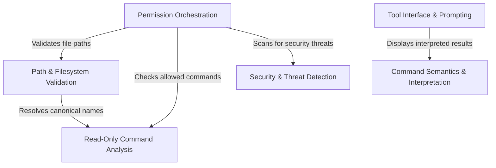

# Tutorial: PowerShellTool

This project implements a secure **PowerShell execution environment** designed for AI agents. It uses an *Abstract Syntax Tree (AST)* to deeply analyze commands before execution, enforcing strict **security policies** by validating file paths, restricting destructive actions, and detecting malicious patterns like script injection or obfuscation. It also acts as a bridge between the raw shell output and the user, interpreting exit codes and rendering user-friendly progress indicators.

## Chapters

1. [Tool Interface & Prompting](01_tool_interface___prompting.md)
2. [Command Semantics & Interpretation](02_command_semantics___interpretation.md)
3. [Permission Orchestration](03_permission_orchestration.md)
4. [Path & Filesystem Validation](04_path___filesystem_validation.md)
5. [Read-Only Command Analysis](05_read_only_command_analysis.md)
6. [Security & Threat Detection](06_security___threat_detection.md)

---

Generated by [Code IQ](https://github.com/adityasoni99/Code-IQ)